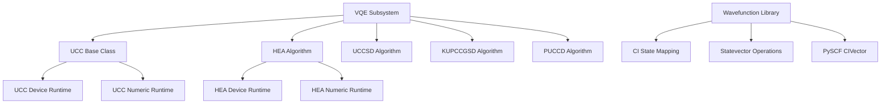
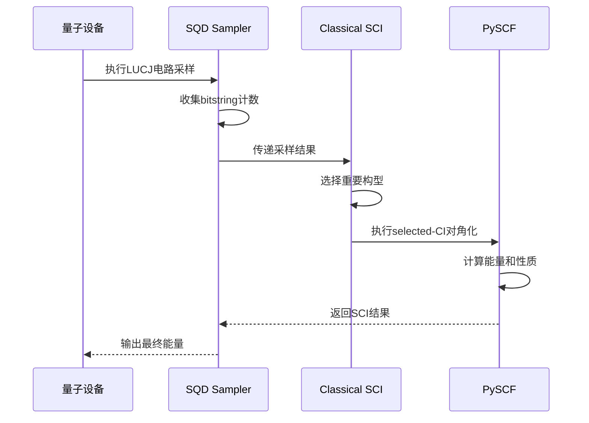

# 量子化学算法

<cite>
**本文引用的文件**   
- [ucc_base.py](file://src/tyxonq/applications/chem/algorithms/vqe/ucc_base.py)
- [hea.py](file://src/tyxonq/applications/chem/algorithms/vqe/hea.py)
- [puccd.py](file://src/tyxonq/applications/chem/algorithms/vqe/puccd.py)
- [kupccgsd.py](file://src/tyxonq/applications/chem/algorithms/vqe/kupccgsd.py)
- [uccsd.py](file://src/tyxonq/applications/chem/algorithms/vqe/uccsd.py)
- [vqe/__init__.py](file://src/tyxonq/applications/chem/algorithms/vqe/__init__.py)
- [pyscf_solver.py](file://src/tyxonq/applications/chem/algorithms/sqd/pyscf_solver.py)
- [fermion.py](file://src/tyxonq/applications/chem/algorithms/sqd/fermion.py)
- [ucc_device_runtime.py](file://src/tyxonq/applications/chem/algorithms/vqe/runtimes/ucc_device_runtime.py)
- [ucc_numeric_runtime.py](file://src/tyxonq/applications/chem/algorithms/vqe/runtimes/ucc_numeric_runtime.py)
- [hea_device_runtime.py](file://src/tyxonq/applications/chem/algorithms/vqe/runtimes/hea_device_runtime.py)
- [hea_numeric_runtime.py](file://src/tyxonq/applications/chem/algorithms/vqe/runtimes/hea_numeric_runtime.py)
- [h2o_sqd.py](file://examples/h2o_sqd.py)
</cite>

## 更新摘要
**变更内容**   
- VQE子系统重构：算法模块迁移到`applications/chem/algorithms/vqe/`目录结构
- 新增SQD（Selected Quantum Diagonalization）算法实现，支持PySCF兼容求解器
- 实现三种子空间策略：frozen（冻结）、refresh（刷新）、adaptive（自适应）
- 增强HEA和UCC设备运行时，优化执行路径和梯度计算效率
- 改进VQE族算法的统一API接口和链式调用机制

## 目录
1. [引言](#引言)
2. [核心算法实现机制](#核心算法实现机制)
3. [SQD算法与PySCF集成](#sqd算法与pyscf集成)
4. [API设计与链式调用](#api设计与链式调用)
5. [执行模式适配](#执行模式适配)
6. [性能表现与对比分析](#性能表现与对比分析)
7. [常见问题与解决方案](#常见问题与解决方案)
8. [结论](#结论)

## 引言
本文档深入探讨TyxonQ量子化学算法模块的核心功能，重点介绍重构后的VQE子系统架构，包括UCCSD、HEA、k-UpCCGSD和PUCCD等核心变分量子算法的实现机制与API设计。文档详细说明了每种算法的适用场景、参数配置、梯度计算方式及其在分子能量计算中的性能表现。特别介绍了新增的SQD算法，它通过量子采样结合经典selected-CI对角化，为大规模量子化学计算提供了新的解决方案。通过代码示例展示了如何通过链式调用初始化算法并执行变分优化。同时，文档解释了算法内核如何适配设备路径（device）与数值路径（numeric）两种执行模式，并提供了与PySCF等传统量子化学软件的对比分析，突出TyxonQ在AI药物设计任务中的灵活性与可扩展性。最后，文档包含了针对收敛困难、资源消耗过高等常见问题的解决方案。

## 核心算法实现机制

### VQE子系统重构架构
VQE（变分量子本征求解器）子系统经过重大重构，所有相关算法现在统一组织在`applications/chem/algorithms/vqe/`目录下。这种模块化设计提高了代码的可维护性和扩展性。


```mermaid
graph TD
A[VQE Subsystem] --> B[UCC Base Class]
A --> C[HEA Algorithm]
A --> D[UCCSD Algorithm]
A --> E[KUPCCGSD Algorithm]
A --> F[PUCCD Algorithm]
B --> G[UCC Device Runtime]
B --> H[UCC Numeric Runtime]
C --> I[HEA Device Runtime]
C --> J[HEA Numeric Runtime]
K[Wavefunction Library] --> L[CI State Mapping]
K --> M[Statevector Operations]
K --> N[PySCF CIVector]
```

**Diagram sources**
- [vqe/__init__.py:1-49](file://src/tyxonq/applications/chem/algorithms/vqe/__init__.py#L1-L49)
- [ucc_base.py:52-800](file://src/tyxonq/applications/chem/algorithms/vqe/ucc_base.py#L52-L800)

### UCC基类与算法家族
重构后的UCC基类提供了统一的接口，支持多种数值后端和优化策略。核心特性包括：

- **多后端支持**：支持statevector、civector、civector-large等多种数值引擎
- **灵活的初始猜测**：支持MP2、CCSD、zeros等多种初始化方法
- **优化的梯度计算**：实现了高效的参数移位梯度计算
- **云化学集成**：支持本地和云端经典化学计算

**Section sources**
- [ucc_base.py:52-800](file://src/tyxonq/applications/chem/algorithms/vqe/ucc_base.py#L52-L800)

### HEA算法增强
HEA（硬件高效试探）算法经过增强，现在支持更灵活的电路构建和优化的执行路径：

- **多映射支持**：支持parity、Jordan-Wigner、Bravyi-Kitaev等多种费米子到量子比特映射
- **外部电路模板**：支持从Qiskit RealAmplitudes等外部电路导入
- **HOMO-LUMO能隙计算**：新增轨道能隙分析功能
- **RDM计算**：支持约化密度矩阵计算用于分子性质分析

**Section sources**
- [hea.py:28-800](file://src/tyxonq/applications/chem/algorithms/vqe/hea.py#L28-L800)

### k-UpCCGSD和PUCCD算法
这两个算法保持了原有的简洁性和高效性：

- **k-UpCCGSD**：通过k层重复的广义单激发和配对双激发算符构建波函数
- **PUCCD**：只包含配对的双激发算符，显著减少参数数量

**Section sources**
- [kupccgsd.py:41-150](file://src/tyxonq/applications/chem/algorithms/vqe/kupccgsd.py#L41-L150)
- [puccd.py:35-102](file://src/tyxonq/applications/chem/algorithms/vqe/puccd.py#L35-L102)

## SQD算法与PySCF集成

### SQD算法概述
SQD（Selected Quantum Diagonalization）是一种混合量子-经典算法，通过量子采样选择重要的构型，然后进行经典的selected-CI对角化。该算法特别适合处理大分子系统的电子结构问题。

### PySCF兼容求解器
SQD算法提供了完整的PySCF兼容接口，支持三种子空间策略：

#### 1. Frozen（冻结）模式
- 每个几何都在同一行列式子空间内对角化
- 能量面光滑，是唯一允许用于解析梯度/MD的模式
- 子空间来源：显式ci_strs > 首帧用sampler采样确定并锁存

#### 2. Refresh（刷新）模式  
- 每个几何都重新采样确定子空间
- 仅可用于单点能；随机子空间下能量不是几何的函数
- 适合快速探索不同构型的能量变化

#### 3. Adaptive（自适应）模式
- 每隔refresh_every个几何重新采样一次
- 步间冻结，能量面分段光滑
- 仅供研究用途

**Section sources**
- [pyscf_solver.py:52-160](file://src/tyxonq/applications/chem/algorithms/sqd/pyscf_solver.py#L52-L160)

### 量子采样与经典对角化流程
SQD算法的核心流程如下：


```mermaid
sequenceDiagram
participant Q as 量子设备
participant S as SQD Sampler
participant C as Classical SCI
participant P as PySCF
Q->>S : 执行LUCJ电路采样
S->>S : 收集bitstring计数
S->>C : 传递采样结果
C->>C : 选择重要构型
C->>P : 执行selected-CI对角化
P->>P : 计算能量和性质
P-->>S : 返回SCI结果
S-->>Q : 输出最终能量
```

**Diagram sources**
- [fermion.py:111-166](file://src/tyxonq/applications/chem/algorithms/sqd/fermion.py#L111-L166)
- [pyscf_solver.py:215-330](file://src/tyxonq/applications/chem/algorithms/sqd/pyscf_solver.py#L215-L330)

### LUCJ采样器集成
SQD算法集成了LUCJ（Local Unitary Coupled Cluster with Jordan-Gutzwiller）采样器，提供高效的量子采样能力：

- **CCSD初始化**：使用冻结CCSD的t1/t2振幅初始化LUCJ参数
- **噪声模拟**：支持depolarizing噪声模型
- **设备兼容性**：支持模拟器和本地设备执行

**Section sources**
- [pyscf_solver.py:215-330](file://src/tyxonq/applications/chem/algorithms/sqd/pyscf_solver.py#L215-L330)
- [h2o_sqd.py:262-336](file://examples/h2o_sqd.py#L262-L336)

## API设计与链式调用

### 统一的VQE API接口
重构后的VQE子系统提供了高度统一的API接口：

```python
from tyxonq.applications.chem.algorithms.vqe import UCCSD, HEA, KUPCCGSD, PUCCD

# 统一的初始化模式
uccsd = UCCSD(molecule=h2, active_space=(2, 2), init_method="mp2")
hea = HEA(molecule=h2, layers=1)
kupccgsd = KUPCCGSD(molecule=h2, k=2)
puccd = PUCCD(molecule=h2)

# 统一的优化接口
energy_uccsd = uccsd.kernel(shots=2048, provider="simulator", device="statevector")
energy_hea = hea.kernel()
```

### SQD算法API
SQD算法提供了简洁的PySCF兼容接口：

```python
from tyxonq.applications.chem.algorithms.sqd import run_sqd_fermion, as_pyscf_solver

# 直接使用run_sqd_fermion
result = run_sqd_fermion(h1, h2, counts, norb=norb, nelec=nelec)

# 使用PySCF兼容接口
solver = as_pyscf_solver(subspace="frozen", sampler=lucj_sampler)
energy, amplitudes = solver.kernel(h1, h2, norb, nelec)
```

**Section sources**
- [vqe/__init__.py:15-49](file://src/tyxonq/applications/chem/algorithms/vqe/__init__.py#L15-L49)
- [pyscf_solver.py:333-351](file://src/tyxonq/applications/chem/algorithms/sqd/pyscf_solver.py#L333-L351)

## 执行模式适配

### 增强的设备运行时
重构后的设备运行时经过优化，提供更高效的执行路径：

#### UCCDeviceRuntime优化
- **批处理执行**：支持批量电路执行和并行测量
- **缓存机制**：预计算哈密顿量分组和测量前缀
- **梯度优化**：实现了两移位参数移位规则，提高梯度计算精度

#### HEADeviceRuntime增强
- **多映射支持**：支持多种费米子到量子比特映射
- **电路模板**：支持外部电路模板导入
- **RDM计算**：优化的约化密度矩阵计算

**Section sources**
- [ucc_device_runtime.py:26-448](file://src/tyxonq/applications/chem/algorithms/vqe/runtimes/ucc_device_runtime.py#L26-L448)
- [hea_device_runtime.py:1-200](file://src/tyxonq/applications/chem/algorithms/vqe/runtimes/hea_device_runtime.py#L1-L200)

### 数值路径优化
数值路径同样经过优化，提供更好的性能和内存管理：

- **智能后端选择**：根据系统大小自动选择合适的数值引擎
- **内存优化**：支持大型系统的稀疏表示
- **并行计算**：利用多核CPU进行并行计算

**Section sources**
- [ucc_numeric_runtime.py:1-313](file://src/tyxonq/applications/chem/algorithms/vqe/runtimes/ucc_numeric_runtime.py#L1-L313)
- [hea_numeric_runtime.py:1-200](file://src/tyxonq/applications/chem/algorithms/vqe/runtimes/hea_numeric_runtime.py#L1-L200)

## 性能表现与对比分析

### 算法性能对比表
| 算法 | 参数数量 | 适用场景 | 收敛速度 | 资源消耗 | 精度 |
| :--- | :--- | :--- | :--- | :--- | :--- |
| **UCCSD** | 高 | 精确计算小分子 | 中等 | 高 | 高 |
| **HEA** | 中等 | NISQ设备上的通用变分算法 | 快 | 低 | 中等 |
| **k-UpCCGSD** | 低 | 资源受限下的高效计算 | 慢（需多次尝试） | 低 | 中等 |
| **PUCCD** | 低 | 具有配对对称性的系统 | 快 | 低 | 低 |
| **SQD** | 可变 | 大分子系统的电子结构 | 依赖采样质量 | 中 | 高 |

### 与PySCF的对比优势
重构后的TyxonQ相比传统量子化学软件具有以下优势：

1. **混合量子-经典计算**：SQD算法结合了量子采样的优势和经典对角化的精确性
2. **灵活的执行模式**：支持模拟器、本地设备和云端设备的无缝切换
3. **丰富的算法库**：从简单的HEA到复杂的UCCSD，覆盖各种计算需求
4. **PySCF集成**：完全兼容PySCF生态，便于与传统方法对比

**Section sources**
- [pyscf_solver.py:1-160](file://src/tyxonq/applications/chem/algorithms/sqd/pyscf_solver.py#L1-L160)

## 常见问题与解决方案

### 收敛困难问题
**问题**：变分优化过程可能陷入局部极小值。

**解决方案**：
1. **多次尝试**：使用不同的初始参数进行多次优化
2. **更好的初始猜测**：使用CCSD或MP2结果作为初始振幅
3. **调整优化器参数**：调整容差和最大迭代次数

### SQD算法特定问题
**问题**：SQD算法的采样质量和子空间选择影响收敛。

**解决方案**：
1. **合适的子空间策略**：对于MD计算使用"frozen"模式，对于单点能计算可使用"refresh"模式
2. **足够的采样数**：确保足够的shots以获得稳定的采样结果
3. **初始占据数**：提供合理的初始占据数以加速收敛

**Section sources**
- [pyscf_solver.py:52-160](file://src/tyxonq/applications/chem/algorithms/sqd/pyscf_solver.py#L52-L160)
- [h2o_sqd.py:262-336](file://examples/h2o_sqd.py#L262-L336)

### 资源消耗过高问题
**问题**：大分子系统的计算资源消耗过大。

**解决方案**：
1. **活性空间近似**：限制计算的电子和轨道数量
2. **选择合适的算法**：对于大分子优先考虑SQD或PUCCD
3. **并行计算**：利用多核CPU和GPU加速计算

## 结论
TyxonQ量子化学算法模块经过重构后，提供了更加模块化和高效的量子化学计算框架。VQE子系统的重构使得算法组织更加清晰，而新增的SQD算法为大规模量子化学计算提供了新的解决方案。通过PySCF兼容接口，用户可以无缝集成到现有的量子化学工作流中。

重构后的系统具有以下关键优势：
- **模块化架构**：清晰的目录结构和职责分离
- **丰富的算法库**：从简单到复杂的完整算法谱系
- **灵活的执行模式**：支持多种设备和后端
- **PySCF集成**：与传统量子化学软件的无缝对接

这些改进使得TyxonQ在AI药物设计、材料科学和量子化学等领域具有更强的竞争力和应用潜力。通过理解并应用本文档中提供的解决方案，用户可以充分发挥新架构的优势，解决复杂的量子化学计算问题。