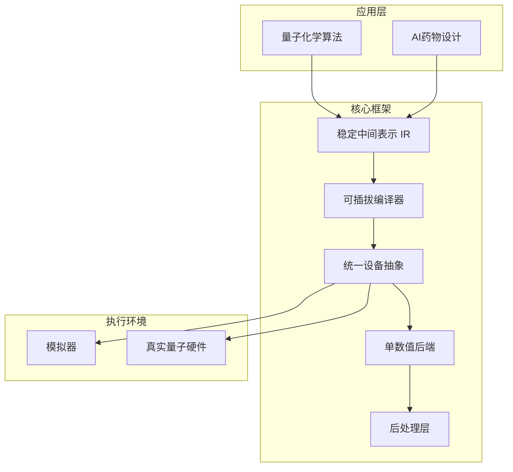
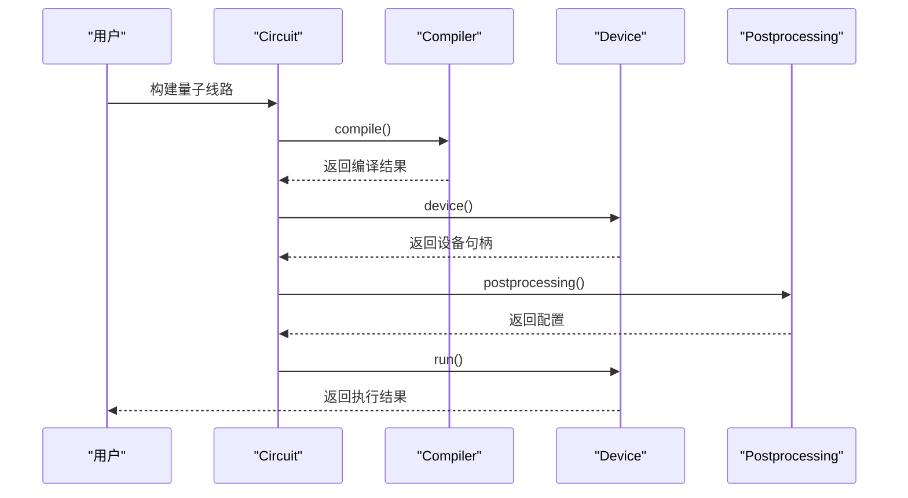

# 项目概述

<cite>
**本文档引用的文件**  
- [README.md](file://README.md)
- [pyproject.toml](file://pyproject.toml)
- [circuit.py](file://src/tyxonq/core/ir/circuit.py)
- [api.py](file://src/tyxonq/compiler/api.py)
- [base.py](file://src/tyxonq/devices/base.py)
- [api.py](file://src/tyxonq/numerics/api.py)
- [io.py](file://src/tyxonq/postprocessing/io.py)
- [TYXONQ_TECHNICAL_WHITEPAPER.md](file://TYXONQ_TECHNICAL_WHITEPAPER.md)
- [cloud_classical_design_summary.md](file://docs-ng/source/next/cloud_classical_design_summary.md)
- [classical_methods.py](file://src/tyxonq/applications/chem/classical_chem_cloud/classical_methods.py)
- [clients.py](file://src/tyxonq/applications/chem/classical_chem_cloud/clients.py)
- [ucc.py](file://src/tyxonq/applications/chem/algorithms/ucc.py)
</cite>

## 更新摘要
**变更内容**  
- 在“核心架构与设计理念”、“关键特性详解”、“量子计算化学与AI药物设计应用”和“双路径执行模型”等章节中新增了关于云加速和混合计算的内容。
- 新增了“云加速混合计算”章节，详细介绍了云加速混合计算的设计目标、关键决策和集成点。
- 更新了“系统组件交互关系”中的序列图，以反映云加速混合计算的交互关系。
- 更新了“第三方工具集成能力”章节，以包含云加速混合计算的集成能力。
- 更新了“学习路径指引”章节，以包含云加速混合计算的学习路径。
- 根据代码变更，更新了项目依赖信息，移除了对Cirq的依赖，并更新了化学模块的依赖配置。

## 目录
1. [简介](#简介)
2. [核心架构与设计理念](#核心架构与设计理念)
3. [关键特性详解](#关键特性详解)
4. [量子计算化学与AI药物设计应用](#量子计算化学与ai药物设计应用)
5. [双路径执行模型](#双路径执行模型)
6. [系统组件交互关系](#系统组件交互关系)
7. [第三方工具集成能力](#第三方工具集成能力)
8. [云加速混合计算](#云加速混合计算)
9. [学习路径指引](#学习路径指引)
10. [项目依赖与许可证](#项目依赖与许可证)
11. [社区支持渠道](#社区支持渠道)

## 简介
TyxonQ（太玄量子）是一个模块化的全栈量子软件框架，专为在真实量子硬件上运行而设计。该项目旨在为工程师和科学家提供一个贴近硬件、系统架构友好的编程模型，同时保持简洁易用的特性。框架采用稳定中间表示（IR）、可插拔编译器、统一设备抽象层和单数值后端接口等核心技术，支持从模拟器到真实量子处理器的无缝切换。TyxonQ特别关注量子计算化学（Quantum AIDD）和AI药物设计领域，致力于提供微观量子化学数据和强大的计算工具，推动人工智能在药物发现中的应用。

## 核心架构与设计理念
TyxonQ的架构设计遵循"硬件真实、系统友好"的核心原则，通过分层解耦的模块化设计实现灵活性与可扩展性。框架采用链式API（`Circuit.compile().device(...).postprocessing(...).run()`）作为主要编程范式，将量子电路的编译、设备执行和后处理过程显式分离，确保各组件间的清晰契约。这种设计不仅镜像了真实设备的执行流程，还为不同层级的优化和替换提供了可能。系统通过统一的中间表示（IR）作为核心数据结构，在编译器、设备驱动和后处理层之间传递，保证了数据的一致性和稳定性。整个架构强调与真实量子硬件的紧密对齐，同时通过抽象层屏蔽底层复杂性，为用户提供简洁的编程体验。

**图源**  
- [README.md](file://README.md)
- [circuit.py](file://src/tyxonq/core/ir/circuit.py)

## 关键特性详解
### 稳定中间表示（IR）
TyxonQ采用稳定中间表示（IR）作为核心数据结构，确保在不同编译阶段和设备间的兼容性。`Circuit`类作为IR的主要载体，包含量子比特数、操作序列、元数据和指令等关键属性。该表示设计为轻量级且可扩展，支持直接构建、JSON序列化和多种格式转换。IR的稳定性保证了从高级算法到低级硬件指令的可靠传递，是实现"编写一次，随处运行"理念的基础。

**章节来源**  
- [circuit.py](file://src/tyxonq/core/ir/circuit.py#L1-L779)

### 可插拔编译器
框架支持可插拔编译器架构，允许用户根据需求选择不同的编译引擎。`compile`函数作为统一入口，支持"tyxonq"、"qiskit"等多种编译引擎，并可根据目标设备自动选择最优输出格式。编译过程包含测量重写/分组、轻锥简化、shot调度等多个优化阶段，有效提升执行效率。这种设计既保持了与主流工具的兼容性，又为特定硬件的深度优化提供了空间。

**章节来源**  
- [api.py](file://src/tyxonq/compiler/api.py#L1-L66)

### 统一设备抽象层
TyxonQ通过统一设备抽象层实现了对模拟器和真实硬件的无缝访问。`Device`协议定义了设备执行的标准接口，包括`run`和`expval`等核心方法。`resolve_driver`函数根据提供者和设备名称动态选择相应的驱动程序，支持本地模拟器、IBM量子设备和TyxonQ自研硬件等多种后端。这种抽象设计使用户能够通过简单的参数更改在不同执行环境间切换，极大地提升了开发效率。

**章节来源**  
- [base.py](file://src/tyxonq/devices/base.py#L1-L389)

### 单数值后端接口
框架提供统一的数值后端接口，支持NumPy、PyTorch和CuPyNumeric等多种计算后端。`ArrayBackend`协议定义了数组创建、基本运算、随机数生成等核心功能，确保在不同后端间的一致性体验。`get_backend`工厂函数根据配置返回相应的后端实例，用户可通过`set_backend`全局设置默认后端。这一设计不仅满足了研究和生产环境的不同需求，还为自动微分等高级功能提供了支持。

**章节来源**  
- [api.py](file://src/tyxonq/numerics/api.py#L1-L195)

### 面向真实硬件的后处理层
后处理层专为真实硬件的特性设计，提供读出校正、期望值计算、噪声分析等关键功能。`apply_postprocessing`函数作为统一入口，根据配置方法处理原始测量结果。`counts_to_csv`、`normalized_count`等工具函数支持多种数据格式转换和统计分析，帮助用户从嘈杂的硬件输出中提取有价值的信息。该层的设计充分考虑了真实量子设备的局限性，为结果的可靠性和可重复性提供了保障。

**章节来源**  
- [io.py](file://src/tyxonq/postprocessing/io.py#L1-L222)

## 量子计算化学与AI药物设计应用
TyxonQ在量子计算化学（Quantum AIDD）和AI药物设计领域具有重要应用价值。框架提供了类似PySCF的用户体验，用户可以通过熟悉的分子/变分线路API在设备路径和数值路径间无缝切换，无需修改代码。在药物设计方面，项目优先开发面向药物设计的哈密顿量和工作流，包括配体-受体片段、溶剂/嵌入和粗粒化模型等。这些特性为AI药物发现提供了关键的微观量子化学数据和稳健的计算工具。

框架支持HEA和UCC系列算法（UCC/UCCSD/k-UpCCGSD/pUCCD），提供一致的能量/梯度/核函数API。通过与PySCF的紧密互操作，用户可以方便地获取参考值和积分数据。`applications/chem/chem_libs`模块包含电路化学库、量子化学库和哈密顿量化学库，为复杂化学计算提供了丰富的工具集。这些设计使TyxonQ成为连接量子计算与AI药物设计的重要桥梁。

**章节来源**  
- [README.md](file://README.md)

## 双路径执行模型
TyxonQ采用创新的双路径执行模型，支持模拟器与真实硬件的并行开发和验证。在设备路径中，系统通过编译器驱动的测量分组和shot调度，将量子线路转换为可在真实硬件上执行的格式，最终通过后处理层计算期望值。在数值路径中，系统利用statevector或矩阵乘积态（MPS）进行精确模拟，支持PyTorch自动微分计算梯度。这种双路径设计允许研究人员在模拟环境中快速迭代算法，然后无缝迁移到真实硬件进行验证，大大加速了量子算法的开发周期。

双路径模型的关键优势在于其语义一致性——无论选择哪种执行路径，用户API保持完全相同。通过简单的`.device(...)`参数更改，即可在模拟器和真实量子处理器间切换。这种设计不仅降低了学习曲线，还确保了结果的可比性，为量子算法的基准测试和性能评估提供了可靠基础。

**章节来源**  
- [README.md](file://README.md)

## 系统组件交互关系
TyxonQ的系统组件通过清晰的接口和数据流相互协作。用户首先构建量子线路（Circuit），然后通过链式API调用`compile()`方法，该方法根据配置选择合适的编译引擎（如Qiskit）将IR转换为目标格式。编译后的电路传递给`device()`方法，该方法根据提供者和设备名称选择相应的驱动程序。对于真实硬件，系统通常生成OpenQASM代码；对于模拟器，则直接传递IR对象。

执行结果通过`postprocessing()`方法进行处理，应用读出校正、期望值计算等后处理技术。整个流程中，全局配置（如`_GLOBAL_COMPILE_DEFAULTS`）和实例级配置共同决定了各阶段的行为。这种分层配置机制既保证了灵活性，又维护了系统的可预测性。各组件间的松耦合设计使得任何部分都可以独立替换或升级，为框架的长期发展奠定了坚实基础。

**图源**  
- [README.md](file://README.md)
- [circuit.py](file://src/tyxonq/core/ir/circuit.py)

## 第三方工具集成能力
TyxonQ具备强大的第三方工具集成能力，特别是与PySCF等量子化学软件的深度整合。框架通过`libs/hamiltonian_encoding`模块支持OpenFermion I/O，实现了与主流量子化学工具的数据互通。用户可以直接使用PySCF计算的积分数据构建量子化学哈密顿量，或将TyxonQ的结果导出供其他工具分析。

在机器学习方面，通过PyTorch后端支持，TyxonQ能够无缝集成到现有的AI工作流中。`vectorize_or_fallback`函数提供了向量化执行的兼容层，确保在不同计算后端间的平滑迁移。框架还支持Qiskit、Cirq等主流量子软件的格式转换，如通过`to_openqasm`方法生成OpenQASM 2.0代码。这些集成能力使TyxonQ能够作为量子计算生态系统中的关键枢纽，连接不同的工具和平台。

**章节来源**  
- [README.md](file://README.md)
- [api.py](file://src/tyxonq/numerics/api.py)

## 云加速混合计算
TyxonQ引入了云加速混合计算，以解决量子化学计算中的计算瓶颈。该设计通过将重计算任务（如HF/post-HF）卸载到云端，同时保持VQE迭代在本地控制，实现了计算效率和灵活性的平衡。

### 设计目标
- 将重计算任务（如HF/post-HF）卸载到云端，同时保持VQE迭代在本地控制。
- 最小化用户更改：只需传递`classical_provider`和`classical_device`参数。
- 支持多种经典计算方法，如FCI、CCSD、DFT、MP2和CASSCF。

### 关键决策
- 使用统一的客户端`TyxonQClassicalClient`，其中`classical_device`可以是{auto, cpu, gpu}，调度决策由服务器端决定。
- 移除云端VQE优化；仅将经典内核卸载到云端。
- 添加`verbose`选项以返回辅助数据和工件（如HF chkfile作为base64编码），以避免重新计算RDM。

### 集成点
- UCCSD/ROUCCSD：当`classical_provider!='local'`时，通过云端进行HF和MO基积分；FCI参考可选云端。
- HEA.from_molecule：云端HF/积分分支；下游相同。
- 纯经典方法：在`cloud_classical_methods`中以一致的API暴露。

**章节来源**  
- [cloud_classical_design_summary.md](file://docs-ng/source/next/cloud_classical_design_summary.md)
- [classical_methods.py](file://src/tyxonq/applications/chem/classical_chem_cloud/classical_methods.py)
- [clients.py](file://src/tyxonq/applications/chem/classical_chem_cloud/clients.py)

## 学习路径指引
对于初学者，建议从安装TyxonQ开始，通过`pip install tyxonq`或源码构建方式完成环境配置。随后，通过阅读`README.md`中的快速入门示例，理解链式API的基本用法。`examples`目录提供了丰富的实践案例，从简单的量子线路到复杂的VQE算法，帮助用户逐步掌握框架的核心功能。

高级用户应重点关注`src/tyxonq`目录下的核心模块，理解IR、编译器、设备抽象等关键组件的实现细节。`tests_core_module`和`tests_examples`目录中的测试用例提供了API使用的最佳实践。对于量子化学应用开发者，`applications/chem`模块的文档

**章节来源**  
- [README.md](file://README.md)
- [pyproject.toml](file://pyproject.toml)

## 项目依赖与许可证
TyxonQ的项目依赖在`pyproject.toml`文件中明确定义，要求Python版本不低于3.10，主要依赖包括NumPy、PyTorch、Qiskit等科学计算和量子软件库。值得注意的是，根据最新的代码变更，项目已从依赖中移除了Cirq。这些依赖确保了框架在数值计算、量子线路操作和硬件接口方面的强大功能。项目采用Apache License 2.0开源许可证，允许商业使用、修改、分发和专利授权，为学术研究和工业应用提供了最大的灵活性。

框架的可选依赖（如Jupyter、pytest）支持开发和测试工作流，使得贡献者能够轻松地参与项目开发。这种清晰的依赖管理和宽松的许可证政策，有助于建立活跃的开发者社区，推动量子计算技术的普及和创新。

**章节来源**  
- [pyproject.toml](file://pyproject.toml)
- [README.md](file://README.md)

## 社区支持渠道
TyxonQ提供多种社区支持渠道，包括官方网站（www.tyxonq.com）、技术邮箱（code@quregenai.com）和通用咨询邮箱（bd@quregenai.com）。用户可以通过GitHub Issues提交问题和建议，参与项目的持续改进。微信公众号和开发者交流群为中文用户提供及时的技术更新和交流平台，扫码即可加入。

项目由QureGenAI（量子硬件基础设施和服务）、TyxonQ核心团队（框架开发和优化）以及社区贡献者（开源开发和测试）共同维护。这种多方协作的开发模式确保了框架在硬件支持、软件优化和用户需求之间的平衡发展，为用户提供稳定可靠的技术支持。

**章节来源**  
- [README.md](file://README.md)