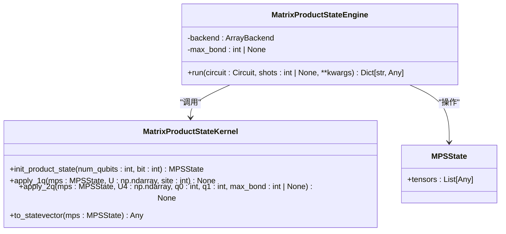
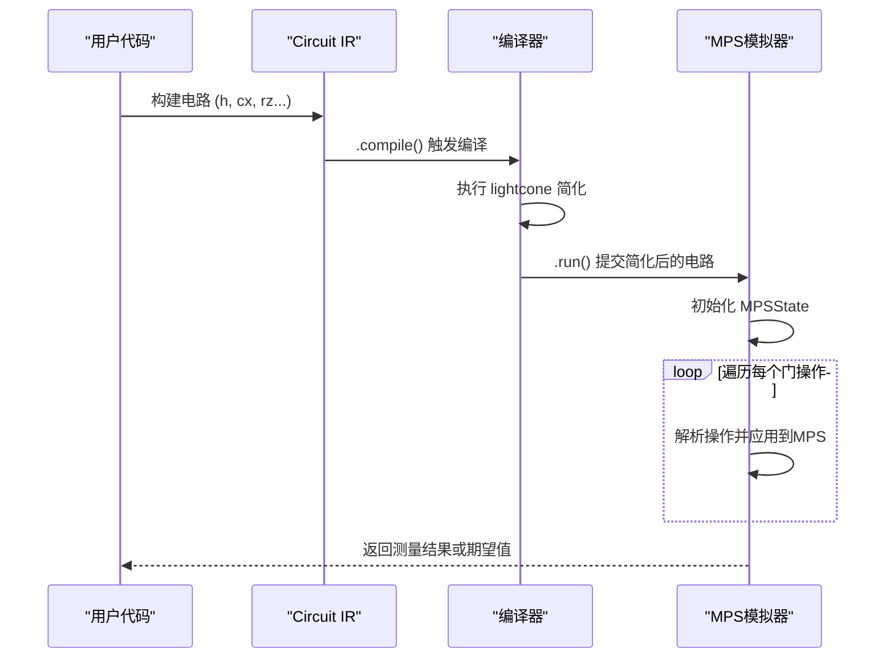

# 大规模量子系统模拟

<cite>
**本文档引用的文件**  
- [engine.py](file://src/tyxonq/devices/simulators/matrix_product_state/engine.py)
- [matrix_product_state.py](file://src/tyxonq/libs/quantum_library/kernels/matrix_product_state.py)
- [lightcone.py](file://src/tyxonq/compiler/stages/simplify/lightcone.py)
- [circuit.py](file://src/tyxonq/core/ir/circuit.py)
- [driver.py](file://src/tyxonq/devices/simulators/driver.py)
- [mpsvsexact.py](file://examples-ng/mpsvsexact.py)
</cite>

## 目录
1. [引言](#引言)
2. [MPS模拟器核心算法](#mps模拟器核心算法)
3. [与核心IR及编译器的交互](#与核心ir及编译器的交互)
4. [典型应用场景与性能分析](#典型应用场景与性能分析)
5. [配置参数与资源消耗](#配置参数与资源消耗)
6. [常见瓶颈与解决方案](#常见瓶颈与解决方案)

## 引言

本文件旨在全面介绍TyxonQ框架中基于矩阵乘积态（Matrix Product State, MPS）的量子系统模拟能力。MPS作为一种高效的张量网络表示方法，能够有效处理一维量子系统中的纠缠，尤其适用于模拟深度量子电路和长程相互作用系统。通过将量子态表示为一系列局部张量的乘积，MPS模拟器在内存和计算效率上相较于全态矢量模拟器具有显著优势。本文将深入解析其算法原理、实现细节、与核心中间表示（IR）及编译器的交互方式，并通过具体示例展示其应用。

## MPS模拟器核心算法

### 张量网络表示与MPSState

MPS模拟器的核心在于将n个量子比特的量子态 \(|\psi\rangle\) 表示为一系列矩阵的乘积。每个量子比特i对应一个三阶张量 \(A_i\)，其形状为 \((D_{i-1}, 2, D_i)\)，其中2是物理维度（对应|0⟩和|1⟩），\(D_{i-1}\) 和 \(D_i\) 分别是左、右的虚拟维度（或称键维度，bond dimension）。整个态可以写为：
\[
|\psi\rangle = \sum_{s_1,s_2,...,s_n} \text{Tr}(A_1^{s_1} A_2^{s_2} ... A_n^{s_n}) |s_1 s_2 ... s_n\rangle
\]

在代码中，这一结构由 `MPSState` 类封装，它包含一个张量列表 `tensors`，每个张量对应一个量子比特。

**Diagram sources**
- [engine.py](file://src/tyxonq/devices/simulators/matrix_product_state/engine.py#L34-L209)
- [matrix_product_state.py](file://src/tyxonq/libs/quantum_library/kernels/matrix_product_state.py#L36-L59)

**Section sources**
- [engine.py](file://src/tyxonq/devices/simulators/matrix_product_state/engine.py#L1-L212)
- [matrix_product_state.py](file://src/tyxonq/libs/quantum_library/kernels/matrix_product_state.py#L1-L235)

### 纠缠截断策略（Truncation）

随着量子门操作的进行，特别是双量子比特门，键维度 \(D_i\) 会指数级增长，导致计算成本高昂。为控制计算复杂度，MPS模拟器实现了**硬截断（hard cap）**策略。该策略通过 `max_bond` 参数对键维度设置一个硬性上限。

当应用双量子比特门（如CNOT）时，模拟器会先将两个相邻的MPS张量合并，应用门操作，然后通过奇异值分解（SVD）将合并后的张量重新分解为两个新的MPS张量。在此过程中，`_truncate_svd` 函数会检查SVD得到的奇异值，首先根据 `svd_cutoff`（可选）移除过小的奇异值，然后强制将奇异值的数量截断至 `max_bond` 指定的最大值。这有效地限制了纠缠的增长，以牺牲部分精度为代价换取了可管理的计算资源消耗。

### 时间演化算法（TEBD）

MPS模拟器的门应用逻辑与时间演化块对角化（TEBD）算法的核心思想一致。对于单量子比特门，直接在对应的MPS张量上进行矩阵乘法即可。对于双量子比特门，如果作用在相邻的量子比特上，则通过SVD进行局域更新；如果作用在非相邻的量子比特上，则通过一系列SWAP门将它们“路由”到相邻位置，应用目标门，再通过SWAP门恢复原位。这一过程在 `apply_2q` 函数中实现，确保了即使在非最近邻相互作用的电路中，也能高效地进行模拟。

## 与核心IR及编译器的交互

### 核心IR（Circuit）的集成

MPS模拟器通过 `MatrixProductStateEngine` 类与TyxonQ的核心中间表示（IR）——`Circuit`类进行交互。`Circuit` 类是量子电路的抽象表示，其 `ops` 字段存储了按顺序排列的量子门操作（如 `("h", 0)` 表示在第0个量子比特上应用H门）。`MatrixProductStateEngine.run` 方法遍历 `circuit.ops`，将每个操作解析并转换为相应的MPS更新操作。

**Diagram sources**
- [circuit.py](file://src/tyxonq/core/ir/circuit.py#L48-L727)
- [engine.py](file://src/tyxonq/devices/simulators/matrix_product_state/engine.py#L34-L209)
- [lightcone.py](file://src/tyxonq/compiler/stages/simplify/lightcone.py#L9-L95)

**Section sources**
- [engine.py](file://src/tyxonq/devices/simulators/matrix_product_state/engine.py#L34-L209)
- [circuit.py](file://src/tyxonq/core/ir/circuit.py#L48-L727)

### Lightcone优化

为了进一步提升计算效率，特别是在处理大规模电路时，TyxonQ的编译器提供了一个名为 `LightconeSimplifyPass` 的优化阶段。该优化基于“光锥”（lightcone）概念：只有那些对最终测量结果有影响的量子门才需要被实际模拟。

`LightconeSimplifyPass` 从电路末尾的测量操作开始，反向遍历所有门操作。它维护一个“活跃”量子比特的集合。当遇到一个门时，如果它作用于任何活跃的量子比特上，则该门被标记为需要保留，并且其作用的量子比特也被加入活跃集合（对于纠缠门，如CNOT，会传播依赖关系）。最终，只有被标记的门会被保留在简化后的电路中。这极大地减少了需要模拟的门操作数量，尤其是在测量只涉及少数量子比特的场景下。

## 典型应用场景与性能分析

### 一维自旋链模拟

MPS模拟器特别适合模拟一维自旋链模型，如横场伊辛模型（Transverse Field Ising Model, TFIM）。在 `examples-ng/mpsvsexact.py` 示例中，展示了如何使用MPS模拟器来近似计算一个15量子比特、20层深度的变分量子电路的基态能量。该电路通过交替应用ZZ相互作用和RX旋转来模拟TFIM的哈密顿量。

该示例通过与精确对角化（全态矢量）结果的对比，量化了MPS近似的精度。结果显示，随着键维度 `bond dimension` 的增加，MPS模拟器的能量计算结果与精确值的相对误差显著减小，同时估计的保真度（fidelity）也相应提高。这清晰地展示了MPS在精度与计算资源之间的权衡。

### 精度与性能的权衡

MPS模拟器的性能优势主要体现在内存和时间复杂度上。全态矢量模拟器的内存和时间复杂度均为 \(O(2^n)\)，而MPS模拟器的复杂度主要由最大键维度 \(\chi\) 决定，通常为 \(O(n \chi^2)\) 或 \(O(n \chi^3)\)。对于纠缠度较低的系统，\(\chi\) 可以保持在一个较小的常数，使得模拟器能够处理远超全态矢量方法能力范围的量子比特数。

然而，这种效率的提升是以精度为代价的。截断操作会引入近似误差。在 `mpsvsexact.py` 的实验中，当 `bond dimension` 较小时（如2或5），近似误差较大；而当 `bond dimension` 增大到50或100时，结果与精确值非常接近。因此，用户需要根据具体问题的纠缠特性和对精度的要求，合理选择 `max_bond` 参数。

## 配置参数与资源消耗

### 配置参数

MPS模拟器的主要配置参数在 `MatrixProductStateEngine` 的初始化函数中定义：
- `backend`: 指定数值计算后端，如NumPy、PyTorch或CuPy，影响计算速度和是否支持GPU加速。
- `max_bond`: 核心参数，用于设置键维度的上限，直接控制内存使用和计算精度。

在运行电路时，可通过 `run` 方法的 `kwargs` 传递噪声模型等选项。

### 资源消耗评估

MPS模拟器的资源消耗主要取决于：
1.  **量子比特数 (n)**：线性影响。
2.  **电路深度和门操作数**：直接影响计算时间。
3.  **最大键维度 (max_bond)**：对内存和计算时间有平方或立方的影响，是主要的控制变量。
4.  **数值后端**：使用PyTorch/CuPy后端在GPU上运行可以显著加速计算，但需要相应的硬件支持。

总体而言，对于低纠缠系统，MPS模拟器的资源消耗远低于指数级增长的全态矢量方法，使其成为模拟大规模一维量子系统的实用工具。

## 常见瓶颈与解决方案

### 常见瓶颈

1.  **键维度爆炸**：在深度电路或强纠缠系统中，即使设置了 `max_bond`，SVD分解的计算成本（\(O(\chi^3)\)）也可能成为瓶颈。
2.  **非最近邻门的SWAP开销**：当电路中存在大量非最近邻的双量子比特门时，需要插入大量的SWAP门进行路由，增加了电路深度和计算量。
3.  **全态矢量重构**：当需要获取全态矢量或计算多个期望值时，`to_statevector` 函数会将MPS展开为 \(O(2^n)\) 的态矢量，这会耗尽内存并抵消MPS的优势。

### 解决方案

1.  **优化 `max_bond`**：根据问题特性进行基准测试，找到满足精度要求的最小 `max_bond` 值。
2.  **利用Lightcone优化**：确保在提交给MPS模拟器前，电路已经过 `lightcone` 简化，移除无关的门操作。
3.  **避免全态矢量重构**：尽可能直接从MPS结构计算所需的物理量（如单点期望值），而不是重构全态矢量。对于需要概率分布的场景，考虑使用采样（`shots>0`）而非精确计算。
4.  **选择合适的后端**：对于大型计算，使用 `cupynumeric` 或 `pytorch` 后端配合GPU，可以利用并行计算能力加速SVD等线性代数运算。