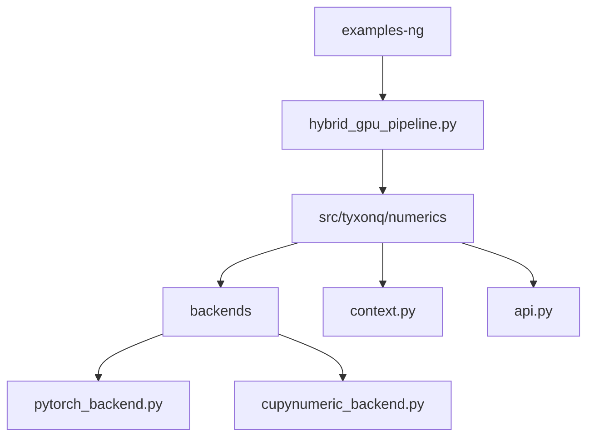
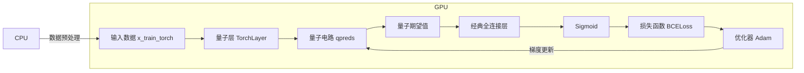
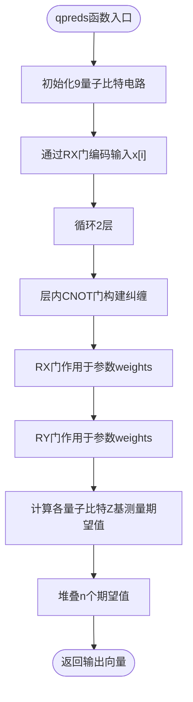
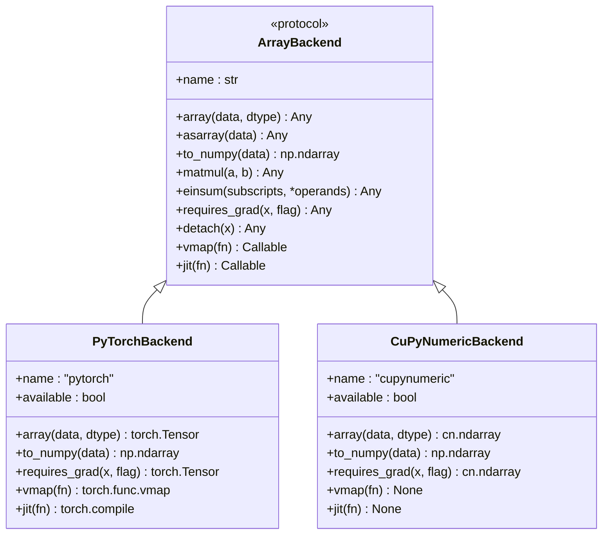
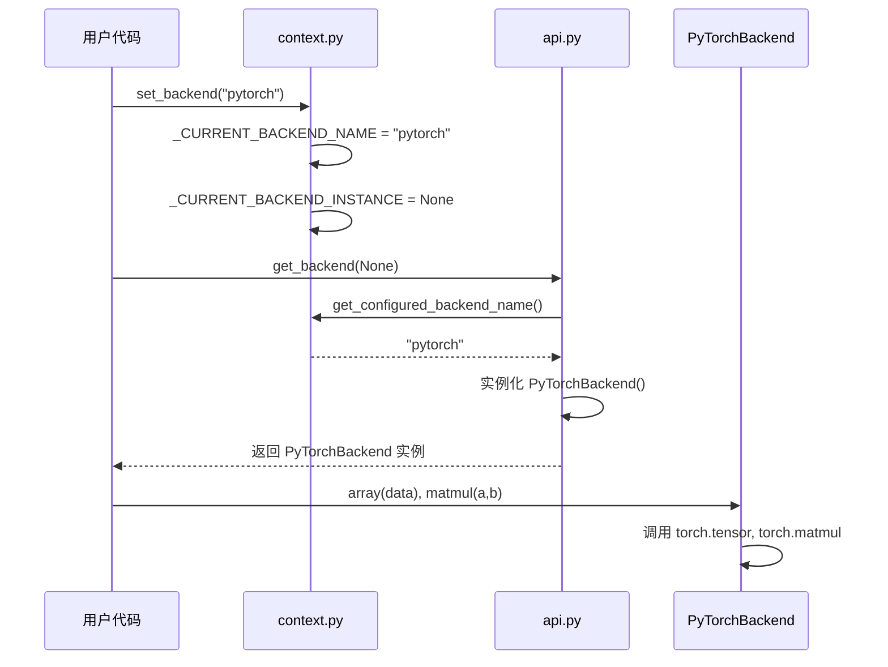
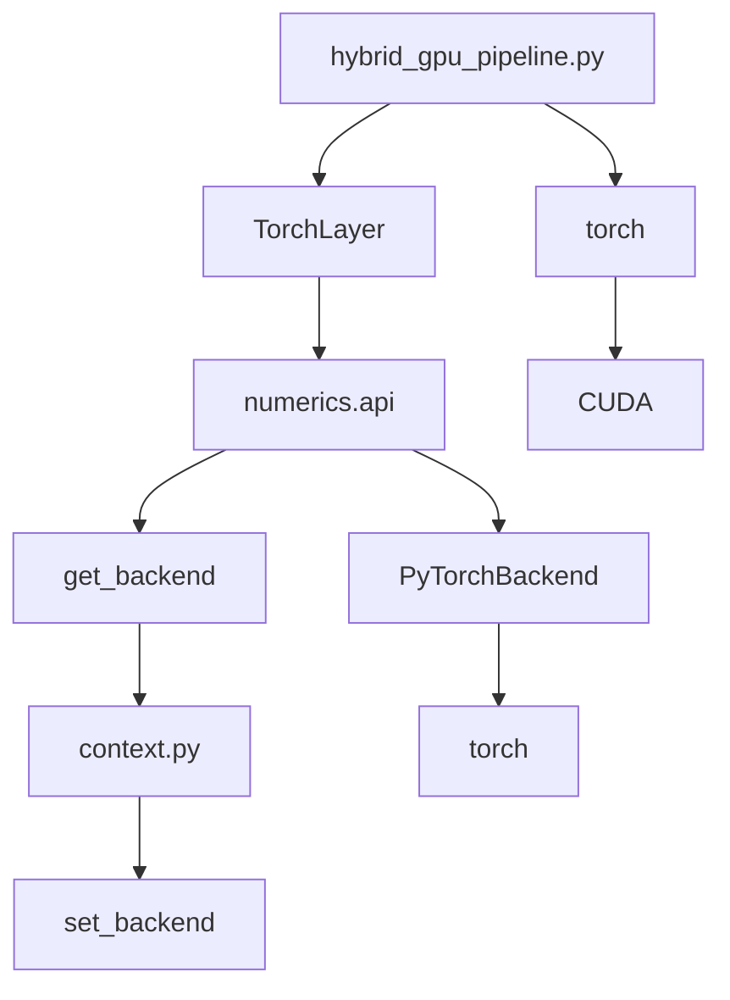

# 混合GPU计算管道

<cite>
**本文档引用的文件**
- [hybrid_gpu_pipeline.py](file://examples-ng/hybrid_gpu_pipeline.py)
- [pytorch_backend.py](file://src/tyxonq/numerics/backends/pytorch_backend.py)
- [cupynumeric_backend.py](file://src/tyxonq/numerics/backends/cupynumeric_backend.py)
- [context.py](file://src/tyxonq/numerics/context.py)
- [api.py](file://src/tyxonq/numerics/api.py)
</cite>

## 目录
1. [引言](#引言)
2. [项目结构](#项目结构)
3. [核心组件](#核心组件)
4. [架构概述](#架构概述)
5. [详细组件分析](#详细组件分析)
6. [依赖分析](#依赖分析)
7. [性能考量](#性能考量)
8. [故障排除指南](#故障排除指南)
9. [结论](#结论)

## 引言
本文档详细阐述了混合GPU计算管道的设计与实现，重点分析如何将量子模拟与经典深度学习模型在GPU上协同执行。以 `examples-ng/hybrid_gpu_pipeline.py` 为核心示例，展示量子电路如何作为可微分层无缝嵌入PyTorch计算图，利用GPU加速量子态传播与梯度反向传播。文档涵盖数值后端配置、量子-经典变量传递机制、变分量子算法（VQA）训练中的性能优势，并提供性能基准、内存管理技巧及多GPU扩展路径。

## 项目结构
本项目采用模块化设计，核心功能分布在 `src/tyxonq` 目录下，示例代码位于 `examples-ng` 目录。混合GPU管道示例文件 `hybrid_gpu_pipeline.py` 位于 `examples-ng` 子目录，依赖于 `numerics` 模块提供的后端抽象层。

**Diagram sources**
- [hybrid_gpu_pipeline.py](file://examples-ng/hybrid_gpu_pipeline.py#L1-L10)
- [pytorch_backend.py](file://src/tyxonq/numerics/backends/pytorch_backend.py#L1-L10)
- [cupynumeric_backend.py](file://src/tyxonq/numerics/backends/cupynumeric_backend.py#L1-L10)

**Section sources**
- [hybrid_gpu_pipeline.py](file://examples-ng/hybrid_gpu_pipeline.py#L1-L124)
- [project_structure](file://project_structure#L1-L200)

## 核心组件
该混合管道的核心在于 `TorchLayer` 的使用，它将量子电路 `qpreds` 封装为PyTorch可识别的层。量子电路的参数（`weights`）作为PyTorch张量进行管理，从而能够参与自动微分。整个模型（`model`）由量子层、经典全连接层和Sigmoid激活函数串联而成，并统一部署在GPU上进行训练。

**Section sources**
- [hybrid_gpu_pipeline.py](file://examples-ng/hybrid_gpu_pipeline.py#L75-L124)

## 架构概述
该架构实现了量子计算与经典深度学习的深度融合。量子电路作为可微分函数，其期望值计算结果直接作为经典神经网络的输入。PyTorch负责管理整个计算图的前向传播和反向传播，而量子模拟的底层数值计算则由指定的后端（如PyTorch或CuPyNumeric）在GPU上高效执行。

**Diagram sources**
- [hybrid_gpu_pipeline.py](file://examples-ng/hybrid_gpu_pipeline.py#L75-L124)

## 详细组件分析

### 量子-经典混合层分析
`TorchLayer` 是实现混合计算的关键。它将一个纯函数（`qpreds`）和其参数形状（`weights_shape`）作为输入，生成一个符合PyTorch `nn.Module` 接口的层。该层在前向传播时调用量子电路函数，并能通过PyTorch的自动微分机制计算梯度。

#### 量子电路函数

**Diagram sources**
- [hybrid_gpu_pipeline.py](file://examples-ng/hybrid_gpu_pipeline.py#L60-L75)

**Section sources**
- [hybrid_gpu_pipeline.py](file://examples-ng/hybrid_gpu_pipeline.py#L60-L75)

### 数值后端配置分析
系统的数值计算能力由 `numerics` 模块的后端系统提供。通过 `set_backend("pytorch")` 全局设置，所有后续的量子模拟计算都将使用PyTorch张量在GPU上执行。

#### 后端抽象层

**Diagram sources**
- [api.py](file://src/tyxonq/numerics/api.py#L50-L200)
- [pytorch_backend.py](file://src/tyxonq/numerics/backends/pytorch_backend.py#L12-L260)
- [cupynumeric_backend.py](file://src/tyxonq/numerics/backends/cupynumeric_backend.py#L12-L252)

**Section sources**
- [api.py](file://src/tyxonq/numerics/api.py#L50-L200)
- [pytorch_backend.py](file://src/tyxonq/numerics/backends/pytorch_backend.py#L12-L260)
- [cupynumeric_backend.py](file://src/tyxonq/numerics/backends/cupynumeric_backend.py#L12-L252)

### 后端切换与管理分析
`context.py` 模块提供了全局后端管理机制，允许用户通过 `set_backend` 函数动态切换计算后端。

**Diagram sources**
- [context.py](file://src/tyxonq/numerics/context.py#L17-L30)
- [api.py](file://src/tyxonq/numerics/api.py#L150-L200)

**Section sources**
- [context.py](file://src/tyxonq/numerics/context.py#L17-L52)
- [api.py](file://src/tyxonq/numerics/api.py#L150-L200)

## 依赖分析
混合GPU管道的实现依赖于多个核心模块的协同工作。`hybrid_gpu_pipeline.py` 依赖 `numerics` 模块提供的后端抽象，而 `numerics` 模块又依赖于具体的后端实现（PyTorch或CuPyNumeric）和全局上下文管理。

**Diagram sources**
- [hybrid_gpu_pipeline.py](file://examples-ng/hybrid_gpu_pipeline.py#L1-L124)
- [api.py](file://src/tyxonq/numerics/api.py#L1-L200)
- [context.py](file://src/tyxonq/numerics/context.py#L1-L52)

**Section sources**
- [hybrid_gpu_pipeline.py](file://examples-ng/hybrid_gpu_pipeline.py#L1-L124)
- [api.py](file://src/tyxonq/numerics/api.py#L1-L200)
- [context.py](file://src/tyxonq/numerics/context.py#L1-L52)

## 性能考量
该架构在VQA训练中展现出显著的性能优势：
1.  **减少主机-设备间数据传输**：通过 `enable_dlpack=True` 和将数据统一管理在GPU上，最大限度地减少了CPU与GPU之间的内存拷贝。
2.  **支持大规模参数化电路**：PyTorch强大的自动微分和GPU加速能力，使得训练包含大量参数的深层量子电路成为可能。
3.  **计算效率**：`use_jit=True` 启用JIT编译，对量子电路执行进行优化；`use_vmap=True` 启用向量化，可并行处理批次数据。

**Section sources**
- [hybrid_gpu_pipeline.py](file://examples-ng/hybrid_gpu_pipeline.py#L75-L85)

## 故障排除指南
- **CUDA不可用**：确保已安装支持CUDA的PyTorch版本，并检查 `torch.cuda.is_available()` 返回 `True`。
- **后端导入失败**：若使用 `cupynumeric` 后端，需确保已正确安装 `cunumeric` 包。
- **梯度计算失败**：检查量子电路函数 `qpreds` 是否返回可微分的PyTorch张量，确保 `TorchLayer` 的 `use_interface=True` 已启用。

**Section sources**
- [hybrid_gpu_pipeline.py](file://examples-ng/hybrid_gpu_pipeline.py#L10-L15)
- [pytorch_backend.py](file://src/tyxonq/numerics/backends/pytorch_backend.py#L12-L260)

## 结论
`hybrid_gpu_pipeline.py` 示例成功展示了如何构建一个高效的量子-经典混合计算管道。通过将量子电路作为可微分层集成到PyTorch框架中，并利用其GPU加速能力，该架构为变分量子算法的训练提供了一个强大且灵活的平台。其模块化的后端设计也允许轻松切换到其他高性能数值库（如CuPyNumeric），为未来的性能优化和多GPU扩展奠定了坚实基础。