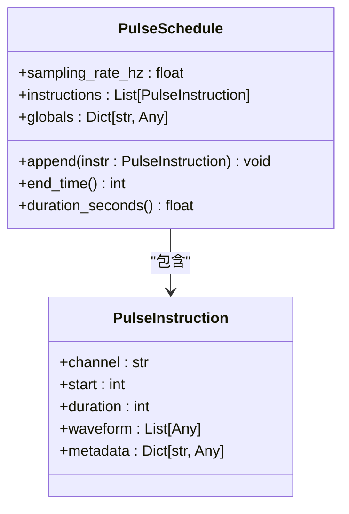
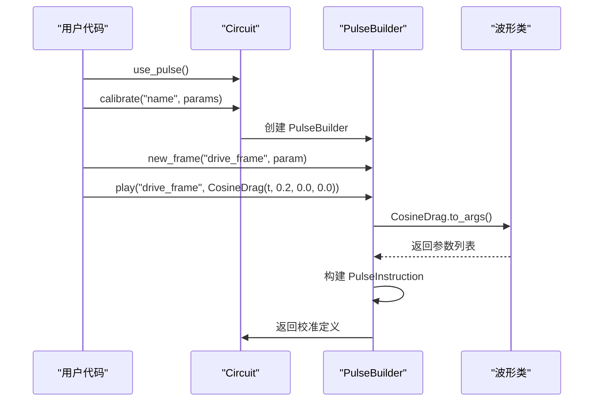
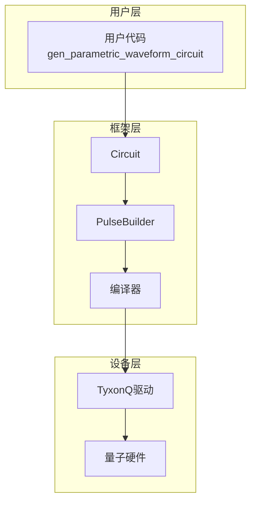

# 脉冲级控制

<cite>
**Referenced Files in This Document**   
- [pulse.py](file://src/tyxonq/core/ir/pulse.py)
- [pulse_demo.py](file://examples/pulse_demo.py)
- [waveforms.py](file://src/tyxonq/waveforms.py)
- [circuit.py](file://src/tyxonq/core/ir/circuit.py)
- [driver.py](file://src/tyxonq/devices/hardware/tyxonq/driver.py)
</cite>

## 目录
1. [引言](#引言)
2. [核心组件](#核心组件)
3. [脉冲指令构建流程](#脉冲指令构建流程)
4. [脉冲序列应用实例](#脉冲序列应用实例)
5. [系统集成架构](#系统集成架构)
6. [性能优化与误差抑制](#性能优化与误差抑制)
7. [常见问题排查](#常见问题排查)
8. [性能调优建议](#性能调优建议)

## 引言

脉冲级控制（Pulse-Level Control）是量子计算系统中实现高精度量子门操作的核心技术。通过直接定义和操控量子硬件的底层微波脉冲信号，该技术能够超越传统门级抽象的限制，实现对量子比特的精细化控制。本文档深入解析TyxonQ框架中脉冲级控制的实现机制，涵盖从波形生成、时序编排到通道映射的完整流程。通过分析核心类与方法，结合实际代码示例，展示如何构建自定义脉冲序列以优化单/双量子比特门的保真度。同时，阐述该功能与编译器、设备驱动的集成关系，讨论其在量子误差抑制和高精度控制中的关键作用。

## 核心组件

脉冲级控制的核心由`PulseInstruction`和`PulseSchedule`两个数据类构成，定义于`src/tyxonq/core/ir/pulse.py`中。`PulseInstruction`代表针对特定硬件通道的单个脉冲指令，包含通道标识、起始时间、持续时间、波形数据和元数据等关键字段。`PulseSchedule`则是一个包含采样率和指令列表的脉冲时序集合，提供了`append`、`end_time`和`duration_seconds`等方法来管理脉冲序列的构建与时间计算。

**Diagram sources**
- [pulse.py](file://src/tyxonq/core/ir/pulse.py#L1-L67)

**Section sources**
- [pulse.py](file://src/tyxonq/core/ir/pulse.py#L1-L67)

## 脉冲指令构建流程

构建脉冲指令的流程始于`Circuit`类的`use_pulse`和`calibrate`方法。`use_pulse`方法启用脉冲模式，而`calibrate`方法创建一个`PulseBuilder`实例，用于定义参数化的脉冲序列。在`PulseBuilder`中，`new_frame`方法创建一个新的脉冲帧，`play`方法将特定波形应用到该帧上。波形由`waveforms.py`中定义的各类波形类（如`CosineDrag`、`Gaussian`等）生成，这些类封装了波形参数并提供QASM名称和参数列表。

**Diagram sources**
- [circuit.py](file://src/tyxonq/core/ir/circuit.py#L500-L538)
- [pulse_demo.py](file://examples/pulse_demo.py#L20-L40)
- [waveforms.py](file://src/tyxonq/waveforms.py#L1-L98)

**Section sources**
- [circuit.py](file://src/tyxonq/core/ir/circuit.py#L500-L538)
- [pulse.py](file://src/tyxonq/core/ir/pulse.py#L1-L67)
- [waveforms.py](file://src/tyxonq/waveforms.py#L1-L98)

## 脉冲序列应用实例

`examples/pulse_demo.py`中的代码展示了如何实现一个参数化的拉比振荡（Rabi Oscillation）实验。通过`gen_parametric_waveform_circuit`函数，创建一个单量子比特电路，并使用`calibrate`方法定义一个名为"hello_world"的校准。该校准使用`CosineDrag`波形，其持续时间`t`作为参数。`run_hello_world`函数遍历不同的脉冲时长，提交任务到"homebrew_s2"设备，并收集结果。此实例清晰地演示了如何通过调整脉冲参数来探索量子门的最优工作点，从而优化门保真度。

**Section sources**
- [pulse_demo.py](file://examples/pulse_demo.py#L1-L81)

## 系统集成架构

脉冲级控制功能与编译器和设备驱动紧密集成。当电路包含脉冲校准时，编译器会将其转换为底层硬件可执行的指令集。设备驱动（如`src/tyxonq/devices/hardware/tyxonq/driver.py`中的`submit_task`）负责将编译后的脉冲序列提交到实际量子硬件。`TyxonQTask`类封装了任务状态和结果，`get_task_details`方法用于轮询任务状态并获取最终结果。整个流程通过`Circuit.run`或`submit_task`方法触发，实现了从高级抽象到物理执行的无缝衔接。

**Diagram sources**
- [circuit.py](file://src/tyxonq/core/ir/circuit.py#L539-L550)
- [driver.py](file://src/tyxonq/devices/hardware/tyxonq/driver.py#L82-L124)
- [pulse_demo.py](file://examples/pulse_demo.py#L45-L81)

**Section sources**
- [circuit.py](file://src/tyxonq/core/ir/circuit.py#L539-L550)
- [driver.py](file://src/tyxonq/devices/hardware/tyxonq/driver.py#L82-L182)

## 性能优化与误差抑制

脉冲级控制在量子误差抑制和高精度控制中发挥着至关重要的作用。通过精确设计脉冲波形（如使用DRAG脉冲抑制泄漏误差），可以显著提高单量子比特门的保真度。时序编排功能允许用户精细控制脉冲的起始和持续时间，从而优化双量子比特门的执行。此外，参数化脉冲序列支持扫描实验，帮助用户找到最优的脉冲参数，进一步提升门操作的性能。这种底层控制能力是实现高保真度量子计算的关键。

## 常见问题排查

在使用脉冲级控制时，可能会遇到脉冲时序冲突或硬件兼容性限制等问题。脉冲时序冲突通常发生在多个脉冲指令在同一通道上重叠时，需要确保`PulseInstruction`的`start`和`duration`参数不产生冲突。硬件兼容性限制则涉及设备支持的采样率、波形类型和通道配置。用户应查阅设备规格，确保生成的脉冲序列符合硬件要求。目前的代码实现中未包含详细的错误处理逻辑，因此在遇到问题时，建议检查脉冲参数的有效性和设备状态。

**Section sources**
- [pulse.py](file://src/tyxonq/core/ir/pulse.py#L1-L67)
- [driver.py](file://src/tyxonq/devices/hardware/tyxonq/driver.py#L82-L182)

## 性能调优建议

为了获得最佳性能，建议采取以下调优措施：首先，合理设置`PulseSchedule`的`sampling_rate_hz`，以平衡时间分辨率和计算开销。其次，利用参数化波形进行系统性扫描，以找到最优的脉冲参数。再者，尽量减少不必要的脉冲指令，以降低序列复杂度和执行时间。最后，充分利用`PulseSchedule`的`end_time`和`duration_seconds`方法进行时序验证，确保脉冲序列的正确性。通过这些措施，可以有效提升脉冲级控制的效率和可靠性。