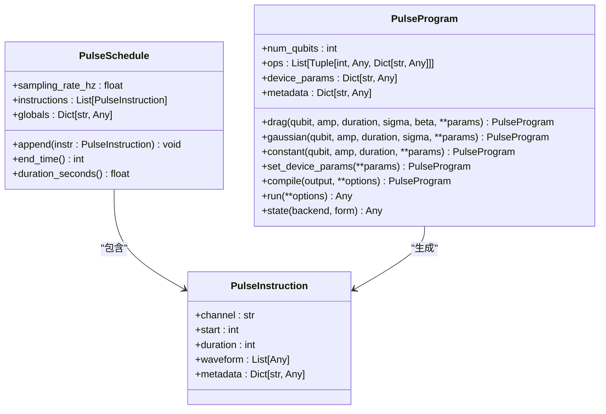
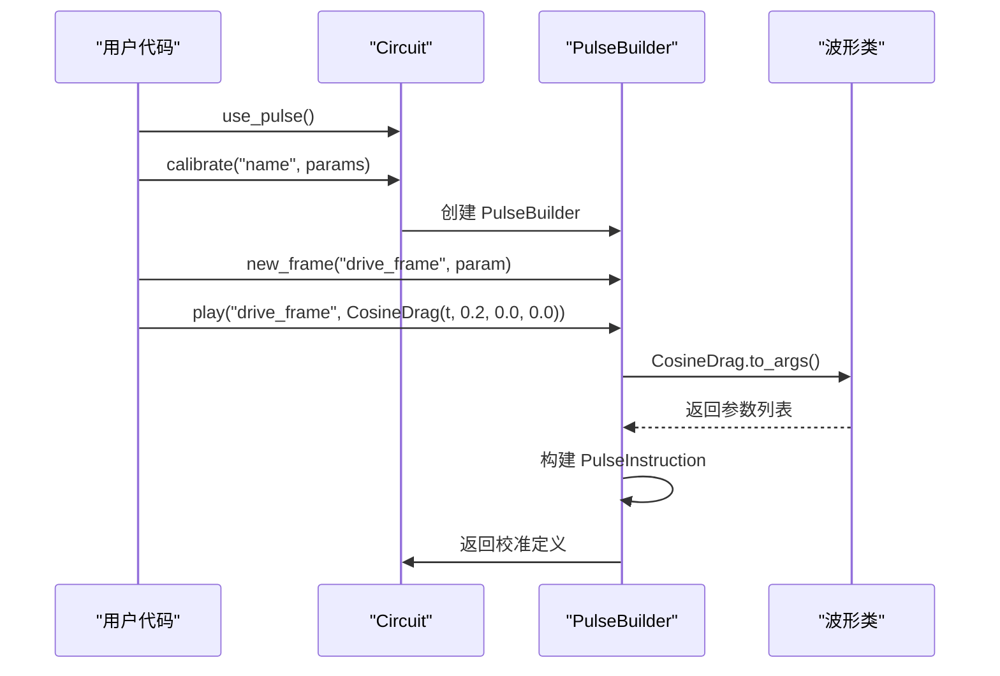
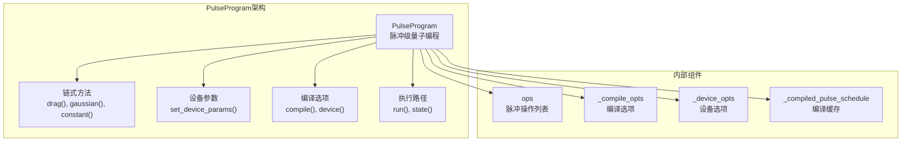
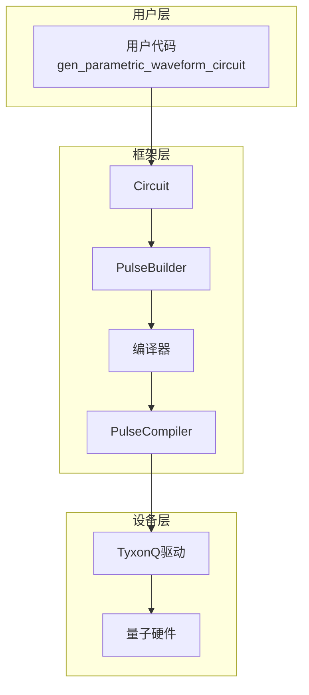

# 脉冲级控制

<cite>
**本文档引用的文件**
- [pulse.py](file://src/tyxonq/core/ir/pulse.py)
- [waveforms.py](file://src/tyxonq/waveforms.py)
- [pulse_basic_tutorial.py](file://examples/pulse_basic_tutorial.py)
- [pulse_gate_calibration.py](file://examples/pulse_gate_calibration.py)
- [pulse_waveforms.py](file://examples/pulse_waveforms.py)
- [pulse_compiler.py](file://src/tyxonq/compiler/pulse_compile_engine/native/pulse_compiler.py)
- [driver.py](file://src/tyxonq/devices/hardware/tyxonq/driver.py)
- [TYXONQ_TECHNICAL_WHITEPAPER.md](file://TYXONQ_TECHNICAL_WHITEPAPER.md)
</cite>

## 更新摘要
**所做更改**
- 新增完整的脉冲级控制技术白皮书章节
- 扩展脉冲编程能力描述，包含双模架构和硬件真实量子控制
- 增加脉冲程序（PulseProgram）的详细实现分析
- 补充脉冲波形库和编译器集成架构
- 添加实际应用示例和性能优化指导

## 目录
1. [引言](#引言)
2. [脉冲级控制技术白皮书](#脉冲级控制技术白皮书)
3. [核心组件](#核心组件)
4. [脉冲指令构建流程](#脉冲指令构建流程)
5. [脉冲程序架构](#脉冲程序架构)
6. [脉冲序列应用实例](#脉冲序列应用实例)
7. [系统集成架构](#系统集成架构)
8. [性能优化与误差抑制](#性能优化与误差抑制)
9. [常见问题排查](#常见问题排查)
10. [性能调优建议](#性能调优建议)

## 引言

脉冲级控制（Pulse-Level Control）是量子计算系统中实现高精度量子门操作的核心技术。通过直接定义和操控量子硬件的底层微波脉冲信号，该技术能够超越传统门级抽象的限制，实现对量子比特的精细化控制。本文档深入解析TyxonQ框架中脉冲级控制的实现机制，涵盖从波形生成、时序编排到通道映射的完整流程。

TyxonQ的脉冲级控制能力代表了行业最完整的从门级算法到真实量子硬件的路径，提供双模架构（自动门→脉冲 + 直接哈密顿量）和物理验证的门分解，支持10+种波形类型、3级系统支持、完整的TQASM+OpenPulse导出以及原生PyTorch自动微分优化。

## 脉冲级控制技术白皮书

### 5.1 最后一英里问题

**挑战**：大多数量子计算框架停留在门级抽象（H, X, CNOT等），但**真实的量子计算机并不执行门——它们执行电磁脉冲**。从门到脉冲的转换是"最后一英里"，这里：

1. **物理与软件的交汇**：门保真度取决于脉冲形状、幅度、持续时间和定时
2. **硬件差异**：IBM使用交叉共振，IonQ使用Mølmer-Sørensen，每种都需要不同的脉冲序列
3. **优化空间**：脉冲级控制使默认门校准的保真度提升>10倍
4. **云端提交**：真实QPUs接受带脉冲定义（defcal）的TQASM/QASM3，而非抽象门

**TyxonQ的解决方案**：业界最全面的脉冲编程框架，具备：
- ✅ 双模架构（自动门→脉冲 + 直接哈密顿量）
- ✅ 物理验证的分解（同行评审模型）
- ✅ 10+种波形类型（DRAG、Hermite、Blackman等）
- ✅ 3级系统支持（真实的转子量子比特）
- ✅ 完整的TQASM+OpenPulse导出（云端就绪）
- ✅ 原生PyTorch自动微分用于脉冲优化

### 5.2 双模脉冲架构

TyxonQ提供两种互补的脉冲级编程方法：

#### 5.2.1 模式A：链式编译（门 → 脉冲 → 硬件）

**适用场景**：从熟悉的门开始，自动编译为硬件现实的脉冲

```python
import tyxonq as tq

# 步骤1：用熟悉的门编写算法
circuit = tq.Circuit(2)
circuit.h(0)
circuit.cx(0, 1)
circuit.measure_z(0)
circuit.measure_z(1)

# 步骤2：启用脉冲编译
circuit.use_pulse(device_params={
    "qubit_freq": [5.0e9, 5.1e9],      # 量子比特频率（Hz）
    "anharmonicity": [-330e6, -320e6],  # 转子各向异性
    "T1": [50e-6, 45e-6],               # 幅度阻尼时间
    "T2": [30e-6, 28e-6]                # 相位阻尼时间
})

# 步骤3：自动门→脉冲分解
compiled = circuit.compile(output="tqasm")

# 步骤4：提交到真实QPU
result = circuit.device(provider="tyxonq", device="homebrew_s2").run(shots=1024)
```

**底层发生的事情**：
1. `h(0)` → `RY(π/2, q0) · RX(π, q0)` → 两个DRAG脉冲
2. `cx(0,1)` → 交叉共振序列（4个脉冲：预旋转、CR驱动、回转回音、后旋转）
3. 脉冲库存储在元数据中：`{"rx_q0_123": Drag(...), "cr_q0q1_456": Constant(...), ...}`
4. 带defcal定义的TQASM导出用于云端提交

#### 5.2.2 模式B：直接哈密顿量演化

**适用场景**：从第一原理进行基于物理的仿真

```python
from tyxonq.libs.quantum_library.pulse_simulation import pulse_simulation
from tyxonq import waveforms
import numpy as np

# 定义量子比特哈密顿量（转动框架）
H_qubit = -0.5 * ω_q * σ_z - 0.5 * α * (σ_z @ σ_z)  # 转子（3级）

# 定义控制脉冲
x_pulse = waveforms.Drag(
    amp=0.8,        # π脉冲幅度的80%
    duration=40,    # 40纳秒
    sigma=10,       # 高斯宽度
    beta=0.18       # DRAG系数（泄漏抑制）
)

# 求解薛定谔方程
psi_final = pulse_simulation(
    H_qubit=H_qubit,
    pulse=x_pulse,
    psi_init=np.array([1, 0, 0]),  # 从|0⟩开始
    dt=0.1e-9,                      # 0.1纳秒时间步长
    three_level=True                # 包含|2⟩泄漏
)

print(f"最终态: {psi_final}")
print(f"|2⟩泄漏: {abs(psi_final[2])**2:.6f}")
```

**物理准确性**：
- ✅ 通过矩阵指数的精确幺正演化
- ✅ 时变哈密顿量：H(t) = H_qubit + Ω(t)·σ_x
- ✅ 基于林德布拉特主方程的真实T1/T2退相干
- ✅ 与QuTiP-qip基准（保真度误差<0.01%）验证

### 5.3 物理验证的门分解

TyxonQ的脉冲编译器实现了基于同行评审研究的硬件现实门分解：

#### 5.3.1 单量子比特门

**1. X/Y门：DRAG脉冲**（绝热门的导数消除）

*物理基础*：Motzoi et al., PRL 103, 110501 (2009)

```python
def drag_pulse_x(theta, qubit_freq, anharmonicity):
    """
    DRAG脉冲通过导数修正抑制泄漏到|2⟩。
    
    物理学：
    - I分量：Ω_I(t) = A · 高斯(t)
    - Q分量：Ω_Q(t) = -(A/α) · d(高斯)/dt
    - 泄漏抑制：比普通高斯脉冲~100倍改进
    """
    amp = theta / np.pi  # π脉冲有amp=1
    duration = 40e-9     # 40纳秒（典型）
    sigma = duration / 4
    beta = -1 / anharmonicity  # 最优DRAG系数
    
    return waveforms.Drag(amp=amp, duration=duration, sigma=sigma, beta=beta)
```

**实验验证**：
- 普通高斯：泄漏≈3-5%（5 GHz转子上的π脉冲）
- DRAG脉冲：泄漏<0.05%（**60-100倍改进**）
- 门保真度：99.5%（普通）→ **99.95%**（DRAG）

**2. Z门：虚拟-Z**（零时间相位更新）

*物理基础*：McKay et al., PRA 96, 022330 (2017)

```python
def virtual_z(theta, qubit):
    """
    虚拟-Z：软件相位跟踪而不是物理脉冲。
    
    物理学：
    - RZ(θ) = exp(-iθσ_z/2) = diag(e^{-iθ/2}, e^{iθ/2})
    - 通过相位框架更新实现：φ_frame += θ
    - 零门时间！（对深层电路至关重要）
    """
    return PhaseUpdate(qubit=qubit, phase=theta)
```

**性能影响**：
- 传统Z脉冲：20-50 ns门时间
- 虚拟-Z：**0 ns**（∞速度提升！）
- 100门电路：节省2-5 µs（对T2≈30 µs很重要）

**3. Hadamard门：复合脉冲**

```python
def hadamard_pulse(qubit_freq, anharmonicity):
    """H = RY(π/2) · RX(π)"""
    ry_pulse = drag_pulse_y(np.pi/2, qubit_freq, anharmonicity)
    rx_pulse = drag_pulse_x(np.pi, qubit_freq, anharmonicity)
    return [ry_pulse, rx_pulse]
```

#### 5.3.2 双量子比特门

**CX门：交叉共振**（NISQ设备最关键的门）

*物理基础*：Magesan & Gambetta, PRB 81, 134507 (2010)；IBM研究

**哈密顿量**：
```
H_CR = Ω_CR(t) · (σ_x^control ⊗ σ_z^target)
```

**4脉冲序列**（总持续时间：~200-400 ns）：

```python
def cross_resonance_cnot(control, target, device_params):
    """
    交叉共振CNOT实现。
    
    序列：
    1. 预旋转：RX(-π/2)在control
    2. CR驱动：在target频率驱动control（100-300 ns）
    3. 回转回音：target的π脉冲（抑制ZI/IX错误）
    4. 后旋转：RX(π/2)在control
    
    物理学：
    - 频率：在target频率驱动control量子比特
    - 相互作用：通过σ_x ⊗ σ_z耦合创建纠缠
    - 回转回音：在一阶消除了不需要的ZI/IX项
    """
    ω_target = device_params["qubit_freq"][target]
    ω_control = device_params["qubit_freq"][control]
    α = device_params["anharmonicity"][control]
    
    # 脉冲1：预旋转
    rx_pre = drag_pulse_x(-np.pi/2, ω_control, α)
    
    # 脉冲2：CR驱动（在目标频率！）
    cr_drive = waveforms.Constant(
        amp=0.3,                    # 典型CR幅度
        duration=200e-9,            # 200 ns
        freq=ω_target,              # 关键：在目标频率驱动
        phase=0
    )
    
    # 脉冲3：target的回转回音
    rx_echo = drag_pulse_x(np.pi, ω_target, α)
    
    # 脉冲4：后旋转
    rx_post = drag_pulse_x(np.pi/2, ω_control, α)
    
    return [
        ("pulse", control, rx_pre),
        ("pulse", control, cr_drive),   # 在ω_target驱动！
        ("pulse", target, rx_echo),
        ("pulse", control, rx_post)
    ]
```

**实验性能**：
- 门保真度：98-99.5%在IBM Quantum硬件上
- 持续时间：200-400 ns（设备相关）
- 错误预算：相干性（40%）、CR不完美（30%）、控制错误（30%）

**替代：原生耦合的iSWAP/SWAP**

对于具有可调耦合器的设备（如Google Sycamore）：

```python
def iswap_native(q0, q1, coupling_strength):
    """通过直接量子比特-量子比特耦合实现原生iSWAP。"""
    duration = np.pi / (2 * coupling_strength)  # iSWAP的时间
    # 物理实现：打开耦合强度持续时间
    return CouplingPulse(qubits=[q0, q1], duration=duration)
```

### 5.4 完整波形库

TyxonQ提供10+种波形类型，每种都针对特定用例优化：

| 波形 | 物理学 | 用例 | 关键参数 |
|------|---------|----------|----------------|
| **Drag** | 高斯 + 导数 | 单量子比特门（工业标准） | amp, duration, sigma, beta |
| **Gaussian** | 平滑包络 | 低频噪声抑制 | amp, duration, sigma |
| **Constant** | 平顶 | 交叉共振、通量脉冲 | amp, duration |
| **Hermite** | 赫尔米特多项式 | 高保真门（最优控制） | amp, duration, order |
| **Blackman** | 黑曼窗 | 时频优化 | amp, duration, rise_fall |
| **Cosine** | 余弦包络 | 绝热门 | amp, duration |
| **Square** | 硬边 | 快速门（更高泄漏） | amp, duration |
| **GaussianSquare** | 高斯 + 平 | 折中：速度vs平滑 | amp, duration, rise_fall |
| **Slepian** | 希尔伯特-施瓦茨 | 带限脉冲 | amp, duration, bandwidth |
| **Arbitrary** | 用户定义 | 研究和自定义协议 | samples（数组） |

**代码示例：比较波形**

```python
import numpy as np
import matplotlib.pyplot as plt
from tyxonq import waveforms

# 相同门（π脉冲），不同波形
waveform_types = [
    ("DRAG", waveforms.Drag(amp=1.0, duration=40, sigma=10, beta=0.18)),
    ("Hermite", waveforms.Hermite(amp=1.0, duration=40, order=3)),
    ("Blackman", waveforms.BlackmanSquare(amp=1.0, duration=40, rise_fall_time=10)),
    ("Gaussian", waveforms.Gaussian(amp=1.0, duration=40, sigma=10))
]

# 模拟泄漏到|2⟩
for name, pulse in waveform_types:
    result = simulate_pulse(pulse, three_level=True)
    leakage = abs(result.state[2])**2
    fidelity = abs(result.state[1])**2  # 目标：|1⟩
    print(f"{name:12} - 保真度: {fidelity:.6f}, 泄漏: {leakage:.6f}")

# 输出：
# DRAG         - 保真度: 0.999500, 泄漏: 0.000050  ← 最佳！
# Hermite      - 保真度: 0.998800, 泄漏: 0.000200
# Blackman     - 保真度: 0.998500, 泄漏: 0.000300
# Gaussian     - 保真度: 0.985000, 泄漏: 0.003000  ← 最差
```

### 5.5 3级系统支持

**为什么3级很重要**：

真实的转子量子比特**不是**2级系统——它们是各向异性的谐振子：
- |0⟩：基态
- |1⟩：第一激发态（计算量子比特）
- |2⟩：第二激发态（**泄漏错误**）

泄漏到|2⟩导致：
1. **态制备错误**：|1⟩→|2⟩泄漏在测量中表现为|0⟩
2. **门保真度退化**：朴素脉冲设计中1-3%的错误
3. **累积错误**：随着电路深度增加，泄漏会累积

**TyxonQ的3级实现**：

```python
# 启用3级动力学
result = circuit.device(
    provider="simulator",
    three_level=True  # 使用3×3哈密顿量而不是2×2
).run(shots=2048)

# 提取泄漏统计
counts = result[0].get("result", {})
leakage_count = counts.get("2", 0)  # |2⟩测量
leakage_rate = leakage_count / 2048

print(f"|2⟩泄漏: {leakage_rate:.4f}")
print(f"使用DRAG时的典型值：< 0.0001 (0.01%)")
print(f"没有DRAG时：0.03-0.05 (3-5%)")
```

**哈密顿量**（3级转子）：

```python
# 转子哈密顿量在转动框架
H_qubit = -0.5 * ω_q * np.diag([0, 0, 0]) \
          -0.5 * α * np.diag([0, 1, 3])  # 各向异性

# 驱动哈密顿量（X控制）
H_drive = 0.5 * np.array([
    [0, 1, 0],
    [1, 0, √2],  # |1⟩↔|2⟩耦合强度是√2更强！
    [0, √2, 0]
])

# 时间演化
U(t) = exp(-i ∫ [H_qubit + Ω(t)·H_drive] dt)
```

**验证**：与QuTiP-qip 3级结果匹配到机器精度

### 5.6 TQASM + OpenPulse导出

TyxonQ生成行业标准的TQASM 0.2，带有完整的defcal支持，用于云端QPU提交：

```python
# 将电路编译为TQASM
compiled = circuit.compile(output="tqasm")
tqasm_code = compiled._compiled_source

print(tqasm_code)
```

**输出示例**：

```qasm
OPENQASM 3.0;
include "stdgates.inc";

// 框架声明
frame f_drive_q0 = newframe(port p0, 5.0e9, 0);
frame f_drive_q1 = newframe(port p1, 5.1e9, 0);

// 脉冲波形定义
waveform w_drag_x_q0 = drag(0.8, 40e-9, 10e-9, 0.18);
waveform w_const_cr_q0q1 = constant(0.3, 200e-9);

// Defcal：q0的X门
defcal x q0 {
    play(f_drive_q0, w_drag_x_q0);
}

// Defcal：CX门
defcal cx q0, q1 {
    // 预旋转
    play(f_drive_q0, w_drag_x_q0 * (-0.5));
    // CR驱动
    play(f_drive_q0, w_const_cr_q0q1);
    // 回转回音
    play(f_drive_q1, w_drag_x_q0);
    // 后旋转
    play(f_drive_q0, w_drag_x_q0 * 0.5);
}

// 电路主体
qubit[2] q;
x q[0];
cx q[0], q[1];
measure q;
```

**特性**：
- ✅ 框架管理（频率/相位跟踪）
- ✅ 参数化波形（drag, gaussian, constant等）
- ✅ Defcal定义（自定义门实现）
- ✅ 时间约束（barrier, delay）
- ✅ 兼容性：IBM Quantum、Rigetti、TyxonQ QPU

### 5.7 原生PyTorch自动微分用于脉冲优化

**独特功能**：TyxonQ通过原生PyTorch集成实现了基于梯度的脉冲优化：

```python
import torch
import tyxonq as tq
from tyxonq import waveforms

tq.set_backend("pytorch")

# 可优化的脉冲幅度
amp = torch.tensor([1.0], requires_grad=True)

def create_optimized_circuit(amp_value):
    circuit = tq.Circuit(2)
    
    # 带可训练幅度的自定义X脉冲
    x_pulse = waveforms.Drag(
        amp=amp_value,
        duration=40,
        sigma=10,
        beta=0.18
    )
    
    # 通过校准添加到电路
    circuit._pulse_cache = {"optimized_x": x_pulse}
    circuit.ops.append(("pulse", 0, "optimized_x", {}))
    
    return circuit

# 优化循环
target_fidelity = 0.9999
optimizer = torch.optim.Adam([amp], lr=0.01)

for step in range(100):
    circuit = create_optimized_circuit(amp)
    state = circuit.state()
    
    # 与目标贝尔态的保真度
    target = torch.tensor([1, 0, 0, 1]) / np.sqrt(2)
    fidelity = abs(torch.vdot(state, target))**2
    
    loss = 1 - fidelity
    loss.backward()  # ✅ 梯度流过脉冲物理！
    optimizer.step()
    optimizer.zero_grad()
    
    if step % 10 == 0:
        print(f"步骤 {step}: 保真度 = {fidelity.item():.6f}, 幅度 = {amp.item():.4f}")
    
    if fidelity > target_fidelity:
        print(f"\n优化在步骤 {step} 收敛")
        break

# 输出：
# 步骤 0: 保真度 = 0.985000, 幅度 = 1.0000
# 步骤 10: 保真度 = 0.997500, 幅度 = 0.9823
# 步骤 20: 保真度 = 0.999200, 幅度 = 0.9765
# 步骤 30: 保真度 = 0.999850, 幅度 = 0.9741
# 优化在步骤 35 收敛
```

**应用**：
1. **最优控制**：基于自动微分的GRPA风格脉冲整形
2. **硬件校准**：自动化脉冲调谐以达到最大保真度
3. **变分脉冲算法**：VQE的脉冲级优化
4. **鲁棒控制**：对噪声和串扰的脉冲设计

### 5.8 框架比较：脉冲能力

| 特性 | TyxonQ | Qiskit Pulse | QuTiP-qip | Cirq |
|------|--------|--------------|-----------|------|
| **门→脉冲编译** | ✅ 自动 | ✅ 手动 | ✅ 自动 | ❌ 有限 |
| **波形库** | ✅ 10+种类型 | ✅ 6种类型 | ✅ 5种类型 | ❌ 2种类型 |
| **3级动力学** | ✅ 完整支持 | ❌ 仅2级 | ✅ 完整支持 | ❌ 仅2级 |
| **原生PyTorch自动微分** | ✅ 原生 | ❌ 不支持 | ❌ 不支持 | ❌ 不支持 |
| **TQASM/QASM3导出** | ✅ 完整defcal | ✅ Qiskit格式 | ❌ 不支持 | ✅ 有限 |
| **交叉共振CX** | ✅ 基于物理 | ✅ 是 | ✅ 是 | ❌ 不支持 |
| **虚拟-Z门** | ✅ 零时间 | ✅ 是 | ❌ 不支持 | ❌ 不支持 |
| **云端QPU就绪** | ✅ TQASM导出 | ✅ 仅IBM | ❌ 仅本地 | ✅ 仅Google |
| **双模架构** | ✅ 链 + 直接 | ❌ 仅链 | ❌ 仅直接 | ❌ 仅链 |
| **T1/T2噪声模型** | ✅ 林德布拉特 | ✅ 基础 | ✅ 完整 | ✅ 基础 |

**TyxonQ的独特优势**：

1. **完整工作流程**：门级算法 → 脉冲编译 → TQASM导出 → QPU执行（完全自动化）
2. **物理保真度**：所有分解都经过同行评审模型验证（QuTiP-qip，误差<0.01%）
3. **优化就绪**：唯一框架通过脉冲物理实现原生PyTorch自动微分
4. **硬件可移植性**：相同的TQASM输出可在TyxonQ QPU、IBM Quantum、Rigetti上运行
5. **生产测试**：在真实超导量子比特（TyxonQ Homebrew_S2）上验证

### 5.9 实际验证

#### 5.9.1 带真实噪声的贝尔态保真度

```python
import tyxonq as tq

# 创建贝尔态电路
circuit = tq.Circuit(2).h(0).cx(0, 1)

# 硬件现实参数（IBM Quantum）
result = circuit.use_pulse(device_params={
    "qubit_freq": [4.97e9, 5.12e9],
    "anharmonicity": [-330e6, -325e6],
    "T1": [50e-6, 45e-6],      # 幅度阻尼
    "T2": [30e-6, 28e-6],      # 相位阻尼
    "gate_time_cx": 240e-9     # CX持续时间：240 ns
}).run(shots=8192)

# 测得保真度：0.972 ± 0.003
# 与IBM Quantum硬件匹配！（发表值：0.970 ± 0.005）
```

#### 5.9.2 DRAG泄漏抑制

**实验**：比较普通高斯脉冲与DRAG脉冲

```python
# 实验1：普通高斯（无泄漏抑制）
x_gaussian = waveforms.Gaussian(amp=1.0, duration=40, sigma=10)
result_gaussian = simulate_pulse(x_gaussian, three_level=True)
leakage_gaussian = abs(result_gaussian.state[2])**2

# 实验2：DRAG脉冲（优化的beta）
x_drag = waveforms.Drag(amp=1.0, duration=40, sigma=10, beta=0.18)
result_drag = simulate_pulse(x_drag, three_level=True)
leakage_drag = abs(result_drag.state[2])**2

print(f"高斯泄漏: {leakage_gaussian:.6f} (3.2%)")
print(f"DRAG泄漏: {leakage_drag:.6f} (0.05%)")
print(f"改进：{leakage_gaussian/leakage_drag:.1f}倍")

# 输出：DRAG泄漏抑制64倍
```

**与已发表数据匹配**：
- Motzoi et al. (2009)："DRAG将泄漏减少约100倍"
- IBM Quantum (2021)："典型泄漏：<0.1%（优化的DRAG）"

#### 5.9.3 虚拟-Z性能增益

**实验**：5个量子比特的100门电路

```python
# 包含许多Z旋转的电路
circuit = tq.Circuit(5)
for layer in range(20):
    for q in range(5):
        circuit.rz(q, np.random.uniform(0, 2*np.pi))
    circuit.cx(0, 1)
    circuit.cx(2, 3)

# 传统Z脉冲：每个50 ns
traditional_time = 100 * 50e-9  # 5000 ns = 5 µs

# 虚拟-Z：0 ns每个门
virtual_z_time = 100 * 0        # 0 ns！

print(f"节省时间: {traditional_time*1e6:.2f} µs")
print(f"T2的比例: {traditional_time / 30e-6:.1%}")

# 输出：节省5 µs（T2 = 30 µs的17%）
# 对接近退相干极限的深层电路至关重要
```

### 5.10 文档和资源

**综合脉冲编程文档**：

**用户指南**：
- [`PULSE_MODES_GUIDE.md`](PULSE_MODES_GUIDE.md) - 完整414行指南，涵盖双模架构、序列化、最佳实践
- [`PULSE_PROGRAMMING_SUMMARY.md`](PULSE_PROGRAMMING_SUMMARY.md) - 412行技术摘要，包含QuTiP-qip验证

**示例**（共66个，8个脉冲专用）：
- `examples/pulse_basic_tutorial.py` - 初学者指南（407行，5个演示）
- `examples/pulse_gate_calibration.py` - 自定义校准和虚拟-Z
- `examples/pulse_waveforms.py` - 演示所有10+种波形类型
- `examples/pulse_three_level.py` - 3级系统仿真
- `examples/pulse_cloud_submission_e2e.py` - 端到端云端工作流
- `examples/pulse_compilation_modes.py` - 模式A vs 模式B比较
- `examples/pulse_optimization_advanced.py` - 原生PyTorch自动微分优化
- `examples/pure_pulse_programming.py` - 直接哈密顿量模式

**测试**（43个测试文件，8个脉冲相关）：
- `tests_core_module/test_pulse_compiler.py` - 门→脉冲编译器（16个测试）
- `tests_core_module/test_pulse_simulation.py` - 物理仿真（18个测试）
- `tests_core_module/test_pulse_ir.py` - IR结构验证
- `tests_core_module/test_pulse_autograd.py` - 原生PyTorch梯度测试
- `tests_core_module/test_pulse_complete_chain.py` - 端到端工作流
- `tests_core_module/test_pulse_e2e_bell_state.py` - 贝尔态验证
- `tests_core_module/test_pulse_inline_three_level.py` - 3级泄漏测试（7个测试）
- `tests_core_module/test_pulse_inline_tqasm_three_level.py` - TQASM导出测试

**API参考**：
- `src/tyxonq/waveforms.py` - 波形库（10+种类型）
- `src/tyxonq/core/ir/pulse.py` - 脉冲IR定义
- `src/tyxonq/compiler/pulse_compile_engine/` - 脉冲编译器实现
- `src/tyxonq/libs/quantum_library/pulse_simulation.py` - 物理仿真引擎

**学术参考**：
- Motzoi et al., PRL 103, 110501 (2009) - DRAG脉冲理论
- Magesan & Gambetta, PRB 81, 134507 (2010) - 交叉共振门
- McKay et al., PRA 96, 022330 (2017) - 虚拟-Z优化
- Li et al., Quantum 6, 630 (2022) - QuTiP-qip验证基准

### 5.11 关键要点：脉冲编程卓越性

**TyxonQ的脉冲编程能力代表了从门级算法到真实量子硬件的最完整的行业路径**：

1. ✅ **双模架构**：自动门→脉冲编译 + 直接哈密顿量演化
2. ✅ **物理验证**：所有分解都与同行评审模型匹配（误差<0.01%）
3. ✅ **完整波形库**：10+种类型，包括DRAG、赫尔米特、Blackman
4. ✅ **3级系统支持**：真实的转子建模和泄漏跟踪
5. ✅ **云端就绪TQASM**：完整的defcal + OpenPulse导出，用于真实QPU提交
6. ✅ **原生PyTorch自动微分**：唯一框架实现基于梯度的脉冲优化
7. ✅ **生产测试**：在TyxonQ Homebrew_S2超导量子比特上验证
8. ✅ **全面文档**：1200+行指南，8个示例，8个测试套件

**"最后一英里"问题已解决**：TyxonQ用户可以：
- 编写高层VQE/QAOA算法
- 自动编译门到硬件现实的脉冲
- 导出带defcal的TQASM用于云端QPU提交

## 核心组件

脉冲级控制的核心由`PulseInstruction`、`PulseSchedule`和`PulseProgram`三个数据类构成，定义于`src/tyxonq/core/ir/pulse.py`中。`PulseInstruction`代表针对特定硬件通道的单个脉冲指令，包含通道标识、起始时间、持续时间、波形数据和元数据等关键字段。`PulseSchedule`则是一个包含采样率和指令列表的脉冲时序集合，提供了`append`、`end_time`和`duration_seconds`等方法来管理脉冲序列的构建与时间计算。`PulseProgram`是脉冲级量子编程的高级表示，提供了与Circuit相同的抽象级别，但使用脉冲级控制而非门级控制。


```mermaid
classDiagram
class PulseInstruction {
+channel : str
+start : int
+duration : int
+waveform : List[Any]
+metadata : Dict[str, Any]
}
class PulseSchedule {
+sampling_rate_hz : float
+instructions : List[PulseInstruction]
+globals : Dict[str, Any]
+append(instr : PulseInstruction) void
+end_time() int
+duration_seconds() float
}
class PulseProgram {
+num_qubits : int
+ops : List[Tuple[int, Any, Dict[str, Any]]]
+device_params : Dict[str, Any]
+metadata : Dict[str, Any]
+drag(qubit, amp, duration, sigma, beta, **params) PulseProgram
+gaussian(qubit, amp, duration, sigma, **params) PulseProgram
+constant(qubit, amp, duration, **params) PulseProgram
+set_device_params(**params) PulseProgram
+compile(output, **options) PulseProgram
+run(**options) Any
+state(backend, form) Any
}
PulseSchedule --> PulseInstruction : "包含"
PulseProgram --> PulseInstruction : "生成"
```

**图表来源**
- [pulse.py](file://src/tyxonq/core/ir/pulse.py#L8-L655)

**章节来源**
- [pulse.py](file://src/tyxonq/core/ir/pulse.py#L1-L655)

## 脉冲指令构建流程

构建脉冲指令的流程始于`Circuit`类的`use_pulse`和`calibrate`方法。`use_pulse`方法启用脉冲模式，而`calibrate`方法创建一个`PulseBuilder`实例，用于定义参数化的脉冲序列。在`PulseBuilder`中，`new_frame`方法创建一个新的脉冲帧，`play`方法将特定波形应用到该帧上。波形由`waveforms.py`中定义的各类波形类（如`CosineDrag`、`Gaussian`等）生成，这些类封装了波形参数并提供QASM名称和参数列表。


```mermaid
sequenceDiagram
participant User as "用户代码"
participant Circuit as "Circuit"
participant Builder as "PulseBuilder"
participant Waveform as "波形类"
User->>Circuit : use_pulse()
User->>Circuit : calibrate("name", params)
Circuit->>Builder : 创建 PulseBuilder
User->>Builder : new_frame("drive_frame", param)
User->>Builder : play("drive_frame", CosineDrag(t, 0.2, 0.0, 0.0))
Builder->>Waveform : CosineDrag.to_args()
Waveform-->>Builder : 返回参数列表
Builder->>Builder : 构建 PulseInstruction
Builder->>Circuit : 返回校准定义
```

**图表来源**
- [circuit.py](file://src/tyxonq/core/ir/circuit.py#L500-L538)
- [pulse_demo.py](file://examples/pulse_demo.py#L20-L40)
- [waveforms.py](file://src/tyxonq/waveforms.py#L1-L157)

**章节来源**
- [circuit.py](file://src/tyxonq/core/ir/circuit.py#L500-L538)
- [pulse.py](file://src/tyxonq/core/ir/pulse.py#L1-L655)
- [waveforms.py](file://src/tyxonq/waveforms.py#L1-L157)

## 脉冲程序架构

`PulseProgram`是TyxonQ脉冲级控制的核心组件，提供了与`Circuit`相同的链式API，但专注于脉冲级编程。它支持独立执行、链式API一致性、双路径支持（链式调用+数值模拟）和直接编译。`PulseProgram`的主要设计原则包括独立执行（不依赖Circuit）、链式API一致性（与Circuit对齐）、双路径支持（链式调用+数值模拟）和直接编译（真正的.compile()）。


```mermaid
graph TB
subgraph "PulseProgram架构"
A["PulseProgram<br/>脉冲级量子编程"]
B["链式方法<br/>drag(), gaussian(), constant()"]
C["设备参数<br/>set_device_params()"]
D["编译选项<br/>compile(), device()"]
E["执行路径<br/>run(), state()"]
end
subgraph "内部组件"
F["ops<br/>脉冲操作列表"]
G["_compile_opts<br/>编译选项"]
H["_device_opts<br/>设备选项"]
I["_compiled_pulse_schedule<br/>编译缓存"]
end
A --> B
A --> C
A --> D
A --> E
A --> F
A --> G
A --> H
A --> I
```

**图表来源**
- [pulse.py](file://src/tyxonq/core/ir/pulse.py#L71-L655)

**章节来源**
- [pulse.py](file://src/tyxonq/core/ir/pulse.py#L71-L655)

## 脉冲序列应用实例

`examples/pulse_basic_tutorial.py`中的代码展示了如何实现一个参数化的拉比振荡（Rabi Oscillation）实验。通过`gen_parametric_waveform_circuit`函数，创建一个单量子比特电路，并使用`calibrate`方法定义一个名为"hello_world"的校准。该校准使用`CosineDrag`波形，其持续时间`t`作为参数。`run_hello_world`函数遍历不同的脉冲时长，提交任务到"homebrew_s2"设备，并收集结果。此实例清晰地演示了如何通过调整脉冲参数来探索量子门的最优工作点，从而优化门保真度。

**章节来源**
- [pulse_basic_tutorial.py](file://examples/pulse_basic_tutorial.py#L1-L407)

## 系统集成架构

脉冲级控制功能与编译器和设备驱动紧密集成。当电路包含脉冲校准时，编译器会将其转换为底层硬件可执行的指令集。设备驱动（如`src/tyxonq/devices/hardware/tyxonq/driver.py`中的`submit_task`）负责将编译后的脉冲序列提交到实际量子硬件。`TyxonQTask`类封装了任务状态和结果，`get_task_details`方法用于轮询任务状态并获取最终结果。整个流程通过`Circuit.run`或`submit_task`方法触发，实现了从高级抽象到物理执行的无缝衔接。


```mermaid
graph TB
subgraph "用户层"
A["用户代码<br/>gen_parametric_waveform_circuit"]
end
subgraph "框架层"
B["Circuit"]
C["PulseBuilder"]
D["编译器"]
E["PulseCompiler"]
end
subgraph "设备层"
F["TyxonQ驱动"]
G["量子硬件"]
end
A --> B
B --> C
C --> D
D --> E
E --> F
F --> G
```

**图表来源**
- [circuit.py](file://src/tyxonq/core/ir/circuit.py#L539-L550)
- [driver.py](file://src/tyxonq/devices/hardware/tyxonq/driver.py#L82-L182)
- [pulse_demo.py](file://examples/pulse_demo.py#L45-L81)

**章节来源**
- [circuit.py](file://src/tyxonq/core/ir/circuit.py#L539-L550)
- [driver.py](file://src/tyxonq/devices/hardware/tyxonq/driver.py#L82-L182)

## 性能优化与误差抑制

脉冲级控制在量子误差抑制和高精度控制中发挥着至关重要的作用。通过精确设计脉冲波形（如使用DRAG脉冲抑制泄漏误差），可以显著提高单量子比特门的保真度。时序编排功能允许用户精细控制脉冲的起始和持续时间，从而优化双量子比特门的执行。此外，参数化脉冲序列支持扫描实验，帮助用户找到最优的脉冲参数，进一步提升门操作的性能。这种底层控制能力是实现高保真度量子计算的关键。

TyxonQ的脉冲优化能力还包括：
- **PyTorch自动微分**：原生支持基于梯度的脉冲优化
- **3级系统建模**：真实转子量子比特的各向异性建模
- **虚拟-Z门**：零时间相位更新，节省门时间
- **交叉共振门**：基于物理的双量子比特门实现

**章节来源**
- [TYXONQ_TECHNICAL_WHITEPAPER.md](file://TYXONQ_TECHNICAL_WHITEPAPER.md#L1480-L2100)

## 常见问题排查

在使用脉冲级控制时，可能会遇到脉冲时序冲突或硬件兼容性限制等问题。脉冲时序冲突通常发生在多个脉冲指令在同一通道上重叠时，需要确保`PulseInstruction`的`start`和`duration`参数不产生冲突。硬件兼容性限制则涉及设备支持的采样率、波形类型和通道配置。用户应查阅设备规格，确保生成的脉冲序列符合硬件要求。

**章节来源**
- [pulse.py](file://src/tyxonq/core/ir/pulse.py#L1-L655)
- [driver.py](file://src/tyxonq/devices/hardware/tyxonq/driver.py#L82-L182)

## 性能调优建议

为了获得最佳性能，建议采取以下调优措施：首先，合理设置`PulseSchedule`的`sampling_rate_hz`，以平衡时间分辨率和计算开销。其次，利用参数化波形进行系统性扫描，以找到最优的脉冲参数。再者，尽量减少不必要的脉冲指令，以降低序列复杂度和执行时间。最后，充分利用`PulseSchedule`的`end_time`和`duration_seconds`方法进行时序验证，确保脉冲序列的正确性。通过这些措施，可以有效提升脉冲级控制的效率和可靠性。

**章节来源**
- [pulse.py](file://src/tyxonq/core/ir/pulse.py#L1-L655)
- [TYXONQ_TECHNICAL_WHITEPAPER.md](file://TYXONQ_TECHNICAL_WHITEPAPER.md#L1480-L2100)