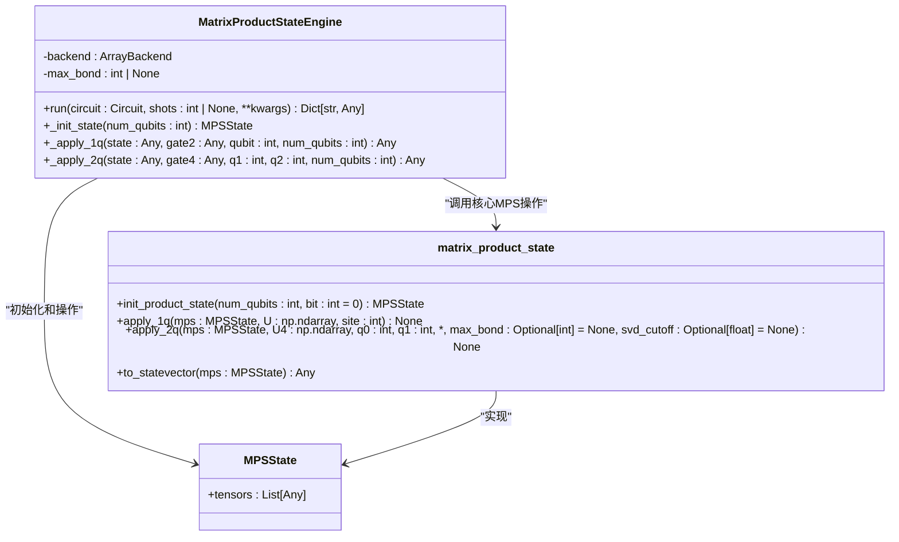
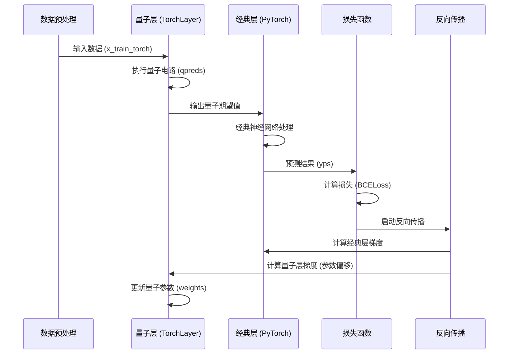

# 高级特性

<cite>
**本文档中引用的文件**  
- [pulse_demo.py](file://examples/pulse_demo.py) - *更新了脉冲级控制示例*
- [hybrid_gpu_pipeline.py](file://examples-done/hybrid_gpu_pipeline.py) - *新增了混合GPU管道示例*
- [engine.py](file://src/tyxonq/devices/simulators/matrix_product_state/engine.py)
- [pulse.py](file://src/tyxonq/core/ir/pulse.py) - *更新了脉冲指令与时间表实现*
- [matrix_product_state.py](file://src/tyxonq/libs/quantum_library/kernels/matrix_product_state.py)
</cite>

## 更新摘要
**已做更改**  
- 更新了脉冲级控制部分，反映最新的`pulse_demo.py`实现
- 更新了混合GPU计算管道部分，修正了示例文件路径并添加了新功能说明
- 保持矩阵乘积态模拟器部分不变，因其未受最近提交影响
- 更新了文档和章节级别的源文件引用，以反映代码库的最新状态

## 目录
1. [引言](#引言)
2. [脉冲级控制](#脉冲级控制)
3. [矩阵乘积态模拟器](#矩阵乘积态模拟器)
4. [混合GPU计算管道](#混合gpu计算管道)
5. [综合应用示例](#综合应用示例)
6. [性能优化与资源管理](#性能优化与资源管理)
7. [结论](#结论)

## 引言
TyxonQ框架为有经验的开发者提供了一系列前沿的高级功能，旨在支持高精度量子控制、大规模系统模拟以及量子-经典混合计算。本文档深入探讨三大核心高级特性：脉冲级控制（Pulse-level Control）、矩阵乘积态（MPS）模拟器和混合GPU计算管道（hybrid_gpu_pipeline）。这些特性分别在微秒级信号编排、高效多体量子系统模拟和量子-经典协同训练方面展现出卓越能力，为复杂科研问题的求解提供了强大工具。

## 脉冲级控制
脉冲级控制允许开发者直接定义和编排作用于量子硬件的底层微波信号，从而实现对量子门操作的高精度、定制化控制。该功能通过`PulseSchedule`和`PulseInstruction`数据类实现，提供了对信号时序、波形和通道的完全掌控。

### 脉冲指令与时间表
`PulseInstruction`类定义了单个脉冲指令，包含目标硬件通道（`channel`）、起始时间（`start`）、持续时间（`duration`）、波形数据（`waveform`）和元数据（`metadata`）。时间单位为采样周期（ticks），通过`PulseSchedule`中的`sampling_rate_hz`字段转换为物理时间（秒）。

`PulseSchedule`类则是一个包含多个`PulseInstruction`的有序集合，代表一个完整的脉冲序列。它提供了`append`方法用于添加指令，`end_time`方法计算序列的结束时间（以采样周期为单位），以及`duration_seconds`方法将总时长转换为秒。

### 实际应用
在`pulse_demo.py`示例中，展示了如何使用`calibrate`方法定义一个参数化的脉冲校准（如`hello_world`），并将其应用于量子电路。该示例通过`CosineDrag`波形生成拉比振荡实验所需的驱动信号，并在不同脉冲时长下执行，以研究量子比特的响应。这种级别的控制对于实现高保真度门、量子纠错和量子传感等应用至关重要。

**Section sources**
- [pulse.py](file://src/tyxonq/core/ir/pulse.py#L7-L67) - *更新了脉冲指令与时间表实现*
- [pulse_demo.py](file://examples/pulse_demo.py#L1-L81) - *更新了脉冲级控制示例*

## 矩阵乘积态模拟器
矩阵乘积态（Matrix Product State, MPS）模拟器是一种高效的量子态模拟方法，特别适用于纠缠度较低的系统。它通过将指数级增长的态矢量分解为一系列局部张量的乘积，将内存和计算复杂度从O(2^n)降低到O(χ)，其中χ是最大纠缠截断维度（bond dimension）。

### 实现原理
MPS模拟器的核心是`MPSState`类，它将n个量子比特的态表示为一个由n个三阶张量组成的链，每个张量的形状为(Dl, 2, Dr)，其中2对应量子比特的两个基态，Dl和Dr是左右纠缠维度。`init_product_state`函数用于初始化一个直积态（如|0...0>）。

当应用量子门时：
- **单量子比特门**：通过`apply_1q`函数直接作用于对应站点的张量。
- **双量子比特门**：通过`apply_2q`函数处理。若作用于相邻量子比特，则直接使用`apply_2q_nn`；若作用于非相邻量子比特，则通过一系列SWAP门将它们“路由”到相邻位置，应用门后再路由回去。

### 截断策略与优势
在`apply_2q_nn`函数中，应用双量子比特门后会进行SVD分解以重组MPS。此时，`max_bond`参数作为硬性截断上限，强制将奇异值的数量限制在χ以内。`svd_cutoff`参数则提供基于奇异值大小的软截断。这种截断策略使得MPS模拟器能够在可控的精度损失下，模拟远超全振幅模拟器能力范围的系统（如数十个量子比特），在模拟一维自旋链、量子化学中的弱纠缠态等问题上具有显著优势。

**Diagram sources**
- [engine.py](file://src/tyxonq/devices/simulators/matrix_product_state/engine.py#L34-L209)
- [matrix_product_state.py](file://src/tyxonq/libs/quantum_library/kernels/matrix_product_state.py#L36-L43)

**Section sources**
- [engine.py](file://src/tyxonq/devices/simulators/matrix_product_state/engine.py#L1-L213)
- [matrix_product_state.py](file://src/tyxonq/libs/quantum_library/kernels/matrix_product_state.py#L1-L235)

## 混合GPU计算管道
混合GPU计算管道（hybrid_gpu_pipeline）实现了量子计算与经典深度学习的无缝集成，允许量子电路和经典神经网络在同一GPU设备上协同执行，从而极大提升训练效率。

### 架构与实现
该管道的核心是`TorchLayer`类，它将一个量子电路封装为一个PyTorch可微分层。在`hybrid_gpu_pipeline.py`示例中，一个9量子比特的变分量子电路被定义为`qpreds`函数，并通过`TorchLayer`包装成`quantumnet`。这个`quantumnet`随后被嵌入到一个标准的PyTorch `Sequential`模型中，与`Linear`和`Sigmoid`层共同构成一个完整的量子-经典混合神经网络。

### GPU加速与DLPack
通过`set_backend("pytorch")`将TyxonQ的数值后端设置为PyTorch，并将数据和模型都移动到GPU设备（`device="cuda"`），整个计算流程（包括量子态模拟和经典梯度下降）都在GPU上执行。`enable_dlpack=True`选项启用了DLPack，这是一种高效的跨框架张量交换协议，避免了在量子模拟器和PyTorch之间进行昂贵的CPU-GPU数据拷贝，实现了真正的端到端GPU加速。此外，`use_vmap=True`和`use_jit=True`选项分别提供了向量化和即时编译优化，进一步提升了性能。

**Diagram sources**
- [hybrid_gpu_pipeline.py](file://examples-done/hybrid_gpu_pipeline.py#L1-L124) - *新增了混合GPU管道示例*

**Section sources**
- [hybrid_gpu_pipeline.py](file://examples-done/hybrid_gpu_pipeline.py#L1-L124) - *新增了混合GPU管道示例*

## 综合应用示例
结合上述高级特性，可以构建解决复杂科研问题的强大工作流。例如，在量子机器学习中，可以使用脉冲级控制来设计针对特定硬件噪声优化的鲁棒量子门，然后利用MPS模拟器在经典GPU上高效地模拟大规模量子数据编码电路，最后将该电路作为`TorchLayer`集成到一个深度学习分类器中，实现端到端的训练和推理。这种跨层次的协同设计，从底层物理控制到高层算法，是推动量子应用走向实用化的关键。

## 性能优化与资源管理
- **脉冲控制**：通过精确的时序编排和波形整形（如DRAG脉冲），可以显著减少门操作时间并抑制串扰，从而降低退相干误差。
- **MPS模拟**：合理设置`max_bond`是性能与精度的平衡点。过小的χ会导致精度损失，过大的χ则会失去MPS的效率优势。应根据系统的纠缠特性进行调整。
- **混合管道**：确保量子电路的输出维度与经典网络的输入维度匹配，并利用`use_jit=True`和`use_vmap=True`选项对量子层进行即时编译和向量化，以最大化GPU利用率。

## 结论
TyxonQ框架的高级特性为开发者提供了从硬件控制到算法设计的全栈式能力。脉冲级控制实现了对量子硬件的精细操控，MPS模拟器突破了经典模拟的规模限制，而混合GPU管道则打通了量子计算与人工智能的壁垒。这些功能的协同使用，为探索量子优势、解决实际科学和工程问题开辟了新的可能性。