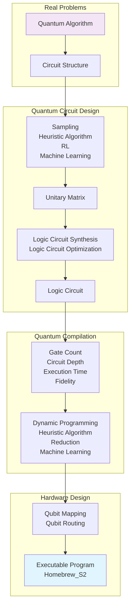

<h2><p align="center">TyxonQ</p></h2>
<h3><p align="center">Full-stack Quantum Software Framework on Real Machine</p></h3>

[](https://opensource.org/licenses/Apache-2.0)
[](https://www.python.org/downloads/)
[](https://www.tyxonq.com/)

TyxonQ​​ 太玄量子 is a full-stack quantum software framework for quantum simulation, optimization, and quantum machine learning. Forked from the open-source project ​[​TensorCircuit](https://github.com/tencent-quantum-lab/tensorcircuit)​​ and licensed under Apache License 2.0, it integrates modern quantum programming paradigms including automatic differentiation, just-in-time compilation, and hardware acceleration. 

**🚀 REAL QUANTUM HARDWARE READY**: TyxonQ supports **real quantum machine execution** through our quantum cloud services powered by **QureGenAI**. Currently featuring the **Homebrew_S2** quantum processor, enabling you to run your quantum algorithms on actual quantum hardware, not just simulators.

***Try Real Quantum Computer Right Now！***: [Getting a Key](https://www.tyxonq.com/) to register and obtain your API key

Innovatively combining generative AI, heterogeneous computing architectures, TyxonQ delivers ​​end-to-end solutions​​ for quantum chemistry, drug discovery, and materials science.

## 🏗️ Quantum-Classical Hybrid Architecture

TyxonQ implements a comprehensive quantum-classical hybrid workflow that bridges high-level quantum algorithms to executable quantum programs:



### Architecture Components:
- **🧮 Quantum Algorithm Layer**: High-level quantum algorithm specification
- **🔄 Circuit Structure**: Parameterized quantum circuits with rotation parameters
- **⚙️ Logic Circuit Synthesis**: Automated circuit optimization and compilation
- **🎯 Qubit Mapping**: Physical qubit topology-aware mapping and routing
- **💻 Hardware Execution**: Direct execution on **Homebrew_S2** quantum processor

## Features

### 🔥 Real Quantum Hardware Integration
- **Production-Ready Quantum Execution**: Direct integration with **QureGenAI's Homebrew_S2** quantum processor
- **Pulse-Level Control**: Support for both gate-level operations and **pulse-level signals** for advanced quantum control
- **Real-Time Quantum Computing**: Execute your quantum algorithms on actual quantum hardware with low latency
- **Quantum-Classical Hybrid Workflows**: Seamlessly combine classical preprocessing with quantum execution

### 🚀 Upcoming API & MCP Services (Coming Soon)
- **🔗 Quantum API Gateway**: RESTful APIs for direct quantum hardware access
- **🤖 LLM Integration**: Model Control Protocol (MCP) services for large language model integration
- **☁️ Quantum Cloud Services**: Scalable quantum computing as a service
- **📊 Real-time Monitoring**: Quantum job monitoring and result analytics

### Unified Quantum-Classical Hybrid Computing Paradigm​​
- Supports efficient simulation and optimization of variational quantum algorithms (​​VQE, QAOA​​), featuring a built-in ​​automatic differentiation engine​​ for seamless integration with PyTorch/TensorFlow gradient computation workflows.
- Provides a ​​hybrid task scheduler​​ that dynamically allocates quantum hardware and classical computing resources (CPU/GPU) for acceleration​​.

### Multi-Level Hardware Support​​
​​- **Direct Quantum Hardware Integration​​**: Compatible with mainstream quantum processors (e.g., superconducting), supporting low-level control from ​​gate-level operations​​ to **​​pulse-level signals** :fire: :fire: :fire:​.
- ​​**Heterogeneous Computing Optimization​​**: Enhances simulation throughput via ​​GPU vectorization​​ and quantum instruction compilation.

### Generative AI Integration​​
- Built-in [Generative ​Quantum Eigensolver (GQE)](https://arxiv.org/abs/2401.09253)​​ and [​​Quantum Machine Learning (QML)](​​https://arxiv.org/abs/2502.01146) modules for direct pre-trained model deployment in tasks like molecular structure generation and protein folding computing.
- Supports ​​large language model (LLM) interaction​​, enabling automated ​​"natural language → quantum circuit"​​ generation (experimental feature).

### Domain-Specific Toolkits​​
- **Quantum Chemistry Suite​​**: Includes molecular Hamiltonian builders and electronic structure analysis tools, compatible with classical quantum chemistry and drug discovery framework like [PySCF](https://pyscf.org/), [ByteQC](https://github.com/bytedance/byteqc) and [​​OpenMM](https://openmm.org/)​​.
- ​​**Materials Simulation Library​​**: Integrates ​​quantum-accelerated density functional theory (DFT)​​ modules for predicting novel material band structures.

## 🚀 Roadmap & Development Status

### ✅ Current Features (v1.x)
- [x] Quantum circuit simulation and optimization
- [x] **Real quantum hardware execution** (Homebrew_S2)
- [x] Automatic differentiation engine
- [x] Multi-backend support (NumPy, PyTorch, TensorFlow, JAX)
- [ ] Variational quantum algorithms (VQE,GQE,QAOA)
- [ ] Quantum chemistry toolkit integration

### 🔄 In Progress (v2.x)
- [ ] **Quantum API Gateway** - RESTful APIs for quantum hardware access
- [ ] **MCP Services** - Large language model integration protocols  
- [ ] Advanced quantum error correction protocols
- [ ] Enhanced pulse-level control interface
- [ ] Real-time quantum job monitoring dashboard
- [ ] Quantum circuit optimization using machine learning

### 🎯 Future Plans (v3.x+)
- [ ] **Multi-QPU Support** - Support for additional quantum processors
- [ ] **Quantum Networking** - Distributed quantum computing capabilities
- [ ] **Advanced QML Models** - Pre-trained quantum machine learning models
- [ ] **Natural Language Interface** - "English → Quantum Circuit" generation
- [ ] **Quantum Advantage Benchmarks** - Standardized performance metrics
- [ ] **Enterprise Cloud Platform** - Scalable quantum computing infrastructure

### 🧪 Experimental Features
- [ ] Quantum generative adversarial networks (QGANs)
- [ ] Quantum federated learning protocols
- [ ] Quantum-enhanced drug discovery pipelines
- [ ] Materials discovery acceleration frameworks

## Installation
The package now is written in pure Python and can be obtained via `pip` or 

Install from source:

```bash
uv build
uv pip install dist/tyxonq-0.1.1-py3-none-any.whl
```

`uv` as:
```bash
pip install tyxonq
```
or
```bash
uv pip install tyxonq
```
or you can install it from github:
```bash
git clone https://github.com/QureGenAI-Biotech/TyxonQ.git
cd tyxonq
pip install --editable .
```

## Get Started Example

See examples/Get_Started_Demo.ipynb

## 🔑 Real Quantum Hardware Setup

### Getting API Access
1. **Apply for API Key**: Visit [TyxonQ Quantum AI Portal](https://www.tyxonq.com/) to register and obtain your API key
2. **Hardware Access**: Request access to **Homebrew_S2** quantum processor through API [TyxonQ QPU API](https://www.tyxonq.com)

### Configuration
Set up your API credentials:

```python
import tyxonq as tq
from tyxonq.cloud import apis
import getpass

# Configure quantum hardware access
API_KEY = getpass.getpass("Input your TyxonQ API_KEY:")
apis.set_token(API_KEY) # Get from https://www.tyxonq.com
```

### Real Hardware Example

See 'examples/simple_demo_1.py' , run:
```shell
python examples/simple_demo_1.py
```

Code:

```python
import tyxonq as tq
import getpass
from tyxonq.cloud import apis
import time
# Configure for real quantum hardware
apis.set_token(getpass.getpass("Input your TyxonQ API_KEY: "))

provider = "tyxonq"
device = "homebrew_s2"

# Create and execute quantum circuit on real hardware
def quantum_hello_world():
    c = tq.Circuit(2)
    c.H(0)                    # Hadamard gate on qubit 0
    c.CNOT(0, 1)             # CNOT gate between qubits 0 and 1
    c.rx(1, theta=0.2)       # Rotation around x-axis
    
    # Execute on real quantum hardware

    print("Submit task to TyxonQ")

    task = apis.submit_task(provider = provider,
                        device = device,
                        circuit = c,
                        shots = 100)
    print(f"Task submitted: {task}")
    print("Wait 20 seconds to get task details")
    time.sleep(20)
    print(f"Real quantum hardware result: {task.details()}")

quantum_hello_world()

```

## Basic Usage and Guide
Considering that the features and documentation related to ​​TyxonQ characteristics​​ are currently under development, you can refer to the upstream library ​​[Tensorcircuit](https://github.com/tencent-quantum-lab/tensorcircuit)​​ for usage guidance in the interim: [Quick Start](https://github.com/tencent-quantum-lab/tensorcircuit/blob/master/docs/source/quickstart.rst) and [full documentation](https://tensorcircuit.readthedocs.io/). We will promptly update the ​​TyxonQ documentation and tutorials in [English](), [Chinese]() and [Japanese]()​​.

- Circuit manipulation:
```python
import tyxonq as tq
c = tq.Circuit(2)
c.H(0)
c.CNOT(0,1)
c.rx(1, theta=0.2)
print(c.wavefunction())
print(c.expectation_ps(z=[0, 1]))
print(c.sample(allow_state=True, batch=1024, format="count_dict_bin"))
```

- Runtime behavior customization:
```python
tq.set_backend("tensorflow")
tq.set_dtype("complex128")
tq.set_contractor("greedy")
```

- Automatic differentiations with jit:
```python
def forward(theta):
    c = tq.Circuit(2)
    c.R(0, theta=theta, alpha=0.5, phi=0.8)
    return tq.backend.real(c.expectation((tq.gates.z(), [0])))

g = tq.backend.grad(forward)
g = tq.backend.jit(g)
theta = tq.array_to_tensor(1.0)
print(g(theta))
```

## Dependencies
- Python >= 3.7 (supports Python 3.7, 3.8, 3.9, 3.10, 3.11, 3.12+)
- PyTorch >= 1.8.0

## 📧 Contact & Support

- **Home**: [www.tyxonq.com](https://www.tyxonq.com)
- **Technical Support**: [code@quregenai.com](mailto:code@quregenai.com)

- **General Inquiries**: [bd@quregenai.com](mailto:bd@quregenai.com)
- **Documentation (beta version)**: [docs.tyxonq.com](https://tensorcircuit.readthedocs.io/)
- **Issue**:[github issue](https://github.com/QureGenAI-Biotech/TyxonQ/issues)

### Development Team
- **QureGenAI**: Quantum hardware infrastructure and services
- **TyxonQ Core Team**: Framework development and optimization
- **Community Contributors**: Open source development and testing

## License
TyxonQ is open source, released under the Apache License, Version 2.0.
