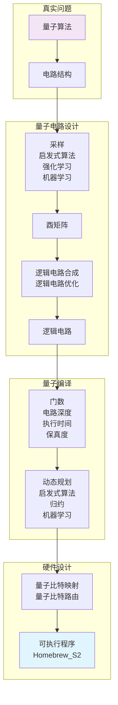

<h2><p align="center">TyxonQ</p></h2>
<h3><p align="center">真实硬件基础上的全栈量子软件框架</p></h3>

[](https://opensource.org/licenses/Apache-2.0)
[](https://www.python.org/downloads/)
[](https://www.tyxonq.com/)

TyxonQ​​ 太玄量子 是一个面向量子模拟、优化和量子机器学习的全栈量子软件框架。它基于开源项目 ​[​TensorCircuit](https://github.com/tencent-quantum-lab/tensorcircuit)​​ 并遵循 Apache 2.0 许可协议。框架整合了现代量子编程范式，包括自动微分、即时编译和硬件加速。 

**🚀 支持真实量子硬件**: TyxonQ 通过提供**QureGenAI**的量子云服务，支持在**真实量子设备上**运行。目前已支持 **Homebrew_S2** 量子处理器，让你的量子算法不止在模拟器上运行，而是真实硬件执行。 

***立即体验真实量子计算！***: [点此申请 Key](https://www.tyxonq.com/) 注册并获取 API 密钥。

通过创新性地结合生成式人工智能与异构计算架构，TyxonQ 为量子化学、药物发现以及材料科学提供端到端的解决方案。

## 🏗️ 量子-经典混合架构

TyxonQ 实现了一个完整的量子-经典混合工作流，将高层量子算法映射为可在硬件上执行的量子程序：



### 架构组成:
- **🧮 量子算法层**: 高层量子算法描述
- **🔄 电路结构**: 带旋转门角度参数的参数化量子电路
- **⚙️ 逻辑电路合成**: 自动化电路优化与编译
- **🎯 量子比特映射**: 物理拓扑的映射与路由
- **💻 硬件执行**: 在 **Homebrew_S2** 量子处理器上直接运行

## 主要特性

### 🔥 实际量子硬件集成
- **面向生产的量子执行**: 直接集成到 **QureGenAI的 Homebrew_S2** 量子处理器
- **脉冲级控制**: 同时支持门级操作和 **pulse-level signals** 以实现高级量子控制
- **实时量子计算**: 以低延迟在真实量子硬件上执行你的量子算法
- **量子–经典混合工作流**: 无缝结合经典预处理与量子执行

### 🚀 即将上线的 API 和 MCP 服务 (即将上线)
- **🔗 量子 API 网关**: RESTful 接口直连量子硬件
- **🤖 LLM 集成**: 大语言模型的控制协议
- **☁️ 量子云服务**: 可扩展的量子计算即服务（QaaS）
- **📊 实时监控**: 量子任务监控与结果分析

### 统一的量子-经典混合计算范式
- 支持高效模拟与优化变分量子算法（VQE、QAOA），内置 自动微分引擎，可与 PyTorch/TensorFlow 的梯度计算流程无缝集成。
- 提供 混合任务调度器，可动态分配量子硬件与经典计算资源（CPU/GPU）以实现加速。

### 多层次硬件支持​​
​​- **直接量子硬件集成​​**: 兼容主流量子处理器（如超导量子机），支持从门级操作到**​脉冲级信号**的低层控制 :fire: :fire: :fire:​.
- ​​**异构计算优化​​**: 通过 GPU 向量化和量子指令编译来提升模拟吞吐量。

### 生成式 AI 集成
- 内置 [生成式量子特征求解器 (GQE)](https://arxiv.org/abs/2401.09253)​​ and [​量子机器学习 (QML)](​​https://arxiv.org/abs/2502.01146) 模块，可直接在分子结构生成、蛋白质折叠计算等任务中部署预训练模型。
- 支持 大语言模型（LLM）交互​​, 实现自动化的 ​​"自然语言 → 量子电路"​​ 生成（实验性功能）。

### Domain-Specific Toolkits​​
- **量子化学套件​**: 包含分子哈密顿量构建器与电子结构分析工具，兼容 [PySCF](https://pyscf.org/), [ByteQC](https://github.com/bytedance/byteqc) 和 [​​OpenMM](https://openmm.org/)​等经典量子化学与药物发现框架。
- ​​**材料模拟库​**: 集成了 量子加速的密度泛函理论（DFT）模块，可用于预测新型材料的能带结构。

## 🚀 路线图与开发进度

### ✅ 当前功能 (v1.x)
- [x] 量子电路仿真与优化
- [x] **真实量子硬件执行** (Homebrew_S2)
- [x] 自动微分引擎
- [x] 多后端支持（NumPy、PyTorch、TensorFlow、JAX）
- [ ] 变分量子算法 (VQE,GQE,QAOA)
- [ ] 量子化学工具包集成

### 🔄 开发中 (v2.x)
- [ ] **量子 API 网关** - 面向量子硬件访问的 RESTful API
- [ ] **MCP 服务** - 大语言模型集成协议 
- [ ] 高级量子纠错协议
- [ ] 增强的脉冲级控制接口
- [ ] 实时量子任务监控面板
- [ ] 基于机器学习的量子电路优化

### 🎯 未来计划 (v3.x+)
- [ ] **多 QPU 支持** - 支持更多量子处理器
- [ ] **量子网络** - 分布式量子计算能力
- [ ] **先进的 QML 模型** - 预训练的量子机器学习模型
- [ ] **自然语言接口** - "英文 → 量子电路" 生成
- [ ] **量子优势基准** - 标准化的性能指标
- [ ] **企业级云平台** - 可扩展的量子计算基础设施

### 🧪 实验性功能
- [ ] 量子生成对抗网络 (QGANs)
- [ ] 量子联邦学习协议
- [ ] 量子增强的药物发现流程
- [ ] 材料发现加速框架

## 安装
当前支持的操作系统：Linux 和 Mac。

该软件包目前由纯 Python 编写，可通过 `pip` 获取，或

从源码安装：

```bash
uv build
uv pip install dist/tyxonq-0.1.1-py3-none-any.whl
```

`pip` 的用法如下:
```bash
# 使用 Python 虚拟环境
python -m venv pyv_tyxonq
source pyv_tyxonq/bin/activate
pip install tyxonq
```
或者
```bash
uv pip install tyxonq
```
或者你也可以从 GitHub 安装:
```bash
git clone https://github.com/QureGenAI-Biotech/TyxonQ.git
cd tyxonq
pip install --editable .
```

## 入门示例

参见 examples/Get_Started_Demo.ipynb

## 🔑 实际量子硬件设置

### 获取 API 访问权限
1. **申请 API Key**：访问 [TyxonQ Quantum AI Portal](https://www.tyxonq.com/) 注册并获取你的 API Key
2. **硬件访问**：通过 API 请求访问 **Homebrew_S2** 量子处理器 [TyxonQ QPU API](https://www.tyxonq.com)

### 配置
设置你的 API 凭证：

```python
import tyxonq as tq
from tyxonq.cloud import apis
import getpass

# 配置量子硬件访问
API_KEY = getpass.getpass("Input your TyxonQ API_KEY:")
apis.set_token(API_KEY) # 从 https://www.tyxonq.com 获取
```

实际硬件示例
参见 'examples/simple_demo_1.py' , 运行：
```shell
python examples/simple_demo_1.py
```

代码:

```python
import tyxonq as tq
import getpass
from tyxonq.cloud import apis
import time
# Configure for real quantum hardware
apis.set_token(getpass.getpass("Input your TyxonQ API_KEY: "))

provider = "tyxonq"
device = "homebrew_s2"

# Create and execute quantum circuit on real hardware
def quantum_hello_world():
    c = tq.Circuit(2)
    c.H(0)                    # Hadamard gate on qubit 0
    c.CNOT(0, 1)             # CNOT gate between qubits 0 and 1
    c.rx(1, theta=0.2)       # Rotation around x-axis
    
    # Execute on real quantum hardware

    print("Submit task to TyxonQ")

    task = apis.submit_task(provider = provider,
                        device = device,
                        circuit = c,
                        shots = 100)
    print(f"Task submitted: {task}")
    print("Wait 20 seconds to get task details")
    time.sleep(20)
    print(f"Real quantum hardware result: {task.details()}")

quantum_hello_world()

```

## 基本用法与指南
鉴于与 ​​TyxonQ 特性​​相关的功能和文档目前仍在开发中，你可以暂时参考上游库 ​​[Tensorcircuit](https://github.com/tencent-quantum-lab/tensorcircuit)​​ 的使用指南：
[快速入门](https://github.com/tencent-quantum-lab/tensorcircuit/blob/master/docs/source/quickstart.rst) 和 [完整文档](https://tensorcircuit.readthedocs.io/)。
我们未来将会更新 ​​TyxonQ​​ 的文档和教程，提供 [英文]()、[中文]() 和 [日文]() 版本。

- 电路操作：
```python
import tyxonq as tq
c = tq.Circuit(2)
c.H(0)
c.CNOT(0,1)
c.rx(1, theta=0.2)
print(c.wavefunction())
print(c.expectation_ps(z=[0, 1]))
print(c.sample(allow_state=True, batch=1024, format="count_dict_bin"))
```

- 运行时行为自定义:
```python
tq.set_backend("tensorflow")
tq.set_dtype("complex128")
tq.set_contractor("greedy")
```

- 带有 jit 的自动微分:
```python
def forward(theta):
    c = tq.Circuit(2)
    c.R(0, theta=theta, alpha=0.5, phi=0.8)
    return tq.backend.real(c.expectation((tq.gates.z(), [0])))

g = tq.backend.grad(forward)
g = tq.backend.jit(g)
theta = tq.array_to_tensor(1.0)
print(g(theta))
```

## 依赖
- Python >= 3.7（支持 Python 3.7、3.8、3.9、3.10、3.11、3.12+）
- PyTorch >= 1.8.0

## 📧 联系与支持

- **主页**：[www.tyxonq.com](https://www.tyxonq.com)
- **技术支持**：[code@quregenai.com](mailto:code@quregenai.com)

- **一般咨询**：[bd@quregenai.com](mailto:bd@quregenai.com)
- **文档（测试版）**：[docs.tyxonq.com](https://tensorcircuit.readthedocs.io/)
- **问题反馈**：[github issue](https://github.com/QureGenAI-Biotech/TyxonQ/issues)


#### 微信公众号 | Official WeChat


#### 开发者交流群 | Developer Community


*扫码关注公众号获取最新资讯 | Scan to follow for latest updates*  
*扫码加入开发者群进行技术交流 | Scan to join developer community*

</div>

### 开发团队
- **QureGenAI**：量子硬件基础设施与服务
- **TyxonQ 核心团队**：框架开发与优化
- **社区贡献者**：开源开发与测试


## 许可协议
TyxonQ 是开源项目，遵循 Apache License 2.0 版发布。
