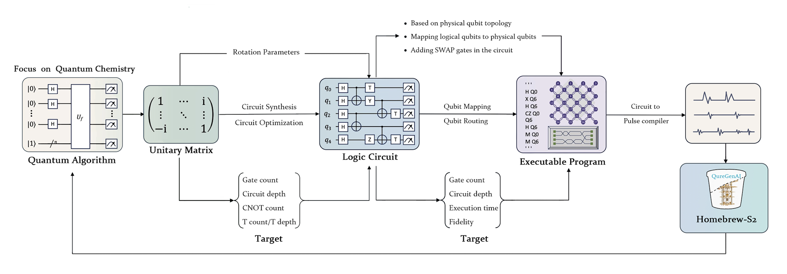

<h2><p align="center">TyxonQ</p></h2>
<h3><p align="center">実機上で動作するフルスタック量子ソフトウェアフレームワーク</p></h3>

[](https://opensource.org/licenses/Apache-2.0)
[](https://www.python.org/downloads/)
[](https://www.tyxonq.com/)

TyxonQ​​ 太玄量子 は、量子シミュレーション・最適化・量子機械学習のためのフルスタック量子ソフトウェアフレームワークです。オープンソースプロジェクト [TensorCircuit](https://github.com/tencent-quantum-lab/tensorcircuit) からフォークされ、Apache License 2.0 を従い提供されています。自動微分、Just-in-Time コンパイル、ハードウェアアクセラレーションなど、最新の量子プログラミングパラダイムを統合しています。

**🚀 実機量子ハードウェア対応**：TyxonQ は **QureGenAI** 提供の量子クラウドサービスを通じて **実機量子コンピュータ実行** をサポートしています。現在は **Homebrew_S2** 量子プロセッサを搭載し、シミュレータだけではなく、実際の量子ハードウェア上で量子アルゴリズムを実行できます。

***今すぐ実機量子コンピュータを体験しましょう！***：[API キーを取得する](https://www.tyxonq.com/) から登録して API キーを取得しましょう。

生成系 AI と異種計算アーキテクチャを革新的に統合することにより、TyxonQ は量子化学、創薬、材料科学に対して **エンドツーエンドの解決策** を提供します。

## 🏗️ 量子–古典ハイブリッドアーキテクチャ

TyxonQ は、量子と古典を統合した完全なハイブリッドワークフローを実現し、高レベルの量子アルゴリズムをハードウェア上で実行可能な量子プログラムへとマッピングします：

<p align="center">
  
</p


### アーキテクチャ構成要素:
- **🧮 量子アルゴリズム層**: 高レベルの量子アルゴリズム仕様
- **🔄 回路構造**: 回転パラメータを備えたパラメータ化量子回路
- **⚙️ 論理回路合成**: 自動化された回路最適化およびコンパイル
- **🎯 量子ビットマッピング**: 物理量子ビットのトポロジを考慮したマッピングとルーティング
- **💻 ハードウェア実行**: **Homebrew_S2** 量子プロセッサでの直接実行

## 機能

### 🔥 実機量子ハードウェア統合
- **本番対応の量子実行**: **QureGenAI の Homebrew_S2** 量子プロセッサと直接統合
- **パルスレベル制御**: ゲートレベル操作と **パルスレベル信号** の両方をサポートし、高度な量子制御を実現
- **リアルタイム量子計算**: 低遅延で実際の量子ハードウェア上で量子アルゴリズムを実行
- **量子–古典ハイブリッドワークフロー**: 古典的な前処理と量子実行をシームレスに統合

### 🚀 近日公開予定の API と MCP サービス
- **🔗 量子 API ゲートウェイ**: 量子ハードウェアへの直接アクセスを可能にする RESTful API
- **🤖 LLM 統合**: 大規模言語モデル統合のための Model Control Protocol (MCP) サービス
- **☁️ 量子クラウドサービス**: スケーラブルな量子計算サービス
- **📊 リアルタイムモニタリング**: 量子ジョブのモニタリングと結果解析

### 統合された量子–古典ハイブリッド計算パラダイム
- 変分量子アルゴリズム（VQE、QAOA）の効率的なシミュレーションと最適化をサポートし、PyTorch/TensorFlow の勾配計算ワークフローとシームレスに統合できる自動微分エンジンを内蔵。
- 量子ハードウェアと古典計算リソース（CPU/GPU）を動的に割り当てて加速を実現するハイブリッドタスクスケジューラを提供。

### マルチレベルハードウェアサポート
- **直接的な量子ハードウェア統合**: 主流の量子プロセッサ（例：超伝導）に対応し、ゲートレベル操作　から **パルスレベル信号** までの低レベル制御をサポート :fire: :fire: :fire:
- **異種計算最適化**: GPU ベクトル化と量子命令コンパイルによってシミュレーションのスループットを向上。

### 生成系AI統合
- [Generative Quantum Eigensolver (GQE)](https://arxiv.org/abs/2401.09253) と [Quantum Machine Learning (QML)](https://arxiv.org/abs/2502.01146) モジュールを内蔵し、分子構造生成やタンパク質折りたたみ計算などのタスクにおいて、事前学習モデルを直接展開可能。
- 大規模言語モデル（LLM）との連携をサポートし、自動で「自然言語 → 量子回路」を生成する実験的機能を提供。

### ドメイン特化型ツールキット
- **量子化学スイート**: 分子ハミルトニアン構築ツールや電子構造解析ツールを含み、[PySCF](https://pyscf.org/)、[ByteQC](https://github.com/bytedance/byteqc)、[OpenMM](https://openmm.org/) などの古典的な量子化学・創薬フレームワークに対応しています。
- **材料シミュレーションライブラリ**: 量子加速型密度汎関数理論（DFT）モジュールを統合し、新規材料のバンド構造予測を実現。

## 🚀 ロードマップと開発状況

### ✅ 現在の機能 (v1.x)
- [x] 量子回路シミュレーションと最適化
- [x] **実機量子ハードウェア実行** (Homebrew_S2)
- [x] 自動微分エンジン
- [x] マルチバックエンド対応 (NumPy, PyTorch, TensorFlow, JAX)
- [ ] 変分量子アルゴリズム (VQE, GQE, QAOA)
- [ ] 量子化学ツールキット統合

### 🔄 開発中 (v2.x)
- [x] **量子APIゲートウェイ** - 量子ハードウェアアクセス用の RESTful API
- [x] **MCPサービス** - 大規模言語モデル統合プロトコル
- [ ] 先進的量子エラー軽減プロトコル
- [x] 強化されたパルスレベル制御インターフェース
- [x] リアルタイム量子ジョブモニタリングダッシュボード
- [ ] 機械学習を用いた量子回路最適化

### 🎯 将来計画 (v3.x+)
- [ ] **マルチQPU対応** - 追加の量子プロセッサをサポート
- [ ] **量子ネットワーキング** - 分散型量子計算機能
- [ ] **高度なQMLモデル** - 事前学習済み量子機械学習モデル
- [ ] **自然言語インターフェース** - 「英語 → 量子回路」生成
- [ ] **量子アドバンテージベンチマーク** - 標準化された性能指標
- [ ] **エンタープライズクラウドプラットフォーム** - スケーラブルな量子計算インフラ

### 🧪 実験的機能
- [ ] 量子生成対向ネットワーク (QGAN)
- [ ] 量子フェデレーテッドラーニングプロトコル
- [ ] 量子強化創薬パイプライン
- [ ] 材料発見加速フレームワーク

## インストール
現在サポートされているOS：Linux と Mac。

このパッケージは完全に Python によって記述されており、`pip` で取得できます。またはソースからインストールも可能です。

ソースからインストールする場合:

```bash
uv build
uv pip install dist/tyxonq-0.1.1-py3-none-any.whl
```

`pip` を使う場合:
```bash
# use a python virtual environment
python -m venv pyv_tyxonq
source pyv_tyxonq/bin/activate
pip install tyxonq
```
または
```bash
uv pip install tyxonq
```
更に GitHub からインストールすることもできます:
```bash
git clone https://github.com/QureGenAI-Biotech/TyxonQ.git
cd tyxonq
pip install --editable .
```

## はじめにの例

examples/Get_Started_Demo.ipynb を参照してください。

## 🔑 実機量子ハードウェアセットアップ

### API アクセスの取得
1. **API キーの申請**： [TyxonQ Quantum AI Portal](https://www.tyxonq.com/) にアクセスして登録し、API キーを取得します。
2. **ハードウェアアクセス**： [TyxonQ QPU API](https://www.tyxonq.com) を通じて **Homebrew_S2** 量子プロセッサへのアクセスを申請します。

### 設定
API 認証情報を設定します：

```python
import tyxonq as tq
from tyxonq.cloud import apis
import getpass

# 量子ハードウェアアクセスを設定
API_KEY = getpass.getpass("Input your TyxonQ API_KEY:")
apis.set_token(API_KEY) # https://www.tyxonq.com　から取得
```

### 実機ハードウェアの実行例

'examples/simple_demo_1.py' を参照し、以下を実行してください:
```shell
python examples/simple_demo_1.py
```

Code:

```python
import tyxonq as tq
import getpass
from tyxonq.cloud import apis
import time
# Configure for real quantum hardware
apis.set_token(getpass.getpass("Input your TyxonQ API_KEY: "))

provider = "tyxonq"
device = "homebrew_s2"

# Create and execute quantum circuit on real hardware
def quantum_hello_world():
    c = tq.Circuit(2)
    c.H(0)                    # Hadamard gate on qubit 0
    c.CNOT(0, 1)             # CNOT gate between qubits 0 and 1
    c.rx(1, theta=0.2)       # Rotation around x-axis
    
    # Execute on real quantum hardware

    print("Submit task to TyxonQ")

    task = apis.submit_task(provider = provider,
                        device = device,
                        circuit = c,
                        shots = 100)
    print(f"Task submitted: {task}")
    print("Wait 20 seconds to get task details")
    time.sleep(20)
    print(f"Real quantum hardware result: {task.details()}")

quantum_hello_world()

```

## 基本的な使い方とガイド
TyxonQ 固有の機能およびドキュメントは現在開発中のため、当面の間は上流ライブラリである [Tensorcircuit](https://github.com/tencent-quantum-lab/tensorcircuit) の使用ガイドを参照してください: [クイックスタート](https://github.com/tencent-quantum-lab/tensorcircuit/blob/master/docs/source/quickstart.rst) および [完全なドキュメント](https://tensorcircuit.readthedocs.io/) をご覧ください。TyxonQ のドキュメントおよびチュートリアルは、[英語](), [中国語](), [日本語]() で更新予定です。

- 回路操作:
```python
import tyxonq as tq
c = tq.Circuit(2)
c.H(0)
c.CNOT(0,1)
c.rx(1, theta=0.2)
print(c.wavefunction())
print(c.expectation_ps(z=[0, 1]))
print(c.sample(allow_state=True, batch=1024, format="count_dict_bin"))
```

- 実行時動作のカスタマイズ:
```python
tq.set_backend("tensorflow")
tq.set_dtype("complex128")
tq.set_contractor("greedy")
```

- jit を用いた自動微分:
```python
def forward(theta):
    c = tq.Circuit(2)
    c.R(0, theta=theta, alpha=0.5, phi=0.8)
    return tq.backend.real(c.expectation((tq.gates.z(), [0])))

g = tq.backend.grad(forward)
g = tq.backend.jit(g)
theta = tq.array_to_tensor(1.0)
print(g(theta))
```

## 依存関係
- Python >= 3.7 (Python 3.7, 3.8, 3.9, 3.10, 3.11, 3.12+　に対応)
- PyTorch >= 1.8.0

## 📧 お問い合わせ & サポート

- **ホームページ**: [www.tyxonq.com](https://www.tyxonq.com)
- **技術サポート**: [code@quregenai.com](mailto:code@quregenai.com)

- **一般問い合わせ**: [bd@quregenai.com](mailto:bd@quregenai.com)
- **ドキュメント（ベータ版）**: [docs.tyxonq.com](https://tensorcircuit.readthedocs.io/)
- **問題報告**: [github issue](https://github.com/QureGenAI-Biotech/TyxonQ/issues)


#### WeChat公式アカウント | Official WeChat


#### WeChat開発者コミュニティ | Developer Community


*QRコードをスキャンして公式アカウントをフォローし、最新情報を入手しましょう | Scan to follow for latest updates*  
*QRコードをスキャンして開発者コミュニティに参加し、技術交流を行いましょう | Scan to join developer community*

</div>

### 開発チーム
- **QureGenAI**: 量子ハードウェアのインフラおよびサービス
- **TyxonQ コアチーム**: フレームワークの開発と最適化
- **コミュニティ貢献者**: オープンソース開発とテスト


## ライセンス
TyxonQ はオープンソースであり、Apache License 2.0 を従い提供されています。
