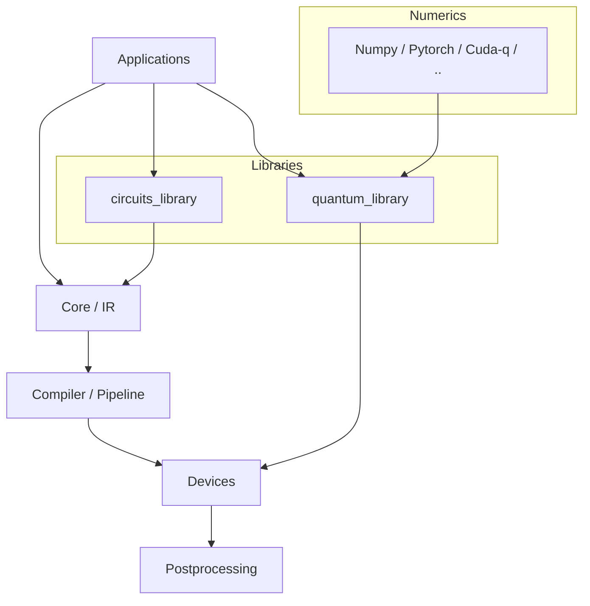

## TyxonQ Technical Architecture Report

### 1. Overview
TyxonQ is a modular quantum computing framework architected to mirror real hardware systems while remaining friendly to computer systems and software engineers. The architecture centers on a stable Core IR, a pluggable compilation pipeline, unified device abstraction (hardware and simulators), a single numeric backend interface, and a results-first postprocessing layer. Examples adopt a chain-style API to ensure a uniform path across simulators and real hardware.

Key properties:
- Stable IR in `core/` decouples applications, compiler, devices, and postprocessing.
- Unified `numerics/` backend abstraction for NumPy, PyTorch, and CuPyNumeric with vectorization.
- Device execution aligns with hardware realities: shots, scheduling, measurement basis transforms.
- Postprocessing owns expectation evaluation, mitigation, and metrics, harmonizing device/provider return formats.
- Libraries provide reusable building blocks: `circuits_library/*` and `quantum_library/*`.

### 2. Architecture Diagram


Module responsibilities:
- Core (`src/tyxonq/core/*`): IR types (`ir/circuit.py`, `ir/pulse.py`), `operations`, `measurements`, error types.
- Compiler (`src/tyxonq/compiler/*`): stages for rewrite, simplify, layout, scheduling, gradients; provider adapters under `compiler/providers/*`.
- Devices (`src/tyxonq/devices/*`): base device contracts, simulators (statevector, density_matrix, MPS) and hardware drivers (`hardware/<vendor>/driver.py`), sessions.
- Numerics (`src/tyxonq/numerics/*`): backend factory/context; backends for NumPy, PyTorch, CuPyNumeric.
- Postprocessing (`src/tyxonq/postprocessing/*`): metrics, IO, readout mitigation, QEM; consumes counts/samples to produce expectations.
- Libraries (`src/tyxonq/libs/*`): `circuits_library` for reusable circuit templates; `quantum_library` for state evolution and kernels.
- Cloud (`src/tyxonq/cloud/api.py`): façade that routes to devices/hardware sessions.

### 2.1 Source Tree (Current)
```text
src/tyxonq/
  about.py
  cloud/
    api.py
  compiler/
    api.py
    native_compiler.py
    pipeline.py
    providers/
      qiskit/
        dialect.py
        qiskit_compiler.py
    stages/
      decompose/rotations.py
      gradients/parameter_shift_pass.py, qng.py
      rewrite/measurement.py, merge_prune.py
      scheduling/shot_scheduler.py
      simplify/lightcone.py
    translation/mpo_converters.py
  config.py
  core/
    errors.py
    ir/circuit.py, pulse.py
    measurements/
    operations/
    types.py
  devices/
    base.py
    session.py
    hardware/
      config.py
      session.py
      ibm/driver.py
      tyxonq/driver.py
    simulators/
      driver.py
      statevector/engine.py
      density_matrix/engine.py
      matrix_product_state/engine.py
      noise/channels.py
  libs/
    circuits_library/
      blocks.py, hamiltonians.py, qaoa_ising.py, trotter_circuit.py, vqe.py
    quantum_library/
      dynamics.py
      kernels/common.py, gates.py, pauli.py, statevector.py, density_matrix.py, unitary.py, matrix_product_state.py
  numerics/
    api.py, context.py, vectorization_checks.py
    backends/numpy_backend.py, pytorch_backend.py, cupynumeric_backend.py
  plugins/registry.py
  postprocessing/
    io.py, metrics.py, noise_analysis.py
    readout/
    classical_shadows/
    qem/
  utils.py
  visualization/dot.py
```

### 2.2 Core Module Feature Plan
- Core/IR
  - Circuit/Pulse as unified intermediate representation; metadata for measurement groups, basis maps, and scheduling hints
  - Operation registry with gradient metadata (parameter-shift availability, commutation rules)
  - Measurement semantics: standardize expectation targets, diagonalization rules
- Compiler
  - Pass pipeline orchestration; per-stage contracts and reproducible pass configs
  - Measurement rewrite and grouping; light-cone pruning; scheduling (shot segmentation)
  - Gradient passes (parameter-shift, QNG); provider-specific dialect lowering
- Devices
  - Stable Device contract: run/compile interfaces, shot execution, result normalization
  - Simulators share numerics backend; unified noise controls; performance baselines
  - Hardware sessions: submission/polling, error normalization, consistent RunResult schema
- Numerics
  - Single ArrayBackend interface; centralized set_backend/get_backend
  - Vectorization support and dtype policy; minimal capability checks
  - Multiple implementations: NumPy, PyTorch, CuPyNumeric
- Postprocessing
  - Counts-to-expectation with basis metadata; metrics; readout mitigation and QEM
  - IO schemas for device/cloud results; composable pipelines
- Libraries
  - circuits_library: reusable templates (VQE, QAOA, Trotter) with IR-friendly metadata
  - quantum_library: decoupled numeric kernels for state evolution and expectations
- Cloud/Plugins
  - Cloud facade for provider routing; plugin registry for devices/compilers/postprocessing

### 3. Chain-style API and Execution Flow
The chain-style API standardizes the end-to-end path from circuit construction to device execution and postprocessing, especially important for unifying simulators and real hardware.

Important: compiler passes take effect only if they participate in the chain prior to run, i.e., when you call `.compile(...)` before `.device(...).run()`, or when you execute the compiled IR returned by the compiler API.

Typical flow:
1) Build IR (possibly via `circuits_library`).
2) Compile through `compiler` pipeline.
3) Execute on a `device` (simulator or hardware) with shots and scheduling.
4) Postprocess counts to expectations and metrics.

Example sketch (aligned with `examples/circuit_chain_demo.py` and `examples/readout_mitigation.py`):
```python
import tyxonq as tq
from tyxonq.postprocessing import metrics

# Backend selection once (numpy/pytorch/cupynumeric)
tq.set_backend("numpy")

# 1) Build circuit IR
c = tq.Circuit(2).h(0).cx(0, 1).measure_z(0).measure_z(1)

# 2) Simulator chain: use default compiler passes for measurement + shots
sim_res = (
    c
     .compile()  # passes take effect here
     .device(provider="simulator", device="statevector", shots=4096)
     .postprocessing(method=None)
     .run()
)

# 3) Hardware chain: choose provider-appropriate compiler settings
#    (example: qiskit engine + vendor-specific passes if needed)
hw_res = (
    c
     .compile(compile_engine="qiskit")  # per-target config
     .device(provider="tyxonq", device="homebrew_s2", shots=4096)
     .run()  # postprocessing can be added or done later depending on driver output
)

# 4) Extract counts and compute expectations (if needed)
def counts_of(res):
    payload = res if isinstance(res, dict) else (res[0] if res else {})
    return payload.get("result", {})

sim_counts = counts_of(sim_res)
hw_counts = counts_of(hw_res)
ez_sim = metrics.expectation(sim_counts, z=[0, 1])
ez_hw = metrics.expectation(hw_counts, z=[0, 1])
print("E[Z] (sim)", ez_sim)
print("E[Z] (hw) ", ez_hw)
```

This shows: (1) passes are effective only when `.compile(...)` is invoked in the chain, (2) per-device compilation can be configured by selecting different engines/passes for different targets while reusing the same circuit.

This design makes the “counts-first” result format the default, while allowing providers to return expectations directly via standardized `RunResult` metadata when available.

### 4. Chain-style End-to-End Example (Complete)
```python
import tyxonq as tq
from tyxonq.compiler import api as compiler
from tyxonq.postprocessing import metrics

# 1) Backend selection (once)
tq.set_backend("numpy")  # or "pytorch" / "cupynumeric"

# 2) Build IR (could also reuse circuits_library templates)
c = tq.Circuit(3)
c.h(0).rx(1, theta=0.3).rz(2, theta=-0.5).cx(0, 2)
# Compiler will infer basis rotations; we only mark measurement intent
c.measure_z(0).measure_z(1).measure_z(2)

# 3) Compile to device-agnostic IR with measurement grouping and shot scheduling
compiled = compiler.compile(
    c,
    provider="default",
    passes=[
        "measurement_rewrite",  # generate basis maps/diagonalization
        "lightcone",            # optional simplification
        "shot_scheduler",       # segment shots if needed
    ],
)

# 4) Execute on a simulator or hardware device (noise explicitly controlled)
res = (
    c.device(
        provider="simulator", device="statevector", shots=8192,
        use_noise=False,
    )
     .postprocessing(method=None)  # let postprocessing interpret counts
     .run()
)

# 5) Postprocess counts to expectations using compiler-produced basis metadata
payload = res if isinstance(res, dict) else (res[0] if res else {})
counts = payload.get("result", {})
ez = metrics.expectation(counts, z=[0, 1, 2])
print("E[Z]:", ez)

# Optional: direct-numeric path for baseline comparisons
from tyxonq.numerics import get_backend
from tyxonq.libs.quantum_library import dynamics as qdyn
nb = get_backend(None)
psi_t = qdyn.evolve_state(psi0=nb.zeros([2**3], dtype=nb.complex64), hamiltonian=None, time=0.5, backend=nb)
# In practice supply a Hamiltonian and use qdyn.expectation(...) accordingly
```

### 3.1 Simulator vs Hardware Dispatch (Same Circuit)
```python
import tyxonq as tq

# Select numeric backend once
tq.set_backend("numpy")  # or "pytorch" / "cupynumeric"

# Build the same circuit
c = tq.Circuit(2).h(0).cx(0, 1).measure_z(0).measure_z(1)

# Run on local simulator with default compiler
sim_res = (
    c
     .compile(passes=["measurement_rewrite", "shot_scheduler"])  # effective here
     .device(provider="simulator", device="statevector", shots=4096)
     .postprocessing(method=None)
     .run()
)

# Run on real hardware with provider-aware compiler configuration
hw_res = (
    c
     .compile(compile_engine="qiskit", passes=["measurement_rewrite", "shot_scheduler"])  # choose engine per target
     .device(provider="tyxonq", device="homebrew_s2", shots=4096)
     .run()
)

# Extract counts (both follow the same result schema)
def counts_of(res):
    payload = res if isinstance(res, dict) else (res[0] if res else {})
    return payload.get("result", {})

sim_counts = counts_of(sim_res)
hw_counts = counts_of(hw_res)
print("sim counts sample:", list(sim_counts.items())[:3])
print("hw  counts sample:", list(hw_counts.items())[:3])
```

Notes:
- Use different `.compile(...)` options per target; do not attempt to set conflicting compiler configurations in a single chain. Create one chain per target.
- If a provider returns native expectations, drivers can pass them via metadata; otherwise postprocessing computes expectations from counts, uniformly.

Representative example usages from the repo:

- JSON IO and chain execution
```24:28:examples/jsonio.py
res = (
    c.device(provider="simulator", device="statevector", shots=shots)
     .postprocessing(method=None)
     .run()
)
```

- Explicit noise controls at call time
```21:25:examples/noise_controls_demo.py
res_clean = (
    c.device(provider="local", device="statevector", shots=0, use_noise=True)
     .run()
)
```
```29:39:examples/noise_controls_demo.py
res_noisy = (
    c.device(
        provider="local",
        device="statevector",
        shots=0,
        use_noise=True,
        noise={"type": "depolarizing", "p": 0.05},
    )
     .postprocessing(method=None)
     .run()
)
```

- Counts-based expectation and gradients via parameter-shift
```68:72:examples/sample_value_gradient.py
res = (
    cc.device(provider="simulator", device="statevector", shots=shots)
      .postprocessing(method=None)
      .run()
)
```
```93:101:examples/sample_value_gradient.py
def parameter_shift_gradient(param, shots: int = 4096, shift: float = 1.5707963267948966):
    p_np = nb.to_numpy(param)
    grad = nb.zeros_like(p_np)
    for i in range(n):
        for j in range(nlayers):
            for k in (0, 1):
                p_plus = p_np.copy(); p_minus = p_np.copy()
                p_plus[i, j, k] += shift
                p_minus[i, j, k] -= shift
```

These examples illustrate: chain-style composition, explicit device/noise control, counts-first expectations aligned with postprocessing, and numeric backends used for gradient baselines and comparisons.

### 4. Numeric Backends and Dual Paths
TyxonQ exposes a single numeric backend abstraction to support multiple ecosystems. We illustrate two complementary cases:

- Case A: Chain path (basis rotation + counts → expectations), aligned to devices and postprocessing
```python
import tyxonq as tq
from tyxonq.postprocessing import metrics

# Build parametric circuit
tq.set_backend("numpy")
c = tq.Circuit(3)
for q in range(3):
    c.h(q)
c.rzz(0, 1, theta=0.4).rx(2, theta=0.2)
# measurement intent
for q in range(3):
    c.measure_z(q)

# Execute and compute counts-based expectations
res = c.device(provider="simulator", device="statevector", shots=4096).postprocessing(method=None).run()
counts = res[0]["result"] if isinstance(res, list) else res.get("result", {})
ez = metrics.expectation(counts, z=[0, 1, 2])
```

- Case B: Direct numeric + PyTorch autograd fusion (adapted from `examples/incremental_twoqubit.py`)
```python
import tyxonq as tq
import torch
from tyxonq.libs.quantum_library.kernels.statevector import (
    init_statevector, apply_1q_statevector, apply_2q_statevector, expect_z_statevector
)
from tyxonq.libs.quantum_library.kernels.gates import gate_rx, gate_rzz, gate_h

n, nlayers = 8, 3

tq.set_backend("pytorch")
nb = tq.get_backend("pytorch")

params = torch.randn(2*nlayers, n, dtype=torch.float64, requires_grad=True)
structures = torch.randint(low=0, high=2, size=(nlayers, n-1), dtype=torch.float64)

def energy_autograd(params_t: torch.Tensor, s_t: torch.Tensor) -> torch.Tensor:
    psi = init_statevector(n, backend=nb)
    for i in range(n):
        psi = apply_1q_statevector(nb, psi, gate_h(), i, n)
    for j in range(nlayers):
        for i in range(n-1):
            theta_eff = (1.0 - s_t[j, i]) * params_t[2*j + 1, i]
            psi = apply_2q_statevector(nb, psi, gate_rzz(2.0 * theta_eff), i, i+1, n)
        for i in range(n):
            psi = apply_1q_statevector(nb, psi, gate_rx(params_t[2*j, i]), i, n)
    e = torch.zeros((), dtype=params_t.dtype)
    for i in range(n):
        psi_x = apply_1q_statevector(nb, psi, gate_h(), i, n)
        e = e + expect_z_statevector(psi_x, i, n, backend=nb)
    return e

loss = energy_autograd(params, structures)
loss.backward()
```

### 5. Reusable Libraries
- circuits_library: reusable circuit templates (e.g., VQE blocks, QAOA Ising, trotter circuits). Encourages standardized circuit construction and metadata.
- quantum_library: numeric kernels for state evolution and expectation calculation, decoupled from devices. Useful for reference baselines and research.

### 6. Postprocessing Principles
- Owns conversion from counts/samples to expectations, matching measurement semantics defined in `core/measurements` and compiler stages (e.g., basis maps, grouping).
- Houses mitigation and readout correction to keep device drivers simple and portable.
- Harmonizes provider result formats: counts-centric but able to consume native expectations when drivers supply them in metadata.

### 7. Devices and Sessions
- Device drivers execute shot plans generated by the compiler, using IR annotations like measurement groups and basis transforms.
- Hardware sessions unify submission and polling logic, consolidate error normalization, and standardize `RunResult`.
- Simulators (statevector, density_matrix, MPS) consume the same IR and numeric backend, enabling like-for-like comparisons and benchmarks.

### 8. Signature Features with Code Snippets
- Chain API: `c.device(...).postprocessing(...).run()` pattern in examples demonstrates modular assembly.
- Parameter-shift gradients in compiler stages align with `operations` metadata, ensuring gradient semantics are consistent between compilers and simulators.
- Dual-path VQE and incremental-twoqubit examples preserve chain-vs-direct numeric comparisons for scientific transparency.

### 5. Comparison with PennyLane
- Execution model
  - PennyLane centers on `QNode`s with measurements returning expectations/stats directly; drivers or interfaces may hide measurement transforms.
  - TyxonQ intentionally standardizes on counts-first results and delegates expectation computation to `postprocessing/`, making provider diversity explicit and portable across hardware.
- Compiler and IR separation
  - PennyLane offers transforms and templates but does not expose a hardware-agnostic IR in the same way; decomposition is often embedded in transform stacks.
  - TyxonQ’s `core/ir` with compiler stages (rewrite, simplify, scheduling, gradients) formalizes contracts between components and devices.
- Numeric backends
  - PennyLane integrates with multiple ML frameworks through interfaces; autograd usually wraps the entire QNode.
  - TyxonQ provides a single ArrayBackend abstraction used consistently by simulators and numeric libraries; autograd via PyTorch backend is a first-class but optional path.
- Postprocessing and mitigation
  - PennyLane provides measurement/shot handling at the QNode level; mitigation toolsets exist but often as plugins or external utilities.
  - TyxonQ centralizes readout mitigation/QEM and metrics in `postprocessing/`, ensuring consistent behavior regardless of device/provider.
- Device/session abstraction
  - PennyLane devices are pluggable; cloud execution is mediated via plugins/providers.
  - TyxonQ adds explicit `devices/hardware/session.py` for submission/polling, error normalization, and a standardized `RunResult`, aiding systems integration for real deployments.

Practical implications for engineers and architects:
- Predictable results pipeline across simulators and hardware (counts → postprocess), simpler to validate and monitor in production.
- Clear separation of concerns enables parallel development (compiler optimizations vs device drivers vs numeric baselines).
- Backend choice is a configuration, not a refactor, unlocking portability and reproducible performance studies.

### 9. Next Steps
- Expand `circuits_library.vqe` reuse across all VQE variants; phase out bespoke implementations.
- Flesh out provider dialect separation in `compiler/providers/*` and normalize device naming.
- Strengthen postprocessing mitigation strategies and IO schemas for cloud/hardware results.
- Performance baselines across backends and devices; vectorization and scheduling improvements.
- Documentation hardening and TDD expansion for `core/`, `numerics/`, `devices/`, and `postprocessing/`.

### 6. Next Steps (Refined)
- Expand `circuits_library.vqe` adoption across VQE variants; provide minimal working examples for each device type.
- Strengthen `postprocessing` APIs for batch evaluation and pluggable mitigation strategies.
- Provider dialect matrices and conformance tests; improve `compiler/providers/*` coverage.
- Performance dashboards comparing backends and devices for representative workloads.

### 10. Architectural Principles for the New System Build
- Shift from direct state manipulation as the primary interface to circuit execution plans reflecting hardware scheduling and measurement optimization.
- Centralize numeric backend selection; unify dtype/policy at the backend; minimize per-function capability checks.
- Adopt counts-first workflows for cross-vendor portability, while allowing explicit expectation passthrough from providers when available.
- Express complex/composite gates via `operations` metadata and compiler rewrite passes to maintain semantic consistency across the stack.
- Place noise mitigation and readout correction in `postprocessing/` to keep device drivers thin and provider-neutral.

This reflects a full system rebuild oriented to real-world hardware integration and systems engineering needs, emphasizing clarity of contracts and practicality for ordinary developers and system architects.
