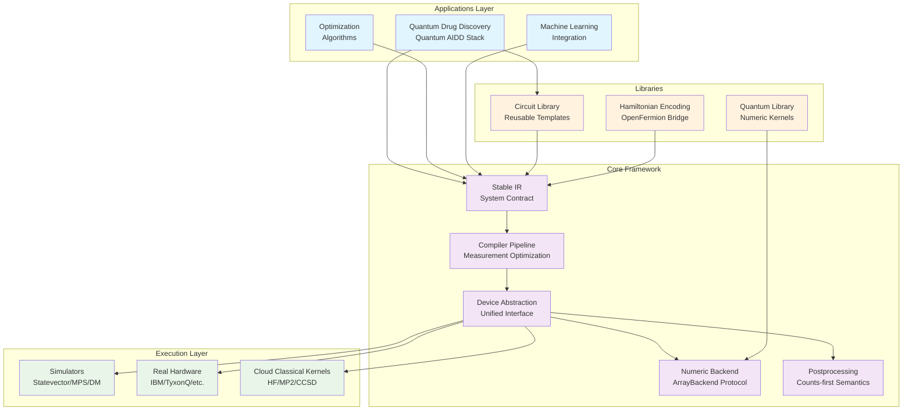
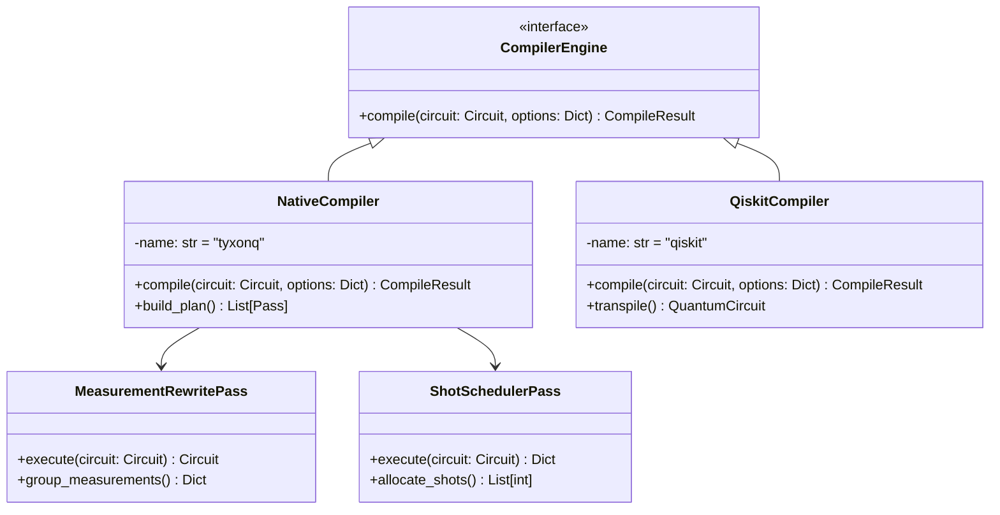
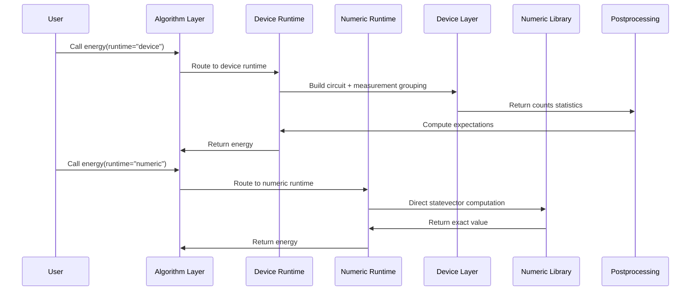
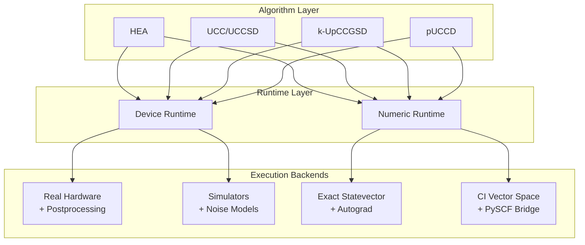

## TyxonQ Technical Architecture Report

# TyxonQ: A Hardware-Realistic Quantum Computing Framework with Novel Dual-Path Execution

## Abstract

TyxonQ is a revolutionary modular quantum computing platform that addresses critical challenges in quantum software engineering by introducing novel architectural patterns for hardware-realistic quantum program execution. The framework centers on five key innovations: (1) **Stable Intermediate Representation (IR)** as a system-wide contract, (2) **Compiler-driven measurement optimization** with explicit grouping and shot scheduling, (3) **Dual-path execution model** with semantic consistency between device and numeric paths, (4) **Counts-first semantics** with unified postprocessing, and (5) **Single numeric backend abstraction** enabling seamless ML framework integration. In addition, TyxonQ integrates a **cloud-local hybrid classical acceleration path** for quantum chemistry workflows, offloading heavy PySCF kernels (HF/post-HF) to cloud resources while keeping VQE iteration locally controlled via artifact-based HF state transfer. These innovations collectively solve the fragmentation problem in quantum software ecosystems while maintaining high engineering usability and research productivity.

**Key Contributions:**
- Novel dual-path execution model that unifies hardware-realistic device execution with exact numeric simulation under consistent semantics
- Compiler-driven measurement grouping and shot scheduling that elevates quantum measurement optimization from device layer to compiler layer
- Counts-first result semantics with provider-neutral postprocessing for cross-vendor portability
- Single ArrayBackend protocol supporting NumPy/PyTorch/CuPyNumeric with transparent gradient integration
- Cloud-local hybrid classical acceleration for PySCF HF/post-HF with GPU-first routing and artifact-based SCF state transfer to local VQE
- Domain-specialized quantum chemistry stack (Quantum AIDD) providing PySCF-level user experience with hardware readiness

## 1. Introduction and Research Context

### 1.1 Problem Statement

The current quantum computing software ecosystem faces several critical challenges that hinder the transition from research to production:

**Fragmented Hardware Abstractions**: Different quantum vendors provide incompatible interfaces, making algorithm migration between platforms difficult and error-prone.

**Scattered Measurement Semantics**: Critical measurement optimization logic (basis transformations, grouping, shot allocation) is distributed across device drivers, leading to unpredictable behavior and vendor lock-in.

**Numeric Computing Silos**: Simulators and numeric libraries use different backend interfaces, increasing maintenance overhead and preventing unified development workflows.

**Inconsistent Result Formats**: Providers return heterogeneous result formats, requiring duplicated postprocessing logic and compromising reproducibility.

### 1.2 Technical Contributions

TyxonQ addresses these challenges through five architectural innovations:

**Innovation 1: Stable IR as System Contract**
- Minimal design principle with only `num_qubits` and `ops` core fields
- Generic operation interpretation supporting diverse backend requirements
- Structural validation combining compile-time type safety with runtime integrity checks

**Innovation 2: Compiler-Driven Measurement Optimization**
- Measurement grouping metadata elevation to IR metadata layer
- Deterministic shot scheduling based on grouping information
- Unified basis transformation handling at compiler level

**Innovation 3: Dual-Path Execution Model (with Hybrid Classical Offloading)**
- Semantic consistency: device and numeric paths use identical Hamiltonian representations and measurement semantics
- Performance specialization: device path optimizes for real hardware execution, numeric path supports fast iteration and gradient computation
- Seamless switching via simple API parameter changes
- Cloud-local hybrid for quantum chemistry: classical HF/post-HF kernels can be offloaded to cloud (GPU-first, CPU fallback) and restored locally via HF chkfile artifacts, preserving local control of VQE optimization.

**Innovation 4: Counts-First Semantics with Unified Postprocessing**
- Cross-vendor consistency: all device drivers return uniform counts format with expectations computed by postprocessing layer
- Pluggable mitigation strategies: readout correction, zero-noise extrapolation standardized in postprocessing
- Metadata-driven processing: compiler-generated measurement metadata guides postprocessing basis transformations and expectation aggregation

**Innovation 5: Single Numeric Backend Abstraction**
- ArrayBackend protocol: unified array operations interface supporting NumPy, PyTorch, CuPyNumeric
- Vectorization strategies: automatic vectorization checks with backend fallback mechanisms
- Gradient integration: PyTorch backend natively supports autograd without additional wrappers

### 1.3 Comparison with Existing Frameworks

| Feature Comparison | Qiskit | PennyLane | TyxonQ |
|-------------------|--------|-----------|--------|
| **IR Design** | Implicit transpiler IR | Transform-based | **Explicit Stable IR** |
| **Result Semantics** | Provider-dependent | Expectation-first | **Counts-first unified** |
| **Measurement Optimization** | Device-layer handling | QNode encapsulation | **Compiler-layer metadata** |
| **Backend Abstraction** | Provider-specific | Interface adapters | **Single ArrayBackend** |
| **Chemistry Applications** | Qiskit Nature | PennyLane QChem | **Native Quantum AIDD stack** |
| **Dual-Path Support** | Separate ecosystems | QNode unification | **Semantic-consistent dual-stack** |

## 2. System Architecture Design

### 2.1 Overall Architecture

TyxonQ adopts a layered, decoupled modular architecture where components collaborate through clear interfaces and data flows:



**Architecture Key Features:**
1. **Stable IR as System Contract**: All inter-component data exchange flows through unified IR
2. **Pluggable Design**: Each layer can be independently replaced or upgraded without affecting other components
3. **Linear Data Flow**: Clear Build IR → Compile → Device → Postprocess pipeline with traceable execution paths

### 2.2 Core Component Details

#### 2.2.1 Stable Intermediate Representation (IR)

**Design Principles:**

```python
from dataclasses import dataclass
from typing import List, Any, Dict, Optional

@dataclass
class Circuit:
    """TyxonQ's core IR type"""
    num_qubits: int                    # Number of quantum bits
    ops: List[Any]                     # Operation sequence (open type)
    metadata: Dict[str, Any] = None    # Compiler metadata
    
    def __post_init__(self):
        # Structural validation logic
        self._validate_structure()
```

**Key Characteristics:**
- **Minimal Design**: Contains only core information needed to construct quantum circuits, easy to maintain and evolve
- **Genericity**: `ops` field has open type, allowing different backends to define their own interpretation methods
- **Type Safety**: Combines compile-time static checking with runtime dynamic validation

#### 2.2.2 Pluggable Compiler Architecture



**Compiler Innovations:**
1. **Measurement Grouping Metadata**: Elevates measurement optimization from device layer to compiler layer
2. **Deterministic Shot Scheduling**: Generates predictable execution plans based on grouping information
3. **Compiler Adapters**: Supports multiple compilation engines while maintaining compatibility with mainstream ecosystems

#### 2.2.3 Unified Device Abstraction Layer

```python
from typing import Protocol, Dict, Any

class Device(Protocol):
    """TyxonQ unified device interface"""
    
    def run(self, circuit: Circuit, shots: int, **kwargs) -> Dict[str, Any]:
        """shots>0: return counts statistics; shots=0: return exact expectations"""
        ...
    
    def batch_run(self, circuits: List[Circuit], shots: int) -> List[Dict]:
        """Batch processing support"""
        ...
        
    @property
    def capabilities(self) -> Dict[str, Any]:
        """Device capability description"""
        ...
```

**Device Abstraction Innovations:**
- **Explicit shots/noise semantics**: `shots=0` indicates exact simulation, `shots>0` indicates sampling simulation
- **Unified result format**: All device drivers return the same `RunResult` structure
- **Capability discovery**: Expose device characteristics through `capabilities` property for adaptive compilation

#### 2.2.4 Single Numeric Backend Abstraction

```python
from typing import Protocol, Any, Tuple
import numpy as np

class ArrayBackend(Protocol):
    """TyxonQ unified numeric backend interface"""
    
    # Array creation
    def zeros(self, shape: Tuple[int, ...], dtype: Any) -> Any: ...
    def ones(self, shape: Tuple[int, ...], dtype: Any) -> Any: ...
    def eye(self, n: int, dtype: Any) -> Any: ...
    
    # Basic operations
    def matmul(self, a: Any, b: Any) -> Any: ...
    def einsum(self, subscripts: str, *operands: Any) -> Any: ...
    def kron(self, a: Any, b: Any) -> Any: ...
    
    # Random number generation
    def random_normal(self, shape: Tuple[int, ...], dtype: Any) -> Any: ...
    def random_choice(self, a: Any, size: int, p: Any = None) -> Any: ...
    
    # Automatic differentiation (optional)
    def requires_grad(self, tensor: Any, requires_grad: bool = True) -> Any: ...
    def backward(self, tensor: Any, grad_output: Any = None) -> None: ...
```

**Backend Abstraction Advantages:**
- **Seamless switching**: Same code runs unmodified across NumPy/PyTorch/CuPyNumeric
- **Performance transparency**: Vectorization checks and backend fallback mechanisms ensure optimal performance
- **Gradient integration**: PyTorch backend natively supports `autograd` without additional wrappers

#### 2.2.5 Counts-First Postprocessing Layer

```python
def apply_postprocessing(
    result: Dict[str, Any], 
    options: Optional[Dict[str, Any]] = None
) -> Dict[str, Any]:
    """TyxonQ unified postprocessing entry point"""
    
    method = options.get("method", "default")
    
    if method == "expval_pauli_sum":
        # Pauli expectation value computation
        return _compute_pauli_expectation(result, options)
    elif method == "readout_mitigation":
        # Readout correction
        return _apply_readout_correction(result, options)
    elif method == "zero_noise_extrapolation":
        # Zero-noise extrapolation
        return _zero_noise_extrapolation(result, options)
    else:
        # Default processing: basic statistics and metadata attachment
        return _default_processing(result, options)
```

**Postprocessing Innovations:**
- **Cross-vendor consistency**: All device raw outputs are normalized through unified postprocessing to achieve format consistency
- **Pluggable mitigation strategies**: Different error mitigation techniques can be uniformly managed in the postprocessing layer
- **Metadata-driven processing**: Smart processing based on compiler-generated measurement metadata

### 2.3 Source Code Organization

TyxonQ organizes source code according to layered abstraction principles, with each module responsible for a clearly defined functional domain:

```
src/tyxonq/
├── core/                           # Core IR and semantics definition
│   ├── ir/
│   │   ├── circuit.py              # Circuit IR and chain API
│   │   └── pulse.py                # Pulse-level IR (advanced control)
│   ├── operations/                 # Operation objects and metadata
│   ├── measurements/               # Measurement types and processing logic
│   └── types.py                    # Shared types and protocols
│
├── compiler/                       # Compilation pipeline and engines
│   ├── api.py                      # Unified compilation entry point
│   ├── compile_engine/
│   │   ├── native/                 # TyxonQ native compiler
│   │   └── qiskit/                 # Qiskit adapter
│   └── stages/                     # Various compilation passes
│       ├── rewrite/
│       │   └── measurement.py     # **Measurement grouping**
│       ├── simplify/
│       │   └── lightcone.py        # Light-cone pruning
│       └── scheduling/
│           └── shot_scheduler.py   # **Shot scheduling**
│
├── devices/                        # Device abstraction and drivers
│   ├── base.py                     # Device protocol and resolver
│   ├── simulators/                 # Local simulators
│   │   ├── statevector/engine.py   # Statevector simulator
│   │   ├── density_matrix/engine.py# Density matrix simulator
│   │   └── matrix_product_state/   # MPS simulator
│   └── hardware/                   # Real hardware drivers
│       ├── ibm/driver.py           # IBM Quantum Network
│       └── tyxonq/driver.py        # TyxonQ self-developed hardware
│
├── numerics/                       # **Numeric backend abstraction**
│   ├── api.py                      # ArrayBackend protocol
│   └── backends/
│       ├── numpy_backend.py        # NumPy backend
│       ├── pytorch_backend.py      # PyTorch backend
│       └── cupynumeric_backend.py  # CuPy backend
│
├── postprocessing/                 # **Unified postprocessing layer**
│   ├── __init__.py                 # Unified entry point
│   ├── counts_expval.py            # Counts→expectations
│   ├── readout.py                  # Readout correction
│   └── error_mitigation.py         # Error mitigation strategies
│
├── applications/                   # Domain specialization
│   └── chem/                       # **Quantum chemistry applications**
│       ├── algorithms/             # HEA/UCC series algorithms
│       ├── runtimes/               # Device/numeric execution times
│       └── chem_libs/              # Chemistry-specific libraries
│
└── libs/                           # General library components
    ├── circuits_library/           # Circuit template library
    ├── quantum_library/            # Quantum computing kernels
    └── hamiltonian_encoding/       # Hamiltonian encoding
```

**Module Responsibility Matrix:**

| Module | Core Responsibility | Key Features |
|--------|-------------------|-------------|
| **Core** | IR definition and semantics | Stable data structures, type safety |
| **Compiler** | Compilation optimization pipeline | Measurement grouping, shot scheduling, simplification |
| **Devices** | Unified device abstraction | Simulator/hardware consistency, noise control |
| **Numerics** | Numeric backend abstraction | Cross-platform compatibility, gradient integration |
| **Postprocessing** | Result standardization | counts-first, mitigation strategies |
| **Applications** | Domain specialization | Dual-path support, PySCF integration |
| **Libraries** | Reusable components | Circuit templates, quantum kernels |

## 3. Core Innovation Features

### 3.1 Chain-style API Design

TyxonQ's chain-style API is a signature feature of the framework that explicitly models the entire execution flow of quantum programs as a linear chain:

```python
import tyxonq as tq

# Set numeric backend
tq.set_backend("numpy")  # or "pytorch" / "cupynumeric"

# Build quantum circuit
c = tq.Circuit(2).h(0).cx(0, 1).measure_z(0).measure_z(1)

# Chain execution: compile -> device -> postprocess -> run
result = (
    c.compile(passes=["measurement_rewrite", "shot_scheduler"])  # Compilation stage
     .device(provider="simulator", device="statevector", shots=4096)    # Device selection
     .postprocessing(method="expval_pauli_sum")                        # Postprocessing config
     .run()                                                            # Execute
)
```

**Chain API Advantages:**
1. **Execution Flow Transparency**: Compilation, device, and postprocessing stages are explicitly separated, easy to understand and debug
2. **Modular Assembly**: Each chain node can be independently configured, supporting different optimization strategies
3. **Lazy Execution**: Only calling `.run()` triggers actual execution, supporting complex compilation optimizations
4. **Type Safety**: Chain calls can detect parameter errors at compile time

### 3.2 Compiler-Driven Measurement Optimization

TyxonQ elevates measurement optimization from traditional device-layer processing to the compiler layer, achieving deterministic and predictable quantum measurement optimization.

#### 3.2.1 Measurement Grouping Metadata

```python
# Example of compiler-generated measurement metadata
measurement_metadata = {
    "measurement_groups": [
        {
            "id": "group_0",
            "qubits": [0, 1],
            "basis": "ZZ",
            "pauli_terms": ["II", "ZI", "IZ", "ZZ"],
            "coefficients": [0.5, 0.3, 0.3, 0.1]
        },
        {
            "id": "group_1", 
            "qubits": [0, 1],
            "basis": "XX",
            "pauli_terms": ["XX"],
            "coefficients": [0.2]
        }
    ],
    "basis_rotations": {
        "group_1": {0: "H", 1: "H"}  # X measurement requires H gate rotation
    }
}
```

#### 3.2.2 Deterministic Shot Scheduling

```python
def schedule_shots(circuit: Circuit, total_shots: int = 4096) -> Dict[str, Any]:
    """TyxonQ's shot scheduling algorithm"""
    
    groups = circuit.metadata["measurement_groups"]
    
    # Allocate shot budget based on variance weights
    shot_allocation = []
    for group in groups:
        variance_weight = sum(abs(c) for c in group["coefficients"])
        group_shots = int(total_shots * variance_weight / total_variance)
        shot_allocation.append(group_shots)
    
    return {
        "shot_plan": shot_allocation,
        "execution_segments": [
            {
                "group_id": group["id"],
                "shots": shots,
                "basis_rotations": get_basis_rotations(group)
            }
            for group, shots in zip(groups, shot_allocation)
        ]
    }
```

**Measurement Optimization Advantages:**
- **Determinism**: Same circuit and parameters produce same shot allocation, supporting result reproducibility
- **Visibility**: Measurement plans can be inspected and optimized before execution
- **Cross-device consistency**: Simulators and real hardware use the same measurement metadata

### 3.3 Dual-Path Execution Model

TyxonQ's dual-path execution model is one of its most important architectural innovations, providing semantic consistency while separately optimizing device and numeric paths.



#### 3.3.1 Device Path

```python
# Device path example: optimized for real hardware
def device_energy_calculation(hamiltonian, circuit, shots=4096):
    # 1. Build measurement circuits and group them
    grouped_circuits = group_measurements(hamiltonian, circuit)
    
    # 2. Execute and collect counts
    all_counts = []
    for group_circuit in grouped_circuits:
        result = (
            group_circuit
            .device(provider="ibm", device="ibm_quebec", shots=shots//len(grouped_circuits))
            .run()
        )
        all_counts.append(result["result"])
    
    # 3. Postprocessing aggregates expectations
    energy = 0.0
    for counts, terms in zip(all_counts, grouped_circuits):
        energy += postprocess_pauli_expectation(counts, terms)
    
    return energy
```

#### 3.3.2 Numeric Path

```python
# Numeric path example: optimized for fast iteration and gradient computation
def numeric_energy_calculation(hamiltonian, circuit, backend="pytorch"):
    # 1. Direct statevector construction
    nb = get_backend(backend)
    psi = build_statevector(circuit, backend=nb)
    
    # 2. Exact expectation value computation
    energy = nb.real(nb.conj(psi).T @ hamiltonian @ psi)
    
    return energy  # Supports PyTorch autograd
```

**Dual-Path Advantages:**
- **Semantic Consistency**: Same algorithm API, different execution paths
- **Performance Specialization**: Device path optimizes for real execution, numeric path optimizes for computation speed
- **Mutual Validation**: Device results can be validated against numeric baselines for accuracy verification

### 3.4 Single Numeric Backend Abstraction Excellence

TyxonQ's ArrayBackend abstraction is one of the framework's most elegant designs, enabling the same code to run seamlessly across different computation frameworks:

```python
# Same algorithm code running on different backends
def vqe_optimization(hamiltonian, ansatz, backend_name="numpy"):
    tq.set_backend(backend_name)
    nb = tq.get_backend()
    
    # Initialize parameters (backend-agnostic)
    params = nb.random_normal((n_layers, n_qubits), dtype=nb.float64)
    
    def energy_function(p):
        circuit = build_ansatz(ansatz, p)
        psi = simulate_circuit(circuit, backend=nb)
        return nb.real(nb.conj(psi).T @ hamiltonian @ psi)
    
    # Optimization (automatic gradient if PyTorch backend)
    if backend_name == "pytorch":
        params.requires_grad_(True)
        optimizer = torch.optim.Adam([params], lr=0.01)
        
        for step in range(100):
            energy = energy_function(params)
            energy.backward()  # Automatic differentiation
            optimizer.step()
            optimizer.zero_grad()
    else:
        # Numerical gradient for other backends
        result = scipy.optimize.minimize(energy_function, params)
        params = result.x
    
    return params

# Run on different backends without code changes
params_numpy = vqe_optimization(H, ansatz, "numpy")
params_torch = vqe_optimization(H, ansatz, "pytorch")  # With autograd
params_cupy = vqe_optimization(H, ansatz, "cupynumeric")  # GPU acceleration
```

**Backend Abstraction Benefits:**
- **Development Efficiency**: Write once, run everywhere
- **Performance Scalability**: Easily switch to GPU computing when needed
- **Gradient Integration**: Native support for modern ML frameworks
- **Research Flexibility**: Researchers can focus on algorithms without worrying about backend details ## 4. Quantum AIDD Application Stack

### 4.1 Dual-Path Drug Discovery Runtime Architecture

TyxonQ's quantum chemistry stack exemplifies the dual-path execution model with domain-specific optimizations for AI-driven drug discovery:



### 4.2 Unified Drug Discovery Algorithm API

All quantum chemistry algorithms for drug discovery expose the same interface while internally routing to optimized execution paths:

```python
# Unified algorithm interface for drug discovery applications
from tyxonq.applications.chem import HEA, UCCSD, pUCCD

# Same API for all algorithms - optimized for drug discovery workflows
hea = HEA(n_qubits=4, layers=2, hamiltonian=H_molecule, runtime="device")
uccsd = UCCSD(n_qubits=4, hamiltonian=H_molecule, runtime="numeric")
puccd = pUCCD(n_qubits=4, hamiltonian=H_molecule, runtime="device")

# Consistent energy/gradient interface for molecular property prediction
energy_hea = hea.energy(shots=4096, provider="ibm", device="ibm_quebec")
energy_uccsd = uccsd.energy()  # Exact computation for reference
energy_puccd = puccd.energy(shots=2048, provider="simulator", device="statevector")

# Gradient computation for drug optimization (automatic path selection)
grad_hea = hea.energy_and_grad(hea.init_guess, shots=1024)
grad_uccsd = uccsd.energy_and_grad(uccsd.init_guess)  # Supports autograd
```

### 4.3 Drug Discovery-Specific Innovations

#### 4.3.1 Multi-Form Hamiltonian Support for Molecular Systems

```python
# Unified Hamiltonian builders supporting multiple output formats
from tyxonq.applications.chem.chem_libs.hamiltonians_chem_library import get_h_from_hf

# Single interface, multiple output formats
H_sparse = get_h_from_hf(hf_object, mode="qubit", htype="sparse")
H_mpo = get_h_from_hf(hf_object, mode="qubit", htype="mpo")
H_fcifunc = get_h_from_hf(hf_object, mode="fermion", htype="fcifunc")

# All formats support the same operations
energy_sparse = compute_energy(psi, H_sparse)
energy_mpo = compute_energy(psi, H_mpo.eval_matrix())  # Lightweight wrapper
energy_fci = H_fcifunc(psi_civector)  # Direct CI space computation
```

#### 4.3.2 Hardware-Realistic Measurement Grouping for Drug Discovery

```python
# Drug discovery-optimized measurement grouping
def group_molecular_measurements(hamiltonian, max_groups=10):
    """Group Pauli terms for efficient hardware execution in drug discovery workflows"""
    
    # 1. Extract Pauli terms from molecular Hamiltonian
    pauli_terms = extract_pauli_terms(hamiltonian)
    
    # 2. Group commuting terms for molecular property calculations
    commuting_groups = find_commuting_groups(pauli_terms)
    
    # 3. Optimize for hardware constraints in drug discovery context
    hardware_groups = optimize_for_connectivity(commuting_groups, max_groups)
    
    # 4. Generate measurement metadata for molecular systems
    return {
        "groups": hardware_groups,
        "shot_weights": compute_variance_weights(hardware_groups),
        "basis_rotations": generate_basis_rotations(hardware_groups)
    }
```

#### 4.3.3 PySCF Integration and Validation

```python
# Seamless PySCF integration for validation
from tyxonq.applications.chem.chem_libs.quantum_chem_library import pyscf_civector
import pyscf

def validate_against_pyscf(molecule, method="UCCSD"):
    """Validate TyxonQ results against PySCF reference"""
    
    # 1. PySCF reference calculation
    mol = pyscf.gto.Mole()
    mol.atom = molecule.atom_string
    mol.basis = molecule.basis
    mol.build()
    
    hf = pyscf.scf.RHF(mol).run()
    fci_solver = pyscf.fci.FCI(hf)
    E_fci, civec_fci = fci_solver.kernel()
    
    # 2. TyxonQ calculation (numeric path for exact comparison)
    tyxonq_alg = get_algorithm(method, runtime="numeric")
    E_tyxonq = tyxonq_alg.energy()
    
    # 3. CI vector comparison
    civec_tyxonq = tyxonq_alg.get_civector()
    fidelity = abs(np.vdot(civec_fci, civec_tyxonq))**2
    
    return {
        "energy_diff": abs(E_fci - E_tyxonq),
        "state_fidelity": fidelity,
        "validation_passed": fidelity > 0.99
    }
```

### 4.4 Validation and Quality Assurance

TyxonQ provides comprehensive validation mechanisms to ensure accuracy and reliability in drug discovery applications:

- **Device vs Numeric Path Consistency**: Systematic validation of results between hardware-realistic device execution and exact numeric simulation
- **Cross-Framework Validation**: Comparison with established quantum chemistry tools like PySCF for reference accuracy
- **Molecular System Benchmarks**: Standard test molecules and drug-relevant chemical systems for performance validation
- **Hardware Migration Testing**: Seamless migration validation between simulators and real quantum hardware

## 5. Research Directions and Opportunities

### 5.1 Measurement Optimization Theory
- Optimal grouping algorithms for specific molecular Hamiltonian classes
- Theoretical bounds on shot requirements for given accuracy targets in drug discovery
- Adaptive measurement strategies based on intermediate results for molecular property prediction

### 5.2 Compilation Strategies for Quantum AIDD
- Device-aware compilation with hardware-specific optimizations for molecular simulations
- Multi-level IR for different abstraction layers in drug discovery workflows
- Formal verification of compilation correctness for pharmaceutical applications

### 5.3 Drug Discovery Applications
- Novel ansatz design for specific molecular systems and drug targets
- Quantum advantage demonstration in practical pharmaceutical chemistry problems
- Integration with AI-driven drug discovery pipelines and molecular design workflows

## 6. Conclusion

TyxonQ represents a significant advancement in quantum software engineering by introducing novel architectural patterns that solve fundamental challenges in the quantum computing ecosystem. The framework's five key innovations — stable IR, compiler-driven measurement optimization, dual-path execution, counts-first semantics, and single numeric backend abstraction — collectively address the fragmentation, unpredictability, and vendor lock-in issues that have hindered the quantum software ecosystem's maturity.

The dual-path execution model stands out as particularly innovative, enabling researchers to maintain fast iteration cycles with exact numeric simulations while ensuring seamless transition to realistic hardware execution with consistent semantics. This bridges the traditional gap between research and deployment in quantum computing.

The Quantum AIDD application stack demonstrates how domain-specific optimizations for AI-driven drug discovery can be elegantly integrated into a general framework without compromising the core architectural principles. By providing PySCF-level user experience with hardware readiness, TyxonQ enables quantum chemists and pharmaceutical researchers to focus on scientific problems rather than software engineering challenges.

Looking forward, TyxonQ's modular architecture and clear separation of concerns position it well for the evolving quantum computing landscape. As hardware capabilities expand and new algorithms emerge, the framework's pluggable design ensures that innovations can be rapidly integrated without disrupting existing workflows.

The framework's emphasis on reproducibility, portability, and hardware realism makes it particularly valuable for the quantum computing community as it transitions from experimental research to practical applications in drug discovery and pharmaceutical research. TyxonQ's contributions to measurement optimization, execution model design, and cross-platform compatibility establish new standards for quantum software engineering that will benefit the entire ecosystem.

In addition, the cloud-local hybrid classical acceleration introduced for quantum chemistry strengthens these conclusions by providing practical, engineering-level advantages without disturbing the core programming model:

- **Selective offloading, full local control**: Only heavy PySCF kernels (HF/post-HF) are offloaded; the VQE loop remains local for debuggability and research agility.
- **Artifact-based reproducibility**: HF `chkfile` artifacts (base64) enable exact SCF-state restoration locally, avoiding redundant recomputation (integrals/RDM) and ensuring reproducible pipelines.
- **GPU-first with graceful fallback**: A unified client and lightweight server route to GPU when available and fall back to CPU otherwise, delivering performance portability with a single API.
- **Stable, language-agnostic interface**: Plain-JSON requests and responses, with numeric arrays serialized to lists and artifacts encoded as strings, simplify integration and long-term maintenance.
- **Consistency and validation**: Unified total-energy conventions and golden tests ensure local/cloud equivalence, aligning with TyxonQ’s dual-path semantic consistency.
- **Minimal user friction**: Users only set `classical_provider`/`classical_device`, and can pass PySCF-style molecule parameters directly; default behavior remains local.

---

*This technical architecture report reflects the current state of TyxonQ development and will be updated as the framework evolves. For the latest implementation details and examples, please refer to the project repository and documentation.*
